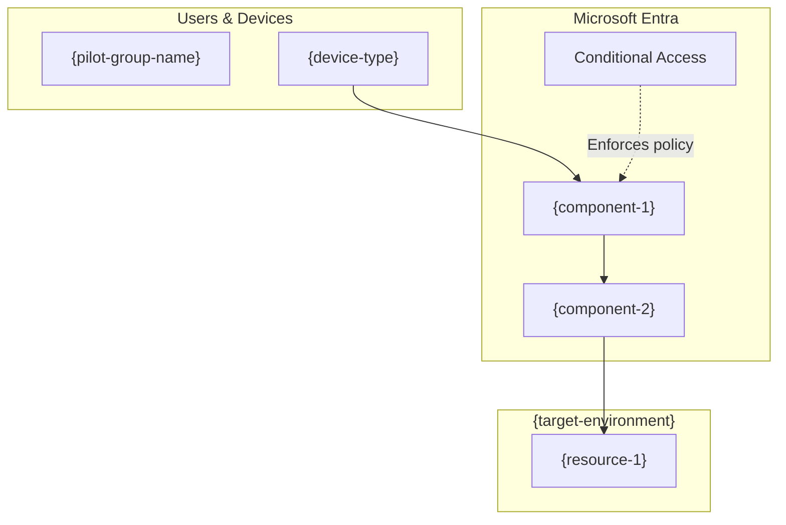

# {scenario-name} - POC Guide

> Generated by entra-poc-advisor on {date}
> Scenario: {scenario-name} | Mode: {operation-mode}

## Overview

{overview-description} All changes are scoped to the pilot group **{pilot-group-name}**.

## Prerequisites

- [ ] **Licenses:** {required-licenses} assigned to pilot users
- [ ] **Roles:** {required-admin-roles} assigned to the administrator
- [ ] **Infrastructure:** {infrastructure-requirements}
- [ ] **Tenant features:** {required-features} enabled in the tenant
- [ ] **Pilot group:** Security group **{pilot-group-name}** created with test users

## Architecture

## Configuration Steps

### Step 1: {step-1-title}

1. Sign in to the [Microsoft Entra admin center](https://entra.microsoft.com).
2. Navigate to **{menu-path}** > **{submenu}** > **{page}**.
3. Configure the following settings:

   | Setting | Value |
   |---|---|
   | {setting-1} | {value-1} |
   | {setting-2} | {value-2} |

4. Select **Save**.

> [!NOTE]
> {step-1-note}

### Step 2: {step-2-title}

1. Navigate to **{menu-path}** > **{submenu}** > **{page}**.
2. Select **{action}** and configure the required settings.
3. Select **Save**.

## Validation

- [ ] **{validation-1-name}:** {validation-1-procedure}
- [ ] **{validation-2-name}:** {validation-2-procedure}
- [ ] **{validation-3-name}:** {validation-3-procedure}

## Troubleshooting

| Symptom | Possible Cause | Resolution |
|---|---|---|
| {symptom-1} | {cause-1} | {resolution-1} |
| {symptom-2} | {cause-2} | {resolution-2} |

## Next Steps

1. **Expand pilot scope:** Add additional users to **{pilot-group-name}**.
2. **Enable additional features:** {next-feature-recommendation}
3. **Production planning:** {production-planning-guidance}
