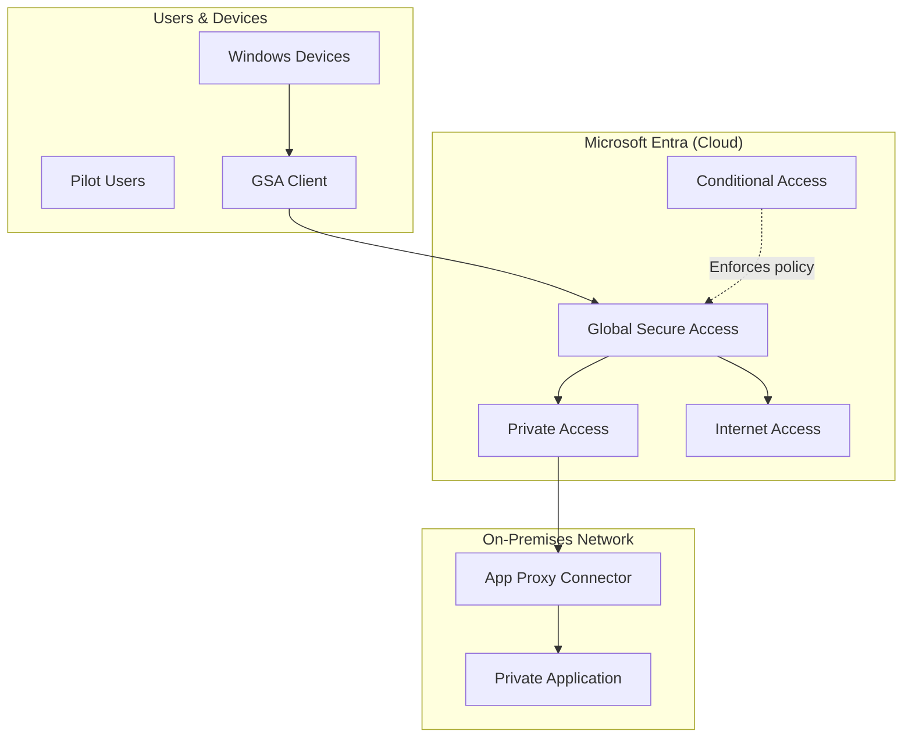

# Documentation Standards

Standards for all documentation generated by the entra-poc-advisor skill.

## Style Guide

### Voice and Tone

- **Professional and direct** -- no filler words or unnecessary qualifiers
- **Second person** -- address the administrator as "you"
- **Present tense** for instructions ("You configure..." not "You will configure...")
- **Active voice** preferred ("Configure the profile" not "The profile should be configured")
- Follow Microsoft documentation style conventions

### Structure

Every generated document includes these sections in order:

1. **Title** -- Clear, descriptive title
2. **Overview** -- 2-3 sentences explaining what this document covers and why
3. **Prerequisites** -- Always at the top, before any procedures
4. **Architecture** -- Mermaid diagram showing the target state
5. **Procedures** -- Numbered step-by-step instructions
6. **Validation** -- How to verify the configuration works
7. **Troubleshooting** -- Common issues and solutions
8. **Next Steps** -- What to do after completing this guide

### Prerequisites Section Format

```markdown
## Prerequisites

Before you begin, verify the following:

- [ ] **Licenses:** {required licenses} assigned to pilot users
- [ ] **Roles:** {required admin roles} assigned to the administrator
- [ ] **Infrastructure:** {infrastructure requirements}
- [ ] **Tenant features:** {features that must be enabled}
- [ ] **Pilot group:** Security group with test users created
```

### Numbered Steps Format

```markdown
## Configure {Component}

1. Sign in to the [Microsoft Entra admin center](https://entra.microsoft.com).

2. Navigate to **{menu path}** > **{submenu}** > **{page}**.

3. Select **{button or option}**.

4. Configure the following settings:

   | Setting | Value |
   |---|---|
   | Name | {value} |
   | Description | {value} |

5. Select **Save**.

> [!NOTE]
> {Additional context or important information.}
```

### Portal Navigation Paths

Always include the full navigation path in the admin center:

- Format: **{Top menu}** > **{Submenu}** > **{Page}** > **{Tab/Section}**
- Example: **Global Secure Access** > **Connect** > **Traffic forwarding** > **Private access profile**
- Use bold for each navigation element
- Link to the admin center URL where applicable

## Callouts

Use Microsoft-style callouts in blockquote format:

### Note
```markdown
> [!NOTE]
> Additional information the administrator should be aware of.
```

### Warning
```markdown
> [!WARNING]
> This action may have significant impact. Review carefully before proceeding.
```

### Important
```markdown
> [!IMPORTANT]
> Critical information required for successful configuration.
```

### Tip
```markdown
> [!TIP]
> Optional best practice or shortcut.
```

### Caution
```markdown
> [!CAUTION]
> This action is potentially dangerous and cannot be easily undone.
```

## Diagrams

All diagrams use **Mermaid** syntax for native rendering in VS Code, GitHub, and modern Markdown viewers.

### Diagram Types

| Type | Purpose | Mermaid Syntax |
|---|---|---|
| Architecture overview | Overall POC topology (users, clients, cloud, private network) | `flowchart TB` or `flowchart LR` |
| Configuration relationships | How Entra objects relate (profiles, policies, groups, apps) | `flowchart` or `graph` |
| Traffic flow | How traffic routes through GSA components | `sequenceDiagram` |
| Deployment sequence | Order of configuration steps and dependencies | `flowchart TD` |
| Component status | Gap analysis visualization | `flowchart` with color coding |

### Diagram Style Guidelines

- Use descriptive node labels (not abbreviations)
- Use subgraphs to group related components
- Color coding:
  - Green (`:::green` or style fill:#90EE90): configured/working
  - Yellow (`:::yellow` or style fill:#FFD700): partially configured
  - Red (`:::red` or style fill:#FF6B6B): missing/misconfigured
  - Blue (`:::blue` or style fill:#87CEEB): informational/external
- Include a legend if using color coding
- Keep diagrams focused -- split complex architectures into multiple diagrams

### Architecture Diagram Template



## Tables

Use Markdown tables for structured data:

- Always include a header row
- Align columns consistently
- Use tables for: settings/values, status comparisons, requirement lists

### Settings Table Format

```markdown
| Setting | Value | Notes |
|---|---|---|
| Name | POC-PrivateAccess-QuickAccess | Descriptive name for the POC |
| Protocol | TCP | Supports TCP and UDP |
| Ports | 443, 3389, 22 | HTTPS, RDP, SSH |
```

### Status Table Format

```markdown
| Component | Status | Details |
|---|---|---|
| GSA Activation | Configured | Activated on 2026-03-01 |
| Traffic Profile | Partially Configured | Missing private access profile |
| Connector | Missing | No connectors installed |
```

## File Naming Conventions

- Use kebab-case for all generated filenames
- Include the scenario or component name
- Examples:
  - `poc-guide-private-access-quick-access.md`
  - `gap-analysis-internet-access.md`
  - `configure-traffic-forwarding.ps1`
  - `audit-log-2026-03-12.md`
