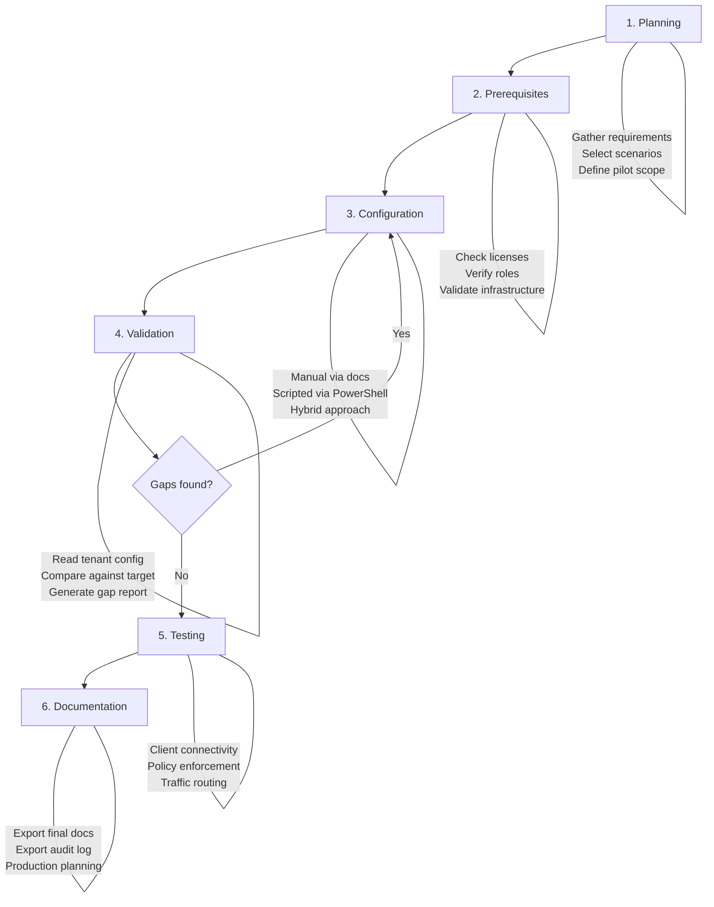

# POC Lifecycle

Detailed guidance for each phase of the six-phase POC lifecycle.

## Overview

## Phase 1: Planning

**Goal:** Understand the administrator's requirements and produce an implementation plan.

**Mode required:** Guidance Only (minimum)

### Steps

1. **Gather requirements**
   - What business problem are you solving?
   - Which users will be in the pilot?
   - What private applications need access? (for Private Access)
   - What internet/SaaS traffic needs to be secured? (for Internet Access)
   - What is the timeline?
   - Are there existing security solutions to integrate with or replace?

2. **Recommend products and features**
   - Map requirements to Entra Suite products
   - Identify the minimum set of features needed
   - Highlight dependencies between products (e.g., Private Access requires GSA activation)

3. **Select or create scenarios**
   - Check `references/scenarios/index.md` for matching pre-defined scenarios
   - If no match, create a custom scenario following the schema
   - Combine multiple scenarios if the POC covers multiple products

4. **Define pilot scope**
   - Recommend a pilot group size (typically 5-20 users)
   - Identify test devices and their OS requirements
   - Define success criteria for the POC

5. **Produce implementation plan**
   - Ordered list of configuration steps with estimated time
   - Dependencies between steps
   - Required admin roles and permissions
   - Required licenses
   - Risk assessment

6. **Confirm operation mode**
   - Ask which mode the admin wants to use
   - Explain the benefits of Read-Only or Read-Write for their scenario

### Deliverables

- Implementation plan (Markdown)
- Architecture diagram (Mermaid)
- Pilot scope definition

## Phase 2: Prerequisites Validation

**Goal:** Verify the tenant is ready for the POC configuration.

**Mode required:** Read-Only (for live validation) or Guidance Only (for generic checklist)

### Prerequisite Categories

#### Licenses

| Product | Required License |
|---|---|
| Global Secure Access (base) | Microsoft Entra ID P1 (minimum) |
| Entra Private Access | Microsoft Entra Suite OR Microsoft Entra Private Access |
| Entra Internet Access | Microsoft Entra Suite OR Microsoft Entra Internet Access |
| ID Protection | Microsoft Entra ID P2 |
| ID Governance | Microsoft Entra ID Governance OR Microsoft Entra Suite |
| Verified ID | Microsoft Entra Verified ID (included in Entra Suite) |

#### Admin Roles

| Role | Purpose |
|---|---|
| Global Administrator | Full tenant configuration (not recommended for day-to-day) |
| Security Administrator | Security policies, Conditional Access |
| Global Secure Access Administrator | GSA-specific configuration |
| Application Administrator | App registrations, enterprise apps |
| Conditional Access Administrator | CA policies only |

#### Infrastructure

| Requirement | Details |
|---|---|
| Connector server | Windows Server 2019+ with line-of-sight to private resources (for Private Access) |
| Test devices | Windows 10/11 (22H2+) for GSA Client |
| Network | Internet access from connector server and test devices |
| DNS | DNS resolution for private resources from connector server |

### MCP Validation Approach (Read-Only mode)

1. **Licenses:** Use `microsoft_graph_get` to query `/v1.0/subscribedSkus` and check for required SKUs
2. **Roles:** Use `microsoft_graph_get` to query `/v1.0/directoryRoles` and verify admin assignments
3. **Feature activation:** Use `microsoft_graph_get` to query `/beta/networkAccess/settings` for GSA status
4. **Pilot group:** Use `microsoft_graph_get` to query `/v1.0/groups?$filter=displayName eq '{name}'`

### Deliverables

- Prerequisites checklist with pass/fail status
- Remediation guidance for any failed checks

## Phase 3: Configuration

**Goal:** Configure the tenant for the POC scenario.

**Mode required:** Varies by configuration path

### Configuration Paths

#### Manual (Guidance Only)

Generate step-by-step Markdown documentation with:
- Portal navigation paths (Entra admin center)
- Screenshots descriptions (what to look for)
- Settings tables with exact values
- Validation steps after each configuration block

Follow `references/documentation-standards.md` for formatting.

#### Scripted (Guidance Only or Read-Write)

Generate idempotent PowerShell scripts with:
- All conventions from `references/powershell-standards.md`
- In Guidance Only mode: use placeholder parameters
- In Read-Write mode: populate parameters from live tenant data

#### Hybrid (any mode)

Generate documentation with embedded PowerShell snippets:
- Portal instructions for steps better done manually
- PowerShell for bulk or complex operations
- Clear indication of which steps are manual vs. scripted

### Configuration Order

For most Entra Suite POCs, follow this general order:

1. **Activate Global Secure Access** (required for Private and Internet Access)
2. **Install and configure connectors** (for Private Access)
3. **Configure traffic forwarding profiles**
4. **Create application segments / web categories**
5. **Configure Conditional Access policies** (POC-scoped)
6. **Deploy GSA Client to test devices**
7. **Configure ID Protection policies** (if applicable)
8. **Configure Governance workflows** (if applicable)

### Deliverables

- Configuration documentation (Markdown) and/or PowerShell scripts
- Per-step validation guidance

## Phase 4: Validation

**Goal:** Verify the configuration matches the target state.

**Mode required:** Read-Only (minimum)

### Validation Approach

1. **Read current configuration** via MCP for each component in the scenario
2. **Compare against target state** defined in the scenario or implementation plan
3. **Generate gap analysis report** with:
   - Executive summary (percentage configured)
   - Per-component status (Configured / Partially Configured / Missing)
   - Detailed findings (current vs. expected for each setting)
   - Prioritized remediation steps
   - Visual diagram with color coding

4. **Iterate:** If gaps are found, return to Phase 3 to remediate

### Validation Scripts

- `scripts/validate-configuration.py` -- Structured validation framework
- `scripts/generate-gap-report.py` -- Gap analysis report generation

### Deliverables

- Gap analysis report (Markdown)
- Remediation plan (if gaps found)

## Phase 5: Testing

**Goal:** Verify the POC works as expected from the end-user perspective.

**Mode required:** Read-Only (for log-based validation) or Guidance Only (for test procedures)

### Test Categories

#### Connectivity Tests
- GSA Client installs and connects on test devices
- Private Access: test devices can reach private applications
- Internet Access: test devices route internet traffic through GSA

#### Policy Enforcement Tests
- Conditional Access policies apply to pilot users
- Web content filtering blocks/allows correct categories
- Security profiles apply correct rules

#### Traffic Flow Tests
- Verify traffic routes through correct forwarding profiles
- Check traffic logs in the GSA dashboard
- Verify no traffic leakage outside GSA tunnel

#### Authentication Tests
- Users can authenticate with MFA (if required by CA)
- SSO works for private applications
- Token acquisition works for protected resources

### MCP-Based Validation (Read-Only mode)

- Query sign-in logs: `microsoft_graph_get` on `/v1.0/auditLogs/signIns`
- Check GSA traffic logs: `microsoft_graph_get` on `/beta/networkAccess/logs/traffic`
- Verify policy application: check sign-in logs for CA policy results

### Deliverables

- Test checklist with pass/fail results
- Sign-in log analysis (if in Read-Only mode)
- Identified issues and remediation

## Phase 6: Documentation Export

**Goal:** Produce final documentation for the POC.

**Mode required:** Any

### Documentation Package

1. **POC Guide** -- Complete step-by-step guide covering everything configured
   - Use template from `assets/templates/poc-guide-template.md`
   - Include all architecture diagrams
   - Include all configuration steps with validation

2. **Gap Analysis Report** -- Final state comparison
   - Use template from `assets/templates/gap-report-template.md`
   - Should show 100% configured if all gaps were remediated

3. **Audit Log** -- Complete record of all actions
   - Use template from `assets/templates/audit-log-template.md`
   - Every MCP call, recommendation, and warning

4. **Production Readiness Assessment** -- Recommendations for moving to production
   - Scale considerations (pilot group to all users)
   - Policy changes needed (report-only to enforced)
   - Monitoring and alerting recommendations
   - Licensing requirements for full deployment

### Deliverables

- Complete documentation package (Markdown files)
- Architecture diagrams (Mermaid, embedded in docs)
- PowerShell scripts (if generated during configuration)
- Audit trail
