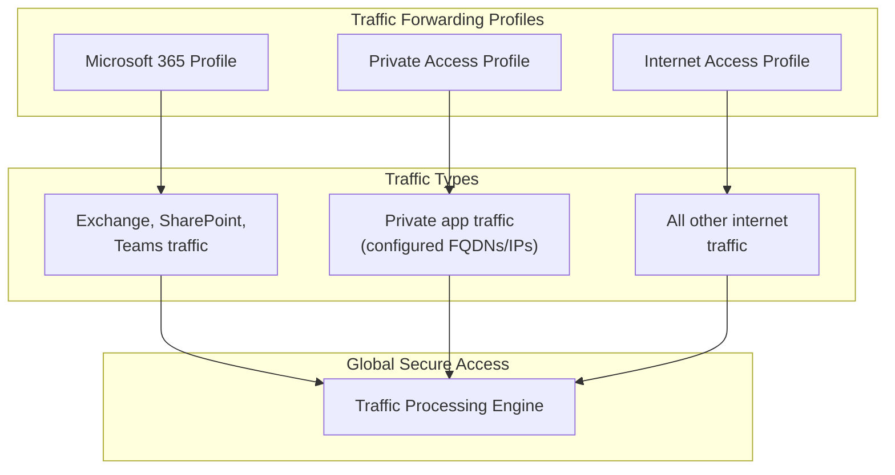
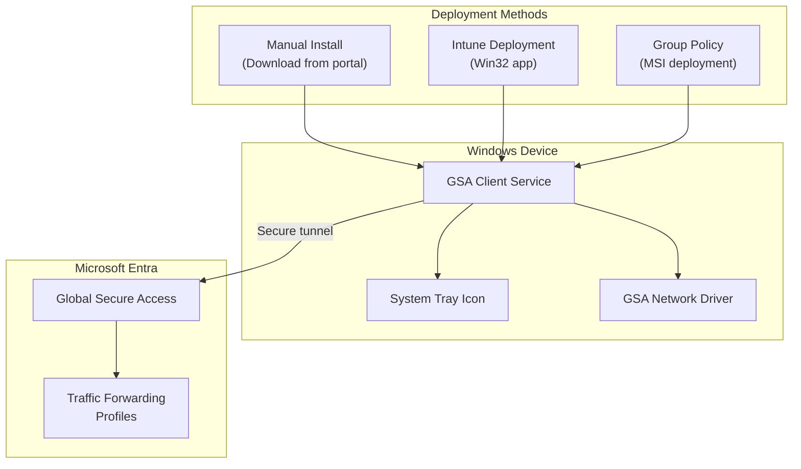
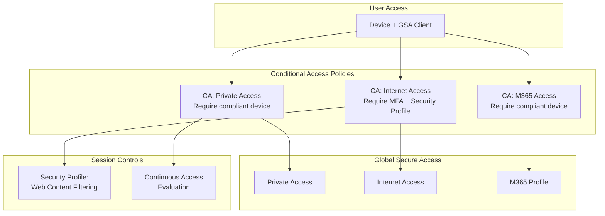
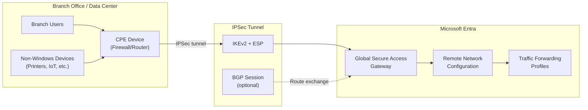

# Global Secure Access Scenarios

## Scenario: gsa-traffic-profiles

**Name:** Global Secure Access - Traffic Forwarding Profiles
**Description:** Configure traffic forwarding profiles to control which network traffic is routed through Global Secure Access. This is the foundational step for both Private Access and Internet Access.
**Products:** Global Secure Access
**Complexity:** Low
**Estimated Time:** 20 minutes

### Prerequisites

- **Licenses:** Microsoft Entra ID P1 (minimum), Entra Private Access or Internet Access for full functionality
- **Roles:** Global Administrator OR Global Secure Access Administrator
- **Infrastructure:**
  - GSA activated in the tenant

### Architecture



### Configuration Steps

1. **Activate Global Secure Access**
   - Component: Global Secure Access
   - Portal Path: **Entra admin center** > **Global Secure Access** > **Get started**
   - Graph API: GET /beta/networkAccess/settings

2. **Review default traffic forwarding profiles**
   - Component: Traffic Forwarding
   - Portal Path: **Global Secure Access** > **Connect** > **Traffic forwarding**
   - Graph API: GET /beta/networkAccess/forwardingProfiles
   - Three profiles exist by default: Microsoft 365, Private Access, Internet Access

3. **Enable Microsoft 365 traffic profile** (if using M365 traffic optimization)
   - Component: Traffic Forwarding
   - Graph API: PATCH /beta/networkAccess/forwardingProfiles/{m365ProfileId}
   - Body: `{"state": "enabled"}`

4. **Enable Private Access profile** (if using Private Access)
   - Component: Traffic Forwarding
   - Graph API: PATCH /beta/networkAccess/forwardingProfiles/{paProfileId}
   - Body: `{"state": "enabled"}`

5. **Enable Internet Access profile** (if using Internet Access)
   - Component: Traffic Forwarding
   - Graph API: PATCH /beta/networkAccess/forwardingProfiles/{iaProfileId}
   - Body: `{"state": "enabled"}`

### Validation Steps

1. **Profile status**
   - Type: automated
   - Description: Query traffic forwarding profiles via MCP and verify enabled/disabled state matches intent

2. **Traffic routing**
   - Type: manual
   - Description: With GSA Client connected, verify traffic routes through the expected profiles by checking the GSA Client advanced diagnostics

---

## Scenario: gsa-client-deployment

**Name:** Global Secure Access - Client Deployment
**Description:** Deploy the Global Secure Access Client to Windows devices for the pilot group. The GSA Client creates a secure tunnel from the device to Microsoft Entra for traffic forwarding.
**Products:** Global Secure Access
**Complexity:** Medium
**Estimated Time:** 30 minutes

### Prerequisites

- **Licenses:** Microsoft Entra ID P1 (minimum) + relevant product license
- **Roles:** Global Administrator OR Global Secure Access Administrator. Intune Administrator for managed deployment.
- **Infrastructure:**
  - Windows 10/11 (22H2+) devices
  - Internet connectivity from devices
  - (Optional) Microsoft Intune for managed deployment

### Architecture



### Configuration Steps

1. **Download GSA Client installer**
   - Component: GSA Client
   - Portal Path: **Global Secure Access** > **Connect** > **Client download**
   - Download the Windows installer (MSI or EXE)

2. **Manual installation (for POC)**
   - Run the installer on each test device
   - Sign in with a pilot user account when prompted
   - Verify the GSA Client icon appears in the system tray

3. **(Optional) Intune deployment**
   - Package the GSA Client installer as a Win32 app in Intune
   - Assign to the pilot device group
   - Configure detection rules (check for GSA Client service)

4. **Verify client connectivity**
   - Component: GSA Client
   - Check the system tray icon shows "Connected"
   - Open GSA Client advanced diagnostics to verify tunnel status

5. **Verify traffic forwarding**
   - Access resources that should route through GSA
   - Check traffic logs in the admin center

### Validation Steps

1. **Client installation**
   - Type: manual
   - Description: Verify GSA Client is installed and running on test devices

2. **Authentication**
   - Type: manual
   - Description: Verify user is signed in to GSA Client with correct identity

3. **Tunnel status**
   - Type: manual
   - Description: Open GSA Client advanced diagnostics and verify active tunnels for enabled profiles

4. **Traffic flow**
   - Type: automated
   - Description: Check GSA traffic logs for traffic from test devices

---

## Scenario: gsa-ca-integration

**Name:** Global Secure Access - Conditional Access Integration
**Description:** Configure Conditional Access policies that integrate with Global Secure Access to enforce security controls on network traffic. This includes requiring compliant devices, MFA, and linking security profiles.
**Products:** Global Secure Access, Microsoft Entra ID (Conditional Access)
**Complexity:** Medium
**Estimated Time:** 45 minutes

### Prerequisites

- **Licenses:** Microsoft Entra ID P1 + relevant product licenses
- **Roles:** Security Administrator OR Conditional Access Administrator
- **Infrastructure:**
  - GSA activated with at least one traffic profile enabled
  - GSA Client deployed on test devices
  - Pilot security group with test users

### Architecture



### Configuration Steps

1. **Identify Global Secure Access target resources in CA**
   - Component: Conditional Access
   - The following target resources are available for GSA:
     - **Microsoft Global Secure Access** (all traffic)
     - **Microsoft 365 Access** (M365 traffic profile)
     - **Private Access** (private access traffic)
     - **Internet Access** (internet traffic)

2. **Create CA policy for Private Access**
   - Component: Conditional Access
   - Portal Path: **Protection** > **Conditional Access** > **New policy**
   - Assignment: Pilot group
   - Target: Private Access traffic
   - Grant: Require compliant device OR require MFA
   - Session: N/A
   - State: Report-only (initially)

3. **Create CA policy for Internet Access with Security Profile**
   - Component: Conditional Access
   - Assignment: Pilot group
   - Target: Internet Access traffic
   - Grant: Require MFA
   - Session: Use Global Secure Access security profile (link to filtering profile)
   - State: Report-only (initially)

4. **Create CA policy for Microsoft 365 traffic** (optional)
   - Component: Conditional Access
   - Assignment: Pilot group
   - Target: Microsoft 365 Access traffic
   - Grant: Require compliant device
   - State: Report-only (initially)

5. **Test in report-only mode**
   - Verify policies would apply correctly by checking sign-in logs
   - Look for "Report-only: Success" or "Report-only: Failure"

6. **Switch to enforced mode** (after validation)
   - Change policy state from "Report-only" to "On"
   - Only for POC-scoped policies targeting pilot group

### Validation Steps

1. **Policy application**
   - Type: automated
   - Description: Check sign-in logs for CA policy evaluation results for pilot users

2. **Grant control enforcement**
   - Type: manual
   - Description: Verify MFA prompt appears for internet access, compliant device check for private access

3. **Security profile linkage**
   - Type: manual
   - Description: Verify web content filtering applies when accessing internet through GSA with CA policy

4. **Non-pilot user exclusion**
   - Type: manual
   - Description: Verify non-pilot users are not affected by the POC CA policies

---

## Scenario: gsa-remote-network

**Name:** Global Secure Access - Remote Network Connectivity
**Description:** Configure site-to-site IPSec tunnel connectivity from a branch office or data center to Global Secure Access. The agent guides through a decision tree to determine if Remote Network is the right approach (vs. GSA Client), gathers CPE device details, validates connectivity prerequisites, and walks through IPSec tunnel + BGP configuration based on the specific CPE provided.
**Products:** Global Secure Access
**Complexity:** High
**Estimated Time:** 60 minutes

### Prerequisites

- **Licenses:** Microsoft Entra Suite OR Microsoft Entra Internet Access OR Microsoft Entra Private Access
- **Roles:** Global Administrator OR Global Secure Access Administrator
- **Infrastructure:**
  - GSA activated in the tenant
  - At least one traffic forwarding profile enabled (Private Access or Internet Access)
  - A supported CPE device at the branch/site (see Supported CPE Devices)
  - Public IP address on the CPE (static preferred)
  - Network firewall rules allowing: UDP 500 (IKE), UDP 4500 (NAT-T), IP Protocol 50 (ESP)

### Use Case Assessment: Remote Network vs. GSA Client

The agent **MUST** guide the administrator through this decision tree **BEFORE** proceeding to configuration. Ask these questions to determine the right connectivity approach:

| Question | Remote Network | GSA Client |
|---|---|---|
| Is this for a branch office/site with multiple users behind a shared network? | ✅ Recommended | ❌ Not ideal |
| Is this for individual roaming/remote users on laptops? | ❌ Not ideal | ✅ Recommended |
| Does the site have a supported CPE/firewall device? | Required | Not required |
| Does the CPE have a public IP and support IKEv2? | Required | Not required |
| Need to cover non-Windows devices (printers, IoT, Linux) at the site? | ✅ Covers all site traffic | ❌ Windows-only |
| Is the site a data center with servers publishing private apps? | Consider connectors instead | N/A |

**Routing based on assessment:**
- If **individual roaming users** → redirect to scenario `gsa-client-deployment`
- If **data center publishing private apps** → redirect to scenario `private-access-quick-access` or `private-access-per-app` (connectors)
- If **branch office with supported CPE** → proceed with this scenario

### Supported CPE Devices

The agent should ask which CPE the administrator has and validate it against this list:

| Vendor | Models / Series | Notes |
|---|---|---|
| **Cisco** | ISR, ASR, CSR 1000v, Catalyst 8000v | IKEv2 + BGP supported |
| **Fortinet** | FortiGate (all models) | IKEv2 + BGP supported |
| **Palo Alto Networks** | PA-Series, VM-Series | IKEv2 + BGP supported |
| **Versa Networks** | Versa SD-WAN appliances | IKEv2 + BGP supported |
| **Check Point** | Security Gateways | IKEv2 + BGP supported |
| **Barracuda** | CloudGen Firewall | IKEv2 + BGP supported |
| **Other** | Any device supporting IKEv2 + IPSec | Manual configuration required |

**Minimal CPE requirements:**
- IKEv2 support (IKEv1 is **NOT** supported)
- IPSec ESP with AES-256-GCM, AES-128-GCM (preferred), or AES-CBC-256
- BGP support (optional but recommended for dynamic routing)
- Public-facing interface with static or stable IP address
- NAT-T support if CPE is behind NAT

### Connectivity Requirements

The agent should verify these parameters with the administrator before configuration:

**IKE Phase 1 (IKEv2):**
- Encryption: AES-256-GCM or AES-128-GCM (preferred) / AES-CBC-256
- Integrity: SHA-256 or SHA-384
- DH Group: 14 (2048-bit) minimum, 24 recommended
- SA Lifetime: 86400 seconds (24 hours)

**IKE Phase 2 (IPSec):**
- Encryption: AES-256-GCM or AES-128-GCM (preferred) / AES-CBC-256
- Integrity: SHA-256 (if not using GCM)
- PFS Group: 14 minimum, 24 recommended
- SA Lifetime: 28800 seconds (8 hours)

**Required Network Ports:**
- UDP 500 — IKE negotiation
- UDP 4500 — NAT traversal
- IP Protocol 50 — ESP (Encapsulating Security Payload)

**BGP Configuration (if using dynamic routing):**
- Microsoft ASN: 65476 (fixed, cannot be changed)
- Customer ASN: any valid private ASN (64512–65534) or public ASN
- BGP peer addresses are provided by Microsoft after remote network creation

### Architecture



### Configuration Steps

1. **Activate Global Secure Access** (if not already done)
   - Component: Global Secure Access
   - Portal Path: **Entra admin center** > **Global Secure Access** > **Get started**
   - Graph API: GET /beta/networkAccess/settings
   - Validation: GET /beta/networkAccess/settings → `isEnabled: true`

2. **Enable required traffic forwarding profile(s)**
   - Component: Traffic Forwarding
   - Portal Path: **Global Secure Access** > **Connect** > **Traffic forwarding**
   - Graph API: PATCH /beta/networkAccess/forwardingProfiles/{id}
   - Body: `{"state": "enabled"}`
   - At least one of Private Access or Internet Access must be enabled for remote network traffic to flow

3. **Create remote network**
   - Component: Remote Networks
   - Portal Path: **Global Secure Access** > **Connect** > **Remote networks** > **Create remote network**
   - Graph API: POST /beta/networkAccess/connectivity/remoteNetworks
   - Body: `{"name": "{site-name}", "region": "{closest-azure-region}"}`
   - Choose the Azure region closest to the branch office for optimal latency
   - Validation: GET /beta/networkAccess/connectivity/remoteNetworks → network exists

4. **Create device link (IPSec tunnel configuration)**
   - Component: Device Links
   - Portal Path: Within the remote network > **Add a link** > Enter CPE details
   - Graph API: POST /beta/networkAccess/connectivity/remoteNetworks/{id}/deviceLinks
   - Body:
     ```json
     {
       "name": "{link-name}",
       "ipAddress": "{cpe-public-ip}",
       "bandwidthCapacityInMbps": "{250|500|750|1000}",
       "deviceVendor": "{vendor-name}",
       "tunnelConfiguration": {
         "@odata.type": "#microsoft.graph.networkaccess.tunnelConfigurationIKEv2Default",
         "preSharedKey": "{psk}"
       },
       "bgpConfiguration": {
         "localIpAddress": "{microsoft-bgp-ip}",
         "peerIpAddress": "{cpe-bgp-ip}",
         "asn": {customer-asn}
       }
     }
     ```
   - Note: `bgpConfiguration` is optional; omit if using static routing only
   - Validation: GET /beta/networkAccess/connectivity/remoteNetworks/{id}/deviceLinks → link exists

5. **Record Microsoft-side tunnel parameters**
   - After creating the device link, Microsoft provides:
     - **Microsoft gateway public IP** (tunnel endpoint for CPE to connect to)
     - **Microsoft BGP peer IP and ASN** (65476) — if BGP was configured
     - **Pre-shared key** — if auto-generated
   - The administrator **MUST** record these values to configure the CPE side
   - Graph API: GET /beta/networkAccess/connectivity/remoteNetworks/{id}/deviceLinks

6. **Configure CPE device (vendor-specific)**
   - Based on the CPE vendor identified in the assessment phase, guide the administrator through:
     - **IKEv2 Phase 1 proposal** matching the parameters from Connectivity Requirements
     - **IPSec Phase 2 proposal** with matching crypto parameters
     - **Tunnel interface** pointing to the Microsoft gateway public IP from step 5
     - **Pre-shared key** matching the value from step 4/5
     - **BGP neighbor configuration** (if using BGP): Microsoft peer IP, ASN 65476, advertised subnets
     - **Route maps or prefix lists** for subnets to advertise to Microsoft
   - The agent should provide vendor-specific CLI examples or portal navigation when possible based on the identified CPE

7. **Verify tunnel establishment**
   - Component: Remote Networks
   - Portal Path: **Global Secure Access** > **Connect** > **Remote networks** > Select network > **View status**
   - Graph API: GET /beta/networkAccess/connectivity/remoteNetworks/{id}/deviceLinks
   - Verify: tunnel status shows **connected**
   - If BGP configured: verify BGP session is **established** and routes are being exchanged
   - Troubleshooting: if tunnel is down, verify IKE parameters match on both sides, check firewall rules for UDP 500/4500, confirm public IP is correct

8. **Associate traffic forwarding profiles**
   - Component: Remote Networks
   - Ensure the remote network is associated with the desired traffic forwarding profiles
   - This determines which traffic from the branch site is routed through GSA
   - Graph API: GET /beta/networkAccess/connectivity/remoteNetworks/{id}/forwardingProfiles

9. **Test traffic flow from branch**
   - From a device at the branch office behind the CPE, test:
     - Access to private applications (if Private Access profile enabled)
     - Internet browsing through GSA (if Internet Access profile enabled)
     - Microsoft 365 access (if M365 profile enabled)
   - Check GSA traffic logs for entries originating from the remote network:
     - Graph API: GET /beta/networkAccess/logs/traffic?$filter=originatingNetwork eq '{remote-network-name}'&$top=50

### Validation Steps

1. **Remote network creation**
   - Type: automated
   - Description: Query GET /beta/networkAccess/connectivity/remoteNetworks and verify the network exists with correct name and region

2. **Device link and tunnel status**
   - Type: automated
   - Description: Query GET /beta/networkAccess/connectivity/remoteNetworks/{id}/deviceLinks and verify tunnel status shows connected. Check IPSec parameters match expected configuration.

3. **BGP session status** (if configured)
   - Type: automated
   - Description: Verify BGP session is established and routes are being advertised and received correctly between the CPE and Microsoft gateway

4. **Traffic flow verification**
   - Type: manual
   - Description: From a branch device behind the CPE, access a resource that should route through GSA. Verify the request appears in GSA traffic logs with the correct source network and action.

5. **Failover testing** (optional, if redundant links configured)
   - Type: manual
   - Description: If multiple device links are configured for redundancy, disable the primary link on the CPE and verify traffic continues to flow through the secondary tunnel
