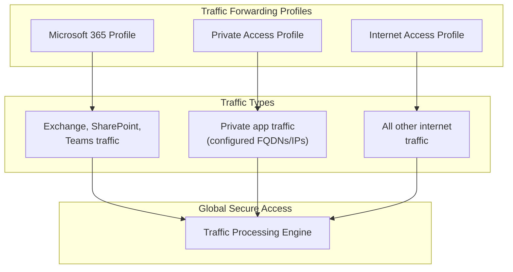
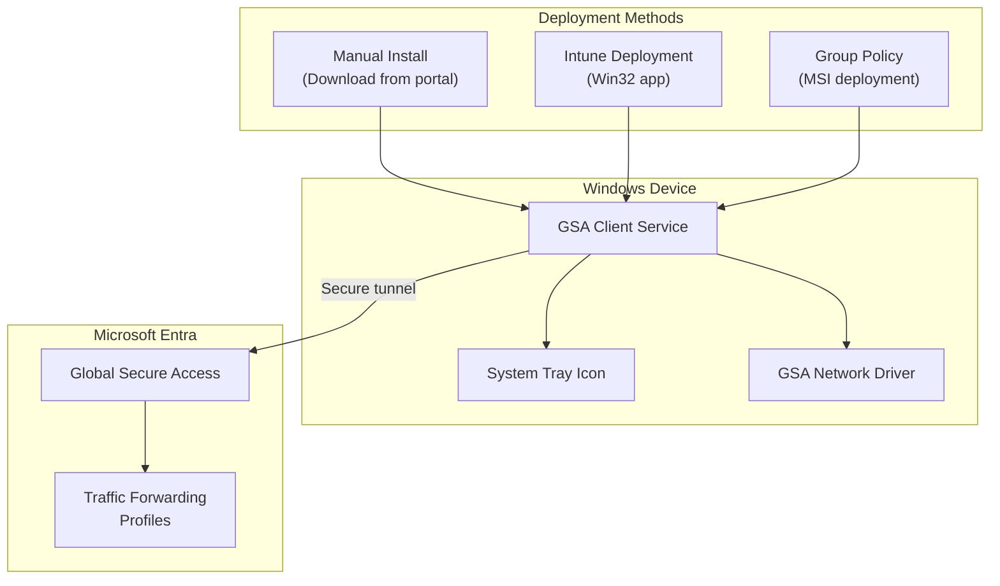
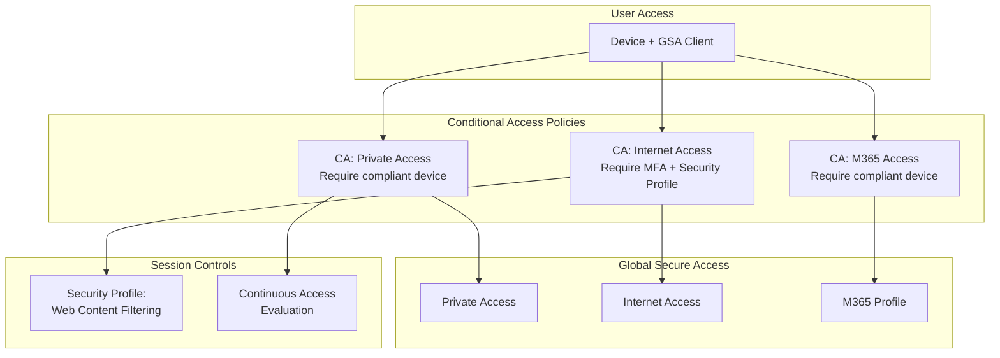

# Global Secure Access Scenarios

## Scenario: gsa-traffic-profiles

**Name:** Global Secure Access - Traffic Forwarding Profiles
**Description:** Configure traffic forwarding profiles to control which network traffic is routed through Global Secure Access. This is the foundational step for both Private Access and Internet Access.
**Products:** Global Secure Access
**Complexity:** Low
**Estimated Time:** 20 minutes

### Prerequisites

- **Licenses:** Microsoft Entra ID P1 (minimum), Entra Private Access or Internet Access for full functionality
- **Roles:** Global Administrator OR Global Secure Access Administrator
- **Infrastructure:**
  - GSA activated in the tenant

### Architecture

### Configuration Steps

1. **Activate Global Secure Access**
   - Component: Global Secure Access
   - Portal Path: **Entra admin center** > **Global Secure Access** > **Get started**
   - Graph API: GET /beta/networkAccess/settings

2. **Review default traffic forwarding profiles**
   - Component: Traffic Forwarding
   - Portal Path: **Global Secure Access** > **Connect** > **Traffic forwarding**
   - Graph API: GET /beta/networkAccess/forwardingProfiles
   - Three profiles exist by default: Microsoft 365, Private Access, Internet Access

3. **Enable Microsoft 365 traffic profile** (if using M365 traffic optimization)
   - Component: Traffic Forwarding
   - Graph API: PATCH /beta/networkAccess/forwardingProfiles/{m365ProfileId}
   - Body: `{"state": "enabled"}`

4. **Enable Private Access profile** (if using Private Access)
   - Component: Traffic Forwarding
   - Graph API: PATCH /beta/networkAccess/forwardingProfiles/{paProfileId}
   - Body: `{"state": "enabled"}`

5. **Enable Internet Access profile** (if using Internet Access)
   - Component: Traffic Forwarding
   - Graph API: PATCH /beta/networkAccess/forwardingProfiles/{iaProfileId}
   - Body: `{"state": "enabled"}`

### Validation Steps

1. **Profile status**
   - Type: automated
   - Description: Query traffic forwarding profiles via MCP and verify enabled/disabled state matches intent

2. **Traffic routing**
   - Type: manual
   - Description: With GSA Client connected, verify traffic routes through the expected profiles by checking the GSA Client advanced diagnostics

---

## Scenario: gsa-client-deployment

**Name:** Global Secure Access - Client Deployment
**Description:** Deploy the Global Secure Access Client to Windows devices for the pilot group. The GSA Client creates a secure tunnel from the device to Microsoft Entra for traffic forwarding.
**Products:** Global Secure Access
**Complexity:** Medium
**Estimated Time:** 30 minutes

### Prerequisites

- **Licenses:** Microsoft Entra ID P1 (minimum) + relevant product license
- **Roles:** Global Administrator OR Global Secure Access Administrator. Intune Administrator for managed deployment.
- **Infrastructure:**
  - Windows 10/11 (22H2+) devices
  - Internet connectivity from devices
  - (Optional) Microsoft Intune for managed deployment

### Architecture

### Configuration Steps

1. **Download GSA Client installer**
   - Component: GSA Client
   - Portal Path: **Global Secure Access** > **Connect** > **Client download**
   - Download the Windows installer (MSI or EXE)

2. **Manual installation (for POC)**
   - Run the installer on each test device
   - Sign in with a pilot user account when prompted
   - Verify the GSA Client icon appears in the system tray

3. **(Optional) Intune deployment**
   - Package the GSA Client installer as a Win32 app in Intune
   - Assign to the pilot device group
   - Configure detection rules (check for GSA Client service)

4. **Verify client connectivity**
   - Component: GSA Client
   - Check the system tray icon shows "Connected"
   - Open GSA Client advanced diagnostics to verify tunnel status

5. **Verify traffic forwarding**
   - Access resources that should route through GSA
   - Check traffic logs in the admin center

### Validation Steps

1. **Client installation**
   - Type: manual
   - Description: Verify GSA Client is installed and running on test devices

2. **Authentication**
   - Type: manual
   - Description: Verify user is signed in to GSA Client with correct identity

3. **Tunnel status**
   - Type: manual
   - Description: Open GSA Client advanced diagnostics and verify active tunnels for enabled profiles

4. **Traffic flow**
   - Type: automated
   - Description: Check GSA traffic logs for traffic from test devices

---

## Scenario: gsa-ca-integration

**Name:** Global Secure Access - Conditional Access Integration
**Description:** Configure Conditional Access policies that integrate with Global Secure Access to enforce security controls on network traffic. This includes requiring compliant devices, MFA, and linking security profiles.
**Products:** Global Secure Access, Microsoft Entra ID (Conditional Access)
**Complexity:** Medium
**Estimated Time:** 45 minutes

### Prerequisites

- **Licenses:** Microsoft Entra ID P1 + relevant product licenses
- **Roles:** Security Administrator OR Conditional Access Administrator
- **Infrastructure:**
  - GSA activated with at least one traffic profile enabled
  - GSA Client deployed on test devices
  - Pilot security group with test users

### Architecture

### Configuration Steps

1. **Identify Global Secure Access target resources in CA**
   - Component: Conditional Access
   - The following target resources are available for GSA:
     - **Microsoft Global Secure Access** (all traffic)
     - **Microsoft 365 Access** (M365 traffic profile)
     - **Private Access** (private access traffic)
     - **Internet Access** (internet traffic)

2. **Create CA policy for Private Access**
   - Component: Conditional Access
   - Portal Path: **Protection** > **Conditional Access** > **New policy**
   - Assignment: Pilot group
   - Target: Private Access traffic
   - Grant: Require compliant device OR require MFA
   - Session: N/A
   - State: Report-only (initially)

3. **Create CA policy for Internet Access with Security Profile**
   - Component: Conditional Access
   - Assignment: Pilot group
   - Target: Internet Access traffic
   - Grant: Require MFA
   - Session: Use Global Secure Access security profile (link to filtering profile)
   - State: Report-only (initially)

4. **Create CA policy for Microsoft 365 traffic** (optional)
   - Component: Conditional Access
   - Assignment: Pilot group
   - Target: Microsoft 365 Access traffic
   - Grant: Require compliant device
   - State: Report-only (initially)

5. **Test in report-only mode**
   - Verify policies would apply correctly by checking sign-in logs
   - Look for "Report-only: Success" or "Report-only: Failure"

6. **Switch to enforced mode** (after validation)
   - Change policy state from "Report-only" to "On"
   - Only for POC-scoped policies targeting pilot group

### Validation Steps

1. **Policy application**
   - Type: automated
   - Description: Check sign-in logs for CA policy evaluation results for pilot users

2. **Grant control enforcement**
   - Type: manual
   - Description: Verify MFA prompt appears for internet access, compliant device check for private access

3. **Security profile linkage**
   - Type: manual
   - Description: Verify web content filtering applies when accessing internet through GSA with CA policy

4. **Non-pilot user exclusion**
   - Type: manual
   - Description: Verify non-pilot users are not affected by the POC CA policies
