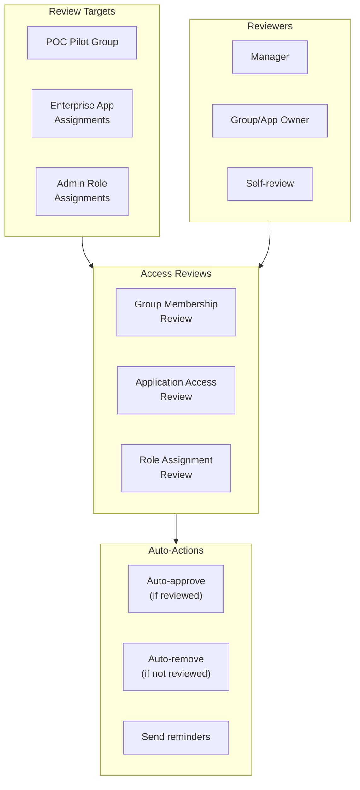
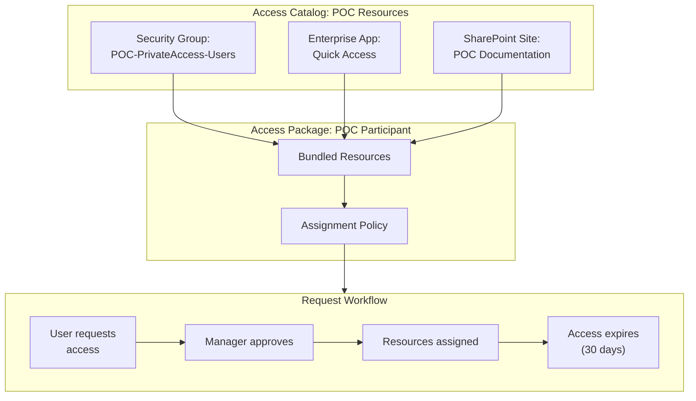

# Governance Scenarios

## Scenario: governance-access-reviews

**Name:** Entra ID Governance - Access Reviews
**Description:** Configure access reviews to periodically review and certify user access to groups, applications, and roles. This ensures the principle of least privilege is maintained and stale access is removed.
**Products:** Microsoft Entra ID Governance
**Complexity:** Medium
**Estimated Time:** 45 minutes

### Prerequisites

- **Licenses:** Microsoft Entra ID Governance OR Microsoft Entra Suite
- **Roles:** Global Administrator OR Identity Governance Administrator
- **Infrastructure:**
  - Security groups with members to review
  - Application assignments to review
  - (Optional) Privileged roles assigned to review

### Architecture

### Configuration Steps

1. **Create an access review for a security group**
   - Component: ID Governance
   - Portal Path: **Entra admin center** > **Identity Governance** > **Access reviews** > **New access review**
   - Graph API: POST /v1.0/identityGovernance/accessReviews/definitions
   - Configuration:
     - Review type: Teams + Groups
     - Scope: Select the pilot group
     - Reviewers: Group owners (or managers)
     - Duration: 7 days (for POC)
     - Recurrence: One-time (for POC)
     - Auto-apply results: Yes
     - If reviewer doesn't respond: Remove access
   - Validation: GET /v1.0/identityGovernance/accessReviews/definitions -> review exists

2. **Create an access review for application assignments**
   - Component: ID Governance
   - Portal Path: **Identity Governance** > **Access reviews** > **New access review**
   - Review type: Applications
   - Scope: Select an enterprise application
   - Reviewers: Application owners or self-review

3. **Create an access review for privileged roles** (optional)
   - Component: ID Governance / PIM
   - Portal Path: **Identity Governance** > **Access reviews** > **New access review**
   - Review type: Roles
   - Scope: Select admin roles (e.g., Global Administrator, Security Administrator)
   - Reviewers: Self-review or designated reviewer

4. **Configure review notifications**
   - Ensure reviewers receive email notifications
   - Configure reminder schedule

5. **Monitor review progress**
   - Portal Path: **Identity Governance** > **Access reviews** > Select review
   - Track: reviewed vs. pending, approval vs. denial rates
   - Graph API: GET /v1.0/identityGovernance/accessReviews/definitions/{id}/instances

### Validation Steps

1. **Review creation**
   - Type: automated
   - Description: Verify access review definitions exist via MCP

2. **Reviewer notification**
   - Type: manual
   - Description: Verify reviewers received email notification to complete the review

3. **Review completion**
   - Type: manual
   - Description: Complete the review as a reviewer and verify decisions are recorded

4. **Auto-apply results**
   - Type: automated
   - Description: After review period ends, verify denied users were removed from the group/app

---

## Scenario: governance-entitlement-mgmt

**Name:** Entra ID Governance - Entitlement Management
**Description:** Configure entitlement management to create access packages that bundle resources (groups, apps, roles) and allow users to request access through a self-service portal with approval workflows.
**Products:** Microsoft Entra ID Governance
**Complexity:** High
**Estimated Time:** 60 minutes

### Prerequisites

- **Licenses:** Microsoft Entra ID Governance OR Microsoft Entra Suite
- **Roles:** Global Administrator OR Identity Governance Administrator
- **Infrastructure:**
  - Security groups representing resource access
  - Enterprise applications to include in access packages
  - Designated approvers for access requests

### Architecture

### Configuration Steps

1. **Create an access catalog**
   - Component: ID Governance
   - Portal Path: **Identity Governance** > **Entitlement management** > **Catalogs** > **New catalog**
   - Graph API: POST /v1.0/identityGovernance/entitlementManagement/catalogs
   - Body: `{"displayName": "POC Resources", "description": "Resources for Entra Suite POC participants", "isExternallyVisible": false}`

2. **Add resources to the catalog**
   - Component: ID Governance
   - Portal Path: Select catalog > **Resources** > **Add resources**
   - Graph API: POST /v1.0/identityGovernance/entitlementManagement/catalogs/{id}/resources
   - Add: security groups, enterprise apps, SharePoint sites

3. **Create an access package**
   - Component: ID Governance
   - Portal Path: **Entitlement management** > **Access packages** > **New access package**
   - Graph API: POST /v1.0/identityGovernance/entitlementManagement/accessPackages
   - Body: `{"displayName": "POC Participant Access", "description": "Provides access to all POC resources", "catalog": {"id": "{catalogId}"}}`

4. **Add resource roles to the access package**
   - Component: ID Governance
   - Add group membership, app assignment, and site access roles from the catalog

5. **Configure assignment policy**
   - Component: ID Governance
   - Portal Path: Select access package > **Policies** > **Add policy**
   - Configuration:
     - Who can request: Specific users/groups (or all members)
     - Approval: Required, single-stage, manager as approver
     - Access duration: 30 days (for POC)
     - Access reviews: Enable (weekly for POC)

6. **Test the request flow**
   - As a test user, navigate to My Access portal (myaccess.microsoft.com)
   - Request the access package
   - As the approver, approve the request
   - Verify resources are assigned

### Validation Steps

1. **Catalog creation**
   - Type: automated
   - Description: Verify catalog exists with correct resources via MCP

2. **Access package availability**
   - Type: manual
   - Description: Verify the access package appears in the My Access portal for eligible users

3. **Request and approval workflow**
   - Type: manual
   - Description: Submit a request, approve it, and verify resources are assigned within the configured timeframe

4. **Access expiration**
   - Type: manual
   - Description: After the access duration, verify access is automatically removed (or configure a short duration for testing)

5. **Audit trail**
   - Type: automated
   - Description: Verify entitlement management audit logs capture the full request lifecycle
