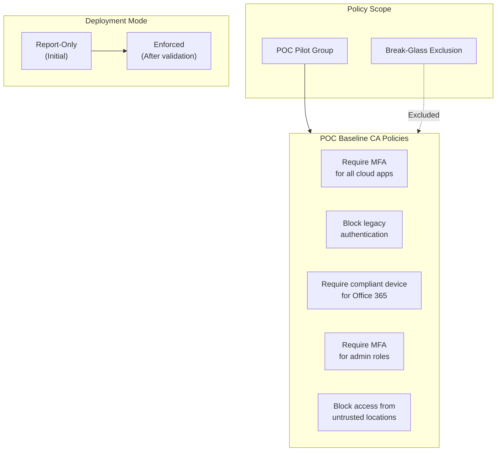
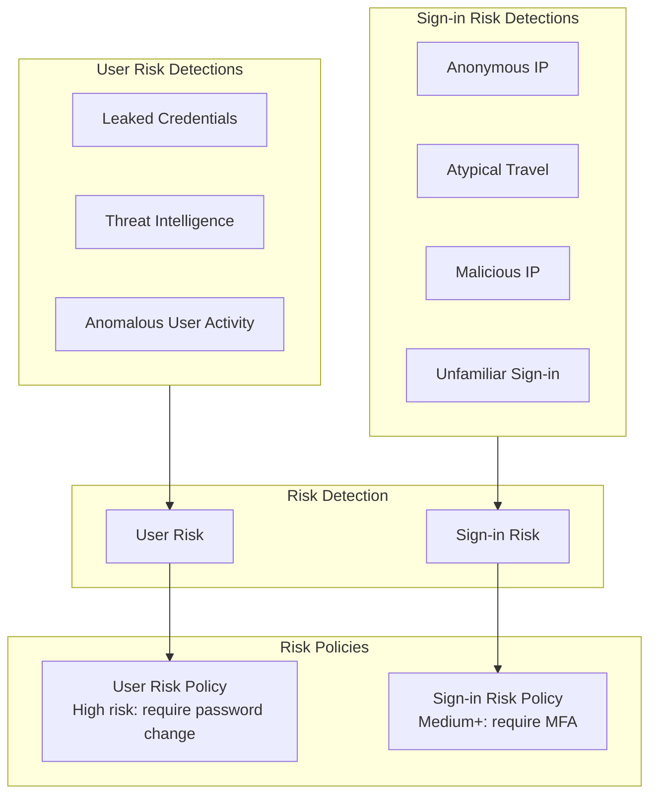

# Identity Scenarios

## Scenario: identity-ca-baseline

**Name:** Conditional Access - POC Baseline Policies
**Description:** Configure a baseline set of Conditional Access policies for the POC environment. These policies provide foundational security controls scoped to the pilot group without affecting production users.
**Products:** Microsoft Entra ID (Conditional Access)
**Complexity:** Medium
**Estimated Time:** 45 minutes

### Prerequisites

- **Licenses:** Microsoft Entra ID P1 (minimum), P2 for risk-based policies
- **Roles:** Security Administrator OR Conditional Access Administrator
- **Infrastructure:**
  - Pilot security group created with test users
  - Break-glass emergency access accounts excluded from all policies
  - (Optional) Named locations configured for trusted networks

### Architecture

### Configuration Steps

1. **Create break-glass emergency access account exclusion group**
   - Component: Entra ID
   - Portal Path: **Groups** > **New group**
   - Graph API: POST /v1.0/groups
   - Body: `{"displayName": "CA-Exclusion-BreakGlass", "securityEnabled": true, "mailEnabled": false, "mailNickname": "ca-exclusion-bg"}`
   - Add emergency access accounts to this group

2. **Policy: Require MFA for all cloud apps (pilot group)**
   - Component: Conditional Access
   - Portal Path: **Protection** > **Conditional Access** > **New policy**
   - Name: `POC-Require-MFA-AllApps`
   - Users: Include pilot group, Exclude break-glass group
   - Cloud apps: All cloud apps
   - Grant: Require multifactor authentication
   - State: Report-only

3. **Policy: Block legacy authentication**
   - Name: `POC-Block-Legacy-Auth`
   - Users: Include pilot group, Exclude break-glass group
   - Cloud apps: All cloud apps
   - Conditions: Client apps = Exchange ActiveSync clients, Other clients
   - Grant: Block access
   - State: Report-only

4. **Policy: Require compliant device for Office 365**
   - Name: `POC-Require-Compliant-Device-O365`
   - Users: Include pilot group, Exclude break-glass group
   - Cloud apps: Office 365
   - Grant: Require device to be marked as compliant
   - State: Report-only

5. **Policy: Require MFA for admin roles**
   - Name: `POC-Require-MFA-Admins`
   - Users: Include Directory roles (Global Admin, Security Admin, etc.), Exclude break-glass group
   - Cloud apps: All cloud apps
   - Grant: Require multifactor authentication
   - State: Report-only

6. **Validate in report-only mode**
   - Review sign-in logs for report-only results
   - Verify no unexpected blocks for pilot users
   - Verify break-glass accounts are excluded

7. **Switch to enforced mode** (after validation period)
   - Enable policies one at a time
   - Monitor sign-in logs for failures

### Validation Steps

1. **Report-only analysis**
   - Type: automated
   - Description: Query sign-in logs for pilot users and check report-only policy results

2. **MFA enforcement**
   - Type: manual
   - Description: After enabling, verify pilot users are prompted for MFA

3. **Legacy auth block**
   - Type: manual
   - Description: Attempt legacy auth (e.g., POP/IMAP) and verify it is blocked

4. **Break-glass exclusion**
   - Type: manual
   - Description: Verify emergency access accounts can sign in without CA restrictions

---

## Scenario: identity-id-protection

**Name:** Microsoft Entra ID Protection
**Description:** Configure ID Protection risk-based policies to automatically detect and respond to identity risks such as leaked credentials, anonymous IP usage, and atypical travel.
**Products:** Microsoft Entra ID Protection
**Complexity:** Medium
**Estimated Time:** 30 minutes

### Prerequisites

- **Licenses:** Microsoft Entra ID P2 OR Microsoft Entra Suite
- **Roles:** Security Administrator OR Global Administrator
- **Infrastructure:**
  - Pilot security group
  - Users with MFA registered (for self-remediation)

### Architecture

### Configuration Steps

1. **Review current risk detections**
   - Component: ID Protection
   - Portal Path: **Entra admin center** > **Protection** > **Identity Protection** > **Risk detections**
   - Graph API: GET /v1.0/identityProtection/riskDetections
   - Review existing detections to understand the baseline

2. **Configure user risk policy**
   - Component: ID Protection
   - Portal Path: **Identity Protection** > **User risk policy**
   - Users: Include pilot group
   - User risk level: High
   - Access: Allow access, Require password change
   - State: Enabled (or report-only via CA)

3. **Configure sign-in risk policy**
   - Component: ID Protection
   - Portal Path: **Identity Protection** > **Sign-in risk policy**
   - Users: Include pilot group
   - Sign-in risk level: Medium and above
   - Access: Allow access, Require multifactor authentication
   - State: Enabled (or report-only via CA)

4. **(Recommended) Use Conditional Access for risk policies**
   - Create CA policies that use risk level as a condition
   - This provides more granular control than the built-in risk policies
   - CA policy: User risk High -> Require password change + MFA
   - CA policy: Sign-in risk Medium+ -> Require MFA

5. **Configure risk notification emails**
   - Portal Path: **Identity Protection** > **Settings** > **Notifications**
   - Configure weekly digest and at-risk user alerts
   - Send to security operations team

### Validation Steps

1. **Risk detection visibility**
   - Type: automated
   - Description: Query risk detections via MCP to verify detections are being generated

2. **Policy evaluation**
   - Type: automated
   - Description: Check sign-in logs for risk-based CA policy evaluation results

3. **Self-remediation**
   - Type: manual
   - Description: Simulate a risky sign-in (e.g., from anonymous VPN) and verify MFA prompt or password change requirement

4. **Notification delivery**
   - Type: manual
   - Description: Verify risk notification emails are delivered to configured recipients
