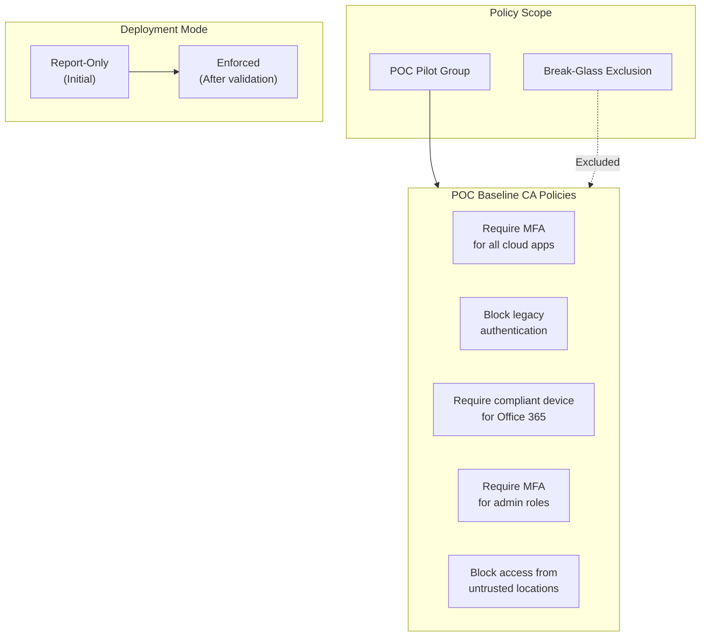
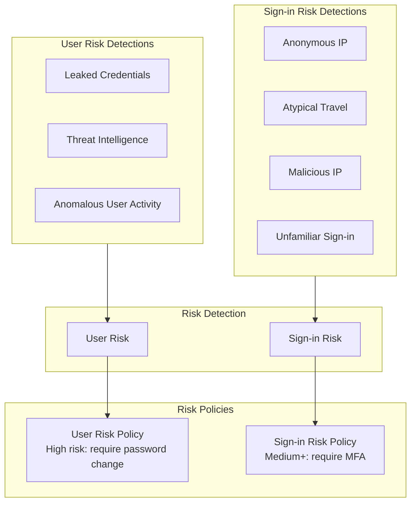
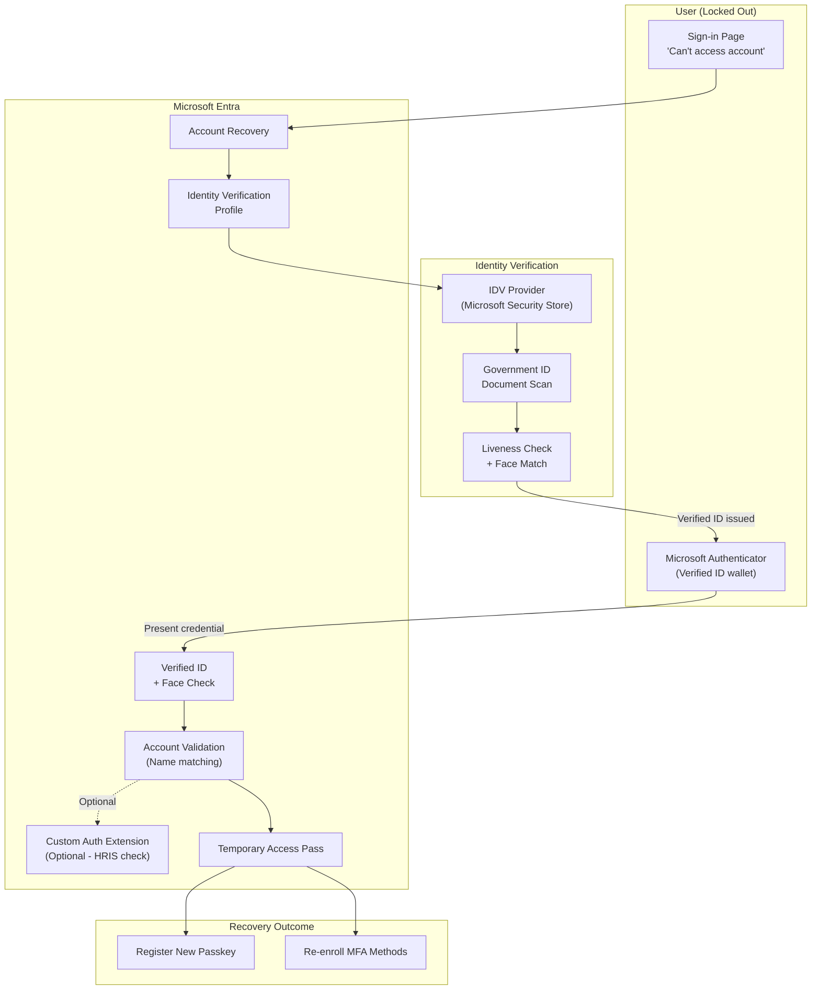

# Identity Scenarios

## Scenario: identity-ca-baseline

**Name:** Conditional Access - POC Baseline Policies
**Description:** Configure a baseline set of Conditional Access policies for the POC environment. These policies provide foundational security controls scoped to the pilot group without affecting production users.
**Products:** Microsoft Entra ID (Conditional Access)
**Complexity:** Medium
**Estimated Time:** 45 minutes

### Prerequisites

- **Licenses:** Microsoft Entra ID P1 (minimum), P2 for risk-based policies
- **Roles:** Security Administrator OR Conditional Access Administrator
- **Infrastructure:**
  - Pilot security group created with test users
  - Break-glass emergency access accounts excluded from all policies
  - (Optional) Named locations configured for trusted networks

### Architecture

```mermaid
flowchart TB
    subgraph Policies["POC Baseline CA Policies"]
        P1["Require MFA<br/>for all cloud apps"]
        P2["Block legacy<br/>authentication"]
        P3["Require compliant device<br/>for Office 365"]
        P4["Require MFA<br/>for admin roles"]
        P5["Block access from<br/>untrusted locations"]
    end

    subgraph Scope["Policy Scope"]
        PG["POC Pilot Group"]
        BG["Break-Glass Exclusion"]
    end

    subgraph Mode["Deployment Mode"]
        RO["Report-Only<br/>(Initial)"]
        EN["Enforced<br/>(After validation)"]
    end

    PG --> Policies
    BG -.->|"Excluded"| Policies
    RO --> EN
```

### Configuration Steps

1. **Create break-glass emergency access account exclusion group**
   - Component: Entra ID
   - Portal Path: **Groups** > **New group**
   - Graph API: POST /v1.0/groups
   - Body: `{"displayName": "CA-Exclusion-BreakGlass", "securityEnabled": true, "mailEnabled": false, "mailNickname": "ca-exclusion-bg"}`
   - Add emergency access accounts to this group

2. **Policy: Require MFA for all cloud apps (pilot group)**
   - Component: Conditional Access
   - Portal Path: **Protection** > **Conditional Access** > **New policy**
   - Name: `POC-Require-MFA-AllApps`
   - Users: Include pilot group, Exclude break-glass group
   - Cloud apps: All cloud apps
   - Grant: Require multifactor authentication
   - State: Report-only

3. **Policy: Block legacy authentication**
   - Name: `POC-Block-Legacy-Auth`
   - Users: Include pilot group, Exclude break-glass group
   - Cloud apps: All cloud apps
   - Conditions: Client apps = Exchange ActiveSync clients, Other clients
   - Grant: Block access
   - State: Report-only

4. **Policy: Require compliant device for Office 365**
   - Name: `POC-Require-Compliant-Device-O365`
   - Users: Include pilot group, Exclude break-glass group
   - Cloud apps: Office 365
   - Grant: Require device to be marked as compliant
   - State: Report-only

5. **Policy: Require MFA for admin roles**
   - Name: `POC-Require-MFA-Admins`
   - Users: Include Directory roles (Global Admin, Security Admin, etc.), Exclude break-glass group
   - Cloud apps: All cloud apps
   - Grant: Require multifactor authentication
   - State: Report-only

6. **Validate in report-only mode**
   - Review sign-in logs for report-only results
   - Verify no unexpected blocks for pilot users
   - Verify break-glass accounts are excluded

7. **Switch to enforced mode** (after validation period)
   - Enable policies one at a time
   - Monitor sign-in logs for failures

### Validation Steps

1. **Report-only analysis**
   - Type: automated
   - Description: Query sign-in logs for pilot users and check report-only policy results

2. **MFA enforcement**
   - Type: manual
   - Description: After enabling, verify pilot users are prompted for MFA

3. **Legacy auth block**
   - Type: manual
   - Description: Attempt legacy auth (e.g., POP/IMAP) and verify it is blocked

4. **Break-glass exclusion**
   - Type: manual
   - Description: Verify emergency access accounts can sign in without CA restrictions

---

## Scenario: identity-id-protection

**Name:** Microsoft Entra ID Protection
**Description:** Configure ID Protection risk-based policies to automatically detect and respond to identity risks such as leaked credentials, anonymous IP usage, and atypical travel.
**Products:** Microsoft Entra ID Protection
**Complexity:** Medium
**Estimated Time:** 30 minutes

### Prerequisites

- **Licenses:** Microsoft Entra ID P2 OR Microsoft Entra Suite
- **Roles:** Security Administrator OR Global Administrator
- **Infrastructure:**
  - Pilot security group
  - Users with MFA registered (for self-remediation)

### Architecture

```mermaid
flowchart TB
    subgraph Detection["Risk Detection"]
        UR["User Risk"]
        SR["Sign-in Risk"]
    end

    subgraph URisks["User Risk Detections"]
        Leaked["Leaked Credentials"]
        TI["Threat Intelligence"]
        Anomalous["Anomalous User Activity"]
    end

    subgraph SRisks["Sign-in Risk Detections"]
        AnonIP["Anonymous IP"]
        Atypical["Atypical Travel"]
        MalIP["Malicious IP"]
        Unfamiliar["Unfamiliar Sign-in"]
    end

    subgraph Policies["Risk Policies"]
        URP["User Risk Policy<br/>High risk: require password change"]
        SRP["Sign-in Risk Policy<br/>Medium+: require MFA"]
    end

    URisks --> UR --> URP
    SRisks --> SR --> SRP
```

### Configuration Steps

1. **Review current risk detections**
   - Component: ID Protection
   - Portal Path: **Entra admin center** > **Protection** > **Identity Protection** > **Risk detections**
   - Graph API: GET /v1.0/identityProtection/riskDetections
   - Review existing detections to understand the baseline

2. **Configure user risk policy**
   - Component: ID Protection
   - Portal Path: **Identity Protection** > **User risk policy**
   - Users: Include pilot group
   - User risk level: High
   - Access: Allow access, Require password change
   - State: Enabled (or report-only via CA)

3. **Configure sign-in risk policy**
   - Component: ID Protection
   - Portal Path: **Identity Protection** > **Sign-in risk policy**
   - Users: Include pilot group
   - Sign-in risk level: Medium and above
   - Access: Allow access, Require multifactor authentication
   - State: Enabled (or report-only via CA)

4. **(Recommended) Use Conditional Access for risk policies**
   - Create CA policies that use risk level as a condition
   - This provides more granular control than the built-in risk policies
   - CA policy: User risk High -> Require password change + MFA
   - CA policy: Sign-in risk Medium+ -> Require MFA

5. **Configure risk notification emails**
   - Portal Path: **Identity Protection** > **Settings** > **Notifications**
   - Configure weekly digest and at-risk user alerts
   - Send to security operations team

### Validation Steps

1. **Risk detection visibility**
   - Type: automated
   - Description: Query risk detections via MCP to verify detections are being generated

2. **Policy evaluation**
   - Type: automated
   - Description: Check sign-in logs for risk-based CA policy evaluation results

3. **Self-remediation**
   - Type: manual
   - Description: Simulate a risky sign-in (e.g., from anonymous VPN) and verify MFA prompt or password change requirement

4. **Notification delivery**
   - Type: manual
   - Description: Verify risk notification emails are delivered to configured recipients

---

## Scenario: identity-account-recovery

**Name:** Microsoft Entra ID - Account Recovery with Identity Verification
**Description:** Configure high-assurance self-service account recovery using identity verification providers and Microsoft Entra Verified ID with Face Check. This enables users who have lost all authentication methods to securely recover their accounts through government-issued ID verification and biometric matching, eliminating helpdesk dependency and social engineering risks.
**Products:** Microsoft Entra ID, Microsoft Entra Verified ID
**Complexity:** High
**Estimated Time:** 60 minutes

### Prerequisites

- **Licenses:** Microsoft Entra ID P1 (minimum); Azure subscription for identity verification provider billing
- **Roles:** Authentication Administrator (account recovery setup), Contributor or Billing Administrator (Azure subscription for IDV provider), User Administrator (verify user profiles)
- **Infrastructure:**
  - Microsoft Entra Verified ID enabled and configured in the tenant
  - Face Check configured in the tenant
  - Pilot security group with test users
  - Test users must have First Name and Last Name properties populated (matching government-issued ID)
  - Microsoft Authenticator installed on test device (for Verified ID credential storage)
  - (Optional) Azure Function or Logic App for custom authentication extension

### Architecture

```mermaid
flowchart TB
    subgraph User["User (Locked Out)"]
        SignIn["Sign-in Page<br/>'Can't access account'"]
        Authenticator["Microsoft Authenticator<br/>(Verified ID wallet)"]
    end

    subgraph IDV["Identity Verification"]
        Provider["IDV Provider<br/>(Microsoft Security Store)"]
        GovID["Government ID<br/>Document Scan"]
        Liveness["Liveness Check<br/>+ Face Match"]
    end

    subgraph Entra["Microsoft Entra"]
        Recovery["Account Recovery"]
        Profile["Identity Verification<br/>Profile"]
        VerifiedID["Verified ID<br/>+ Face Check"]
        Validation["Account Validation<br/>(Name matching)"]
        Extension["Custom Auth Extension<br/>(Optional - HRIS check)"]
        TAP["Temporary Access Pass"]
    end

    subgraph Outcome["Recovery Outcome"]
        Passkey["Register New Passkey"]
        MFA["Re-enroll MFA Methods"]
    end

    SignIn --> Recovery
    Recovery --> Profile
    Profile --> Provider
    Provider --> GovID
    GovID --> Liveness
    Liveness -->|"Verified ID issued"| Authenticator
    Authenticator -->|"Present credential"| VerifiedID
    VerifiedID --> Validation
    Validation -.->|"Optional"| Extension
    Validation --> TAP
    TAP --> Passkey
    TAP --> MFA
```

### Configuration Steps

1. **Verify Verified ID and Face Check are configured**
   - Component: Verified ID
   - Portal Path: **Entra admin center** > **Verified ID** > **Overview**
   - Ensure authority is created with linked domain and Face Check is enabled
   - Reference: [Configure Verified ID tenant](https://learn.microsoft.com/en-us/entra/verified-id/verifiable-credentials-configure-tenant-quick)

2. **Open Account Recovery and complete setup checklist**
   - Component: Entra ID
   - Portal Path: **Entra admin center** > **Entra ID** > **Account recovery**
   - Review the Getting Started checklist:
     - Set up Verified ID ✓
     - Set up Face Check with Verified ID ✓
     - Set up passkeys after recovery (enable passkeys in Authentication Methods policy if not already)
   - Enable passkeys in Authentication Methods policy if prompted

3. **Subscribe to an identity verification provider**
   - Component: Account Recovery
   - Portal Path: **Account recovery** > **Profiles** tab > **Add** > **Identity verification providers** panel
   - Browse available providers (filter by compliance standard if needed)
   - Select **Get Solution** for chosen provider → opens Microsoft Security Store
   - Complete: Select billing subscription, resource group, resource name, pricing plan
   - Place order and activate on provider's admin portal
   - Return to Account Recovery in Entra admin center

4. **Create identity verification profile — Evaluation mode**
   - Component: Account Recovery
   - Portal Path: **Entra admin center** > **Entra ID** > **Account recovery** > **Profiles** > **Add**
   - Configuration wizard:
     - **Profile details:** Name (e.g., "POC Account Recovery - Pilot"), Description
     - **Recovery mode:** Select **Evaluation** (test without actual recovery)
     - **User groups:** Include pilot security group; Exclude break-glass accounts
     - **Identity verification provider:** Select subscribed provider
     - **Account validation:**
       - ID Claim matching: firstName → First Name, lastName → Last Name
       - Match confidence: **Relaxed** (recommended for POC to handle name variations)
       - (Optional) Enable custom authentication extension for additional validation
     - **Review and finalize:** Review settings, select **Complete**

5. **Verify user profiles are ready for account recovery**
   - Component: Entra ID
   - Portal Path: **Entra admin center** > **Entra ID** > **Users** > Select user > **Edit properties**
   - Confirm First Name and Last Name are populated and match government-issued ID
   - Note: Display name is NOT used in matching — only First Name and Last Name

6. **Test in Evaluation mode**
   - On test device, navigate to sign-in page
   - Select "Can't access your account?" link
   - Follow identity verification flow (scan government ID, complete liveness check)
   - Verify the flow completes without errors (account is NOT recovered in Evaluation mode)
   - Review audit logs: **Account recovery** > **View audit logs**

7. **Move profile to Production mode**
   - Component: Account Recovery
   - Portal Path: **Account recovery** > **Profiles** > Edit profile
   - Change Recovery mode from Evaluation to **Production**
   - Select **Complete**
   - Test full recovery: user completes ID verification → receives Temporary Access Pass → registers new passkey

### Validation Steps

1. **Evaluation mode flow**
   - Type: manual
   - Description: As a pilot user with no authentication methods, initiate account recovery and complete identity verification through the provider. Verify the flow succeeds (credential issued, identity matched) but account is NOT recovered

2. **Production mode recovery**
   - Type: manual
   - Description: After switching to Production mode, complete full account recovery flow. Verify user receives a Temporary Access Pass and can register a new passkey

3. **Account validation matching**
   - Type: manual
   - Description: Test with a user whose Entra profile First/Last Name matches their government ID. Verify successful match. Test with a mismatched name and verify recovery fails

4. **Audit logs**
   - Type: automated
   - Description: Check Account Recovery audit logs for recovery attempt entries showing provider, user, and outcome (success/failure)

5. **Passkey enrollment after recovery**
   - Type: manual
   - Description: After successful recovery with TAP, verify the user is prompted to register a passkey and can subsequently sign in with the new passkey

6. **Cost savings estimator**
   - Type: manual
   - Description: On the Account Recovery overview page, select "Estimate savings" and review projected helpdesk cost reduction based on your organization's user count and recovery rate
