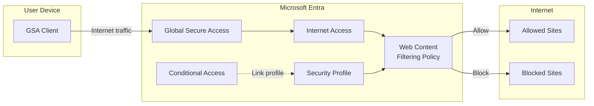
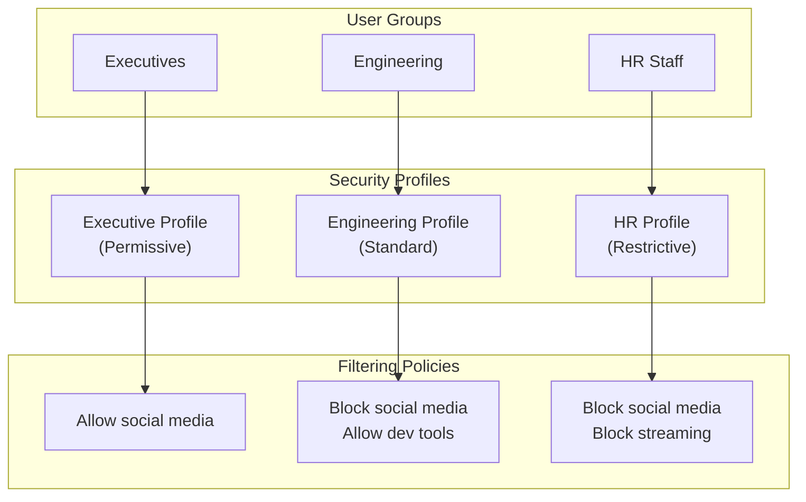
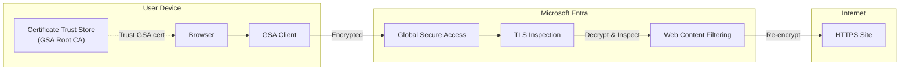
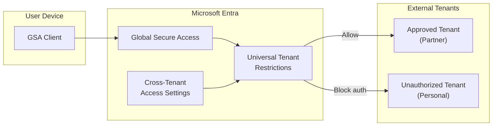

# Internet Access Scenarios

## Scenario: internet-access-wcf

**Name:** Entra Internet Access - Web Content Filtering
**Description:** Configure web content filtering to control access to internet websites based on content categories. This enables organizations to enforce acceptable use policies and block access to malicious or inappropriate content.
**Products:** Microsoft Entra Internet Access, Global Secure Access
**Complexity:** Medium
**Estimated Time:** 30 minutes

### Prerequisites

- **Licenses:** Microsoft Entra Suite OR Microsoft Entra Internet Access
- **Roles:** Global Administrator OR Security Administrator
- **Infrastructure:**
  - Test device with Windows 10/11 (22H2+) for GSA Client
  - GSA activated and Internet Access traffic forwarding enabled

### Architecture

### Configuration Steps

1. **Activate Global Secure Access** (if not already done)
   - Component: Global Secure Access
   - Portal Path: **Entra admin center** > **Global Secure Access** > **Get started**
   - Graph API: GET /beta/networkAccess/settings

2. **Enable Internet Access traffic forwarding profile**
   - Component: Traffic Forwarding
   - Portal Path: **Global Secure Access** > **Connect** > **Traffic forwarding** > **Internet access profile**
   - Graph API: PATCH /beta/networkAccess/forwardingProfiles/{id}
   - Body: `{"state": "enabled"}`

3. **Create web content filtering policy**
   - Component: Internet Access
   - Portal Path: **Global Secure Access** > **Secure** > **Web content filtering policies** > **Create policy**
   - Graph API: POST /beta/networkAccess/filteringPolicies
   - Body: Policy with rule to block specific categories (e.g., Gambling, Adult Content, Social Networking)
   - Validation: GET /beta/networkAccess/filteringPolicies -> policy exists

4. **Create security profile**
   - Component: Internet Access
   - Portal Path: **Global Secure Access** > **Secure** > **Security profiles** > **Create profile**
   - Graph API: POST /beta/networkAccess/filteringProfiles
   - Body: Profile linking to the web content filtering policy
   - Validation: GET /beta/networkAccess/filteringProfiles -> profile exists with linked policy

5. **Create Conditional Access policy with security profile**
   - Component: Conditional Access
   - Portal Path: **Entra admin center** > **Protection** > **Conditional Access** > **New policy**
   - Target: Pilot group, Internet traffic, Session control: Use Global Secure Access security profile
   - Start in report-only mode

6. **Deploy GSA Client and test**
   - Component: GSA Client
   - Install GSA Client on test device
   - Verify blocked categories are inaccessible

### Validation Steps

1. **Policy creation**
   - Type: automated
   - Description: Verify web content filtering policy exists with correct category rules

2. **Profile linkage**
   - Type: automated
   - Description: Verify security profile is linked to the filtering policy

3. **Block verification**
   - Type: manual
   - Description: From test device, attempt to access a site in a blocked category and verify it is blocked

4. **Allow verification**
   - Type: manual
   - Description: From test device, access a site in an allowed category and verify it loads normally

5. **Traffic logs**
   - Type: automated
   - Description: Check GSA traffic logs for blocked and allowed traffic entries

---

## Scenario: internet-access-security-profiles

**Name:** Entra Internet Access - Security Profiles
**Description:** Configure multiple security profiles with different filtering policies for different user groups. This enables differentiated internet access policies based on role or department.
**Products:** Microsoft Entra Internet Access, Global Secure Access
**Complexity:** Medium
**Estimated Time:** 45 minutes

### Prerequisites

- **Licenses:** Microsoft Entra Suite OR Microsoft Entra Internet Access
- **Roles:** Global Administrator OR Security Administrator
- **Infrastructure:**
  - GSA activated and Internet Access enabled
  - Multiple security groups for different user populations
  - Test devices

### Architecture

### Configuration Steps

1. **Create security groups for each user population**
2. **Create web content filtering policies per group** (different category rules)
3. **Create security profiles linking to respective policies**
4. **Create Conditional Access policies per group** linking to the appropriate security profile
5. **Test with users from each group**

### Validation Steps

1. **Group-specific filtering**
   - Type: manual
   - Description: Log in as a user from each group and verify the correct filtering policy applies

2. **Cross-group isolation**
   - Type: manual
   - Description: Verify an engineering user is blocked from social media while an executive is not

---

## Scenario: internet-access-tls-inspection

**Name:** Entra Internet Access - TLS Inspection
**Description:** Enable TLS inspection to decrypt and inspect HTTPS traffic for security threats and policy enforcement. This provides visibility into encrypted traffic that would otherwise bypass content filtering.
**Products:** Microsoft Entra Internet Access, Global Secure Access
**Complexity:** High
**Estimated Time:** 60 minutes

### Prerequisites

- **Licenses:** Microsoft Entra Suite OR Microsoft Entra Internet Access
- **Roles:** Global Administrator OR Security Administrator
- **Infrastructure:**
  - GSA activated and Internet Access enabled
  - Ability to deploy trusted root certificate to test devices
  - Test devices with Windows 10/11

### Architecture

### Configuration Steps

1. **Enable TLS inspection in Internet Access settings**
   - Component: Internet Access
   - Portal Path: **Global Secure Access** > **Secure** > **TLS inspection**
   - Enable TLS inspection feature

2. **Download and deploy the GSA root certificate**
   - Component: Certificate Management
   - Download the GSA trusted root certificate from the admin center
   - Deploy to test devices via GPO, Intune, or manual install

3. **Configure TLS inspection policy**
   - Define which traffic to inspect (by category, domain, or all)
   - Define bypass rules for sensitive sites (banking, healthcare)

4. **Update web content filtering policies**
   - Enable HTTPS category matching (previously only HTTP was inspectable)

5. **Test with blocked HTTPS site**
   - Verify HTTPS traffic is inspected and filtered

### Validation Steps

1. **Certificate deployment**
   - Type: manual
   - Description: Verify the GSA root certificate is in the trusted root store on test devices

2. **HTTPS filtering**
   - Type: manual
   - Description: Access a blocked-category HTTPS site and verify it is blocked (not just HTTP)

3. **Bypass rules**
   - Type: manual
   - Description: Verify banking/healthcare sites are not inspected (no certificate warning)

---

## Scenario: internet-access-utr

**Name:** Entra Internet Access - Universal Tenant Restrictions
**Description:** Configure Universal Tenant Restrictions (UTR) to prevent data exfiltration by blocking authentication to unauthorized tenants. This ensures users can only access corporate resources and approved external tenants.
**Products:** Microsoft Entra Internet Access, Global Secure Access
**Complexity:** Medium
**Estimated Time:** 30 minutes

### Prerequisites

- **Licenses:** Microsoft Entra Suite OR Microsoft Entra Internet Access
- **Roles:** Global Administrator OR Security Administrator
- **Infrastructure:**
  - GSA activated and Internet Access enabled
  - Cross-tenant access settings configured
  - Test devices with GSA Client

### Architecture

### Configuration Steps

1. **Configure cross-tenant access settings**
   - Component: Entra ID
   - Portal Path: **Entra admin center** > **External Identities** > **Cross-tenant access settings**
   - Define default policy (block) and partner-specific policies (allow)

2. **Enable Universal Tenant Restrictions**
   - Component: Internet Access
   - Portal Path: **Global Secure Access** > **Secure** > **Universal tenant restrictions**
   - Enable UTR and link to cross-tenant access settings

3. **Configure allowed tenant list**
   - Add partner tenant IDs to the allowed list
   - Block all other tenants

4. **Test authentication to external tenants**
   - Verify users can authenticate to approved partner tenants
   - Verify users are blocked from personal or unauthorized tenants

### Validation Steps

1. **Approved tenant access**
   - Type: manual
   - Description: Attempt to sign in to an approved partner tenant's app and verify success

2. **Blocked tenant access**
   - Type: manual
   - Description: Attempt to sign in to an unauthorized tenant and verify block

3. **UTR headers**
   - Type: automated
   - Description: Verify GSA is injecting tenant restriction headers in traffic logs
