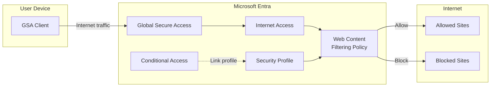
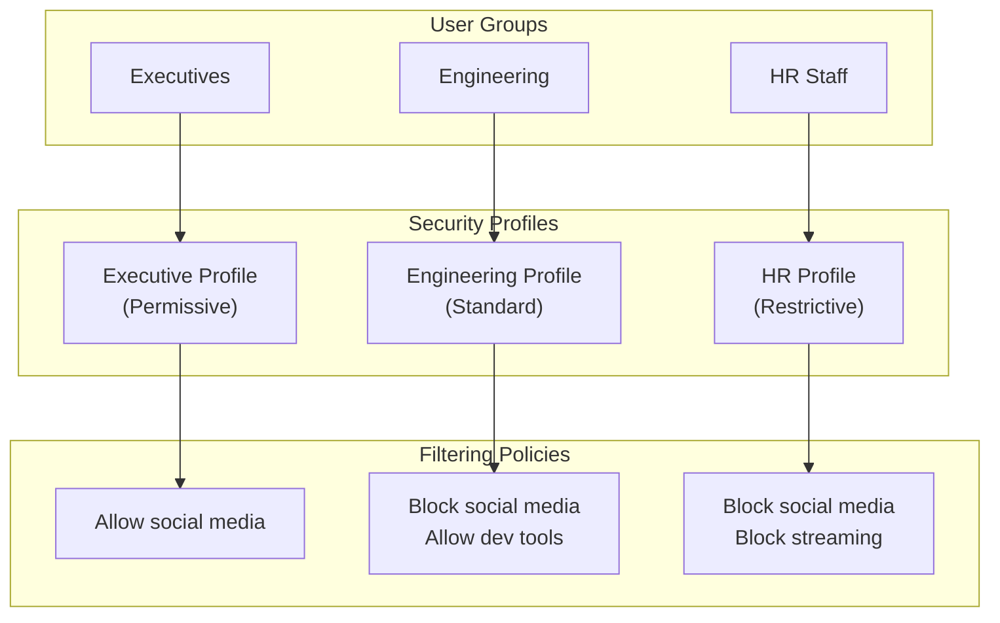
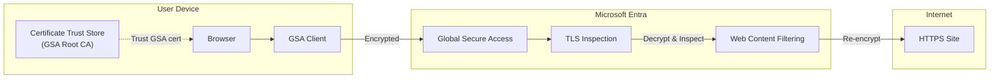
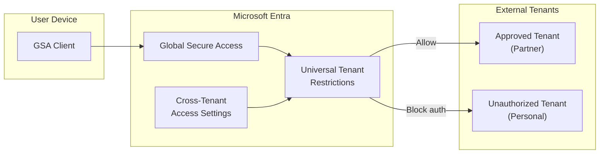
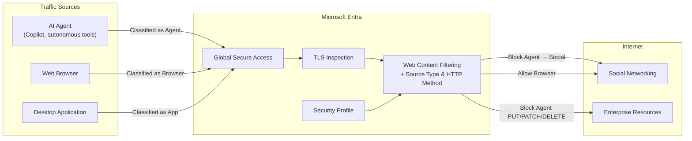
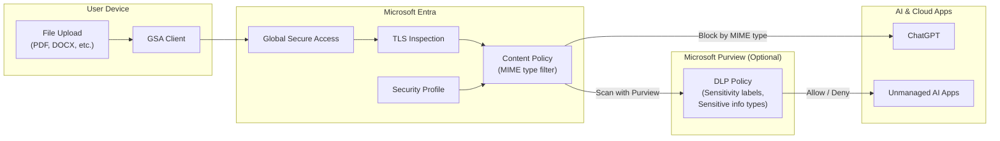
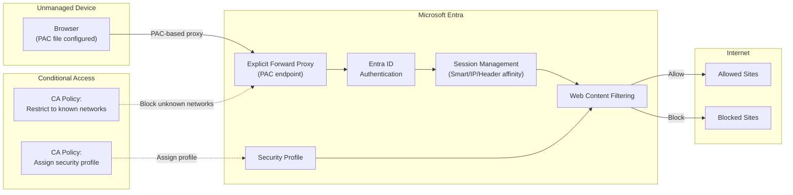
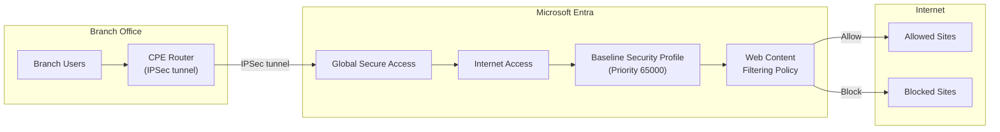

# Internet Access Scenarios

## Scenario: internet-access-wcf

**Name:** Entra Internet Access - Web Content Filtering
**Description:** Configure web content filtering to control access to internet websites based on content categories. This enables organizations to enforce acceptable use policies and block access to malicious or inappropriate content.
**Products:** Microsoft Entra Internet Access, Global Secure Access
**Complexity:** Medium
**Estimated Time:** 30 minutes

### Prerequisites

- **Licenses:** Microsoft Entra Suite OR Microsoft Entra Internet Access
- **Roles:** Global Administrator OR Security Administrator
- **Infrastructure:**
  - Test device with Windows 10/11 (22H2+) for GSA Client
  - GSA activated and Internet Access traffic forwarding enabled

### Architecture

```mermaid
flowchart LR
    subgraph User["User Device"]
        GSAClient["GSA Client"]
    end

    subgraph Entra["Microsoft Entra"]
        GSA["Global Secure Access"]
        IA["Internet Access"]
        WCF["Web Content<br/>Filtering Policy"]
        SP["Security Profile"]
        CA["Conditional Access"]
    end

    subgraph Internet["Internet"]
        Allowed["Allowed Sites"]
        Blocked["Blocked Sites"]
    end

    GSAClient -->|"Internet traffic"| GSA
    GSA --> IA
    IA --> WCF
    WCF -->|"Allow"| Allowed
    WCF -->|"Block"| Blocked
    SP --> WCF
    CA -.->|"Link profile"| SP
```

### Configuration Steps

1. **Activate Global Secure Access** (if not already done)
   - Component: Global Secure Access
   - Portal Path: **Entra admin center** > **Global Secure Access** > **Get started**
   - Graph API: GET /beta/networkAccess/settings

2. **Enable Internet Access traffic forwarding profile**
   - Component: Traffic Forwarding
   - Portal Path: **Global Secure Access** > **Connect** > **Traffic forwarding** > **Internet access profile**
   - Graph API: PATCH /beta/networkAccess/forwardingProfiles/{id}
   - Body: `{"state": "enabled"}`

3. **Create web content filtering policy**
   - Component: Internet Access
   - Portal Path: **Global Secure Access** > **Secure** > **Web content filtering policies** > **Create policy**
   - Graph API: POST /beta/networkAccess/filteringPolicies
   - Body: Policy with rule to block specific categories (e.g., Gambling, Adult Content, Social Networking)
   - Validation: GET /beta/networkAccess/filteringPolicies -> policy exists

4. **Create security profile**
   - Component: Internet Access
   - Portal Path: **Global Secure Access** > **Secure** > **Security profiles** > **Create profile**
   - Graph API: POST /beta/networkAccess/filteringProfiles
   - Body: Profile linking to the web content filtering policy
   - Validation: GET /beta/networkAccess/filteringProfiles -> profile exists with linked policy

5. **Create Conditional Access policy with security profile**
   - Component: Conditional Access
   - Portal Path: **Entra admin center** > **Protection** > **Conditional Access** > **New policy**
   - Target: Pilot group, Internet traffic, Session control: Use Global Secure Access security profile
   - Start in report-only mode

6. **Deploy GSA Client and test**
   - Component: GSA Client
   - Install GSA Client on test device
   - Verify blocked categories are inaccessible

### Validation Steps

1. **Policy creation**
   - Type: automated
   - Description: Verify web content filtering policy exists with correct category rules

2. **Profile linkage**
   - Type: automated
   - Description: Verify security profile is linked to the filtering policy

3. **Block verification**
   - Type: manual
   - Description: From test device, attempt to access a site in a blocked category and verify it is blocked

4. **Allow verification**
   - Type: manual
   - Description: From test device, access a site in an allowed category and verify it loads normally

5. **Traffic logs**
   - Type: automated
   - Description: Check GSA traffic logs for blocked and allowed traffic entries

---

## Scenario: internet-access-security-profiles

**Name:** Entra Internet Access - Security Profiles
**Description:** Configure multiple security profiles with different filtering policies for different user groups. This enables differentiated internet access policies based on role or department.
**Products:** Microsoft Entra Internet Access, Global Secure Access
**Complexity:** Medium
**Estimated Time:** 45 minutes

### Prerequisites

- **Licenses:** Microsoft Entra Suite OR Microsoft Entra Internet Access
- **Roles:** Global Administrator OR Security Administrator
- **Infrastructure:**
  - GSA activated and Internet Access enabled
  - Multiple security groups for different user populations
  - Test devices

### Architecture

```mermaid
flowchart TB
    subgraph Users["User Groups"]
        Exec["Executives"]
        Eng["Engineering"]
        HR["HR Staff"]
    end

    subgraph Profiles["Security Profiles"]
        SP1["Executive Profile<br/>(Permissive)"]
        SP2["Engineering Profile<br/>(Standard)"]
        SP3["HR Profile<br/>(Restrictive)"]
    end

    subgraph Policies["Filtering Policies"]
        P1["Allow social media"]
        P2["Block social media<br/>Allow dev tools"]
        P3["Block social media<br/>Block streaming"]
    end

    Exec --> SP1 --> P1
    Eng --> SP2 --> P2
    HR --> SP3 --> P3
```

### Configuration Steps

1. **Create security groups for each user population**
2. **Create web content filtering policies per group** (different category rules)
3. **Create security profiles linking to respective policies**
4. **Create Conditional Access policies per group** linking to the appropriate security profile
5. **Test with users from each group**

### Validation Steps

1. **Group-specific filtering**
   - Type: manual
   - Description: Log in as a user from each group and verify the correct filtering policy applies

2. **Cross-group isolation**
   - Type: manual
   - Description: Verify an engineering user is blocked from social media while an executive is not

---

## Scenario: internet-access-tls-inspection

**Name:** Entra Internet Access - TLS Inspection
**Description:** Enable TLS inspection to decrypt and inspect HTTPS traffic for security threats and policy enforcement. This provides visibility into encrypted traffic that would otherwise bypass content filtering.
**Products:** Microsoft Entra Internet Access, Global Secure Access
**Complexity:** High
**Estimated Time:** 60 minutes

### Prerequisites

- **Licenses:** Microsoft Entra Suite OR Microsoft Entra Internet Access
- **Roles:** Global Administrator OR Security Administrator
- **Infrastructure:**
  - GSA activated and Internet Access enabled
  - Ability to deploy trusted root certificate to test devices
  - Test devices with Windows 10/11

### Architecture

```mermaid
flowchart LR
    subgraph Device["User Device"]
        Browser["Browser"]
        GSAClient["GSA Client"]
        TrustStore["Certificate Trust Store<br/>(GSA Root CA)"]
    end

    subgraph Entra["Microsoft Entra"]
        GSA["Global Secure Access"]
        TLS["TLS Inspection"]
        WCF["Web Content Filtering"]
    end

    subgraph Internet
        Site["HTTPS Site"]
    end

    Browser --> GSAClient
    GSAClient -->|"Encrypted"| GSA
    GSA --> TLS
    TLS -->|"Decrypt & Inspect"| WCF
    WCF -->|"Re-encrypt"| Site
    TrustStore -.->|"Trust GSA cert"| Browser
```

### Configuration Steps

1. **Enable TLS inspection in Internet Access settings**
   - Component: Internet Access
   - Portal Path: **Global Secure Access** > **Secure** > **TLS inspection**
   - Enable TLS inspection feature

2. **Download and deploy the GSA root certificate**
   - Component: Certificate Management
   - Download the GSA trusted root certificate from the admin center
   - Deploy to test devices via GPO, Intune, or manual install

3. **Configure TLS inspection policy**
   - Define which traffic to inspect (by category, domain, or all)
   - Define bypass rules for sensitive sites (banking, healthcare)

4. **Update web content filtering policies**
   - Enable HTTPS category matching (previously only HTTP was inspectable)

5. **Test with blocked HTTPS site**
   - Verify HTTPS traffic is inspected and filtered

### Validation Steps

1. **Certificate deployment**
   - Type: manual
   - Description: Verify the GSA root certificate is in the trusted root store on test devices

2. **HTTPS filtering**
   - Type: manual
   - Description: Access a blocked-category HTTPS site and verify it is blocked (not just HTTP)

3. **Bypass rules**
   - Type: manual
   - Description: Verify banking/healthcare sites are not inspected (no certificate warning)

---

## Scenario: internet-access-utr

**Name:** Entra Internet Access - Universal Tenant Restrictions
**Description:** Configure Universal Tenant Restrictions (UTR) to prevent data exfiltration by blocking authentication to unauthorized tenants. This ensures users can only access corporate resources and approved external tenants.
**Products:** Microsoft Entra Internet Access, Global Secure Access
**Complexity:** Medium
**Estimated Time:** 30 minutes

### Prerequisites

- **Licenses:** Microsoft Entra Suite OR Microsoft Entra Internet Access
- **Roles:** Global Administrator OR Security Administrator
- **Infrastructure:**
  - GSA activated and Internet Access enabled
  - Cross-tenant access settings configured
  - Test devices with GSA Client

### Architecture

```mermaid
flowchart LR
    subgraph Device["User Device"]
        GSAClient["GSA Client"]
    end

    subgraph Entra["Microsoft Entra"]
        GSA["Global Secure Access"]
        UTR["Universal Tenant<br/>Restrictions"]
        CTA["Cross-Tenant<br/>Access Settings"]
    end

    subgraph External["External Tenants"]
        Approved["Approved Tenant<br/>(Partner)"]
        Blocked["Unauthorized Tenant<br/>(Personal)"]
    end

    GSAClient --> GSA
    GSA --> UTR
    UTR -->|"Allow"| Approved
    UTR -->|"Block auth"| Blocked
    CTA --> UTR
```

### Configuration Steps

1. **Configure cross-tenant access settings**
   - Component: Entra ID
   - Portal Path: **Entra admin center** > **External Identities** > **Cross-tenant access settings**
   - Define default policy (block) and partner-specific policies (allow)

2. **Enable Universal Tenant Restrictions**
   - Component: Internet Access
   - Portal Path: **Global Secure Access** > **Secure** > **Universal tenant restrictions**
   - Enable UTR and link to cross-tenant access settings

3. **Configure allowed tenant list**
   - Add partner tenant IDs to the allowed list
   - Block all other tenants

4. **Test authentication to external tenants**
   - Verify users can authenticate to approved partner tenants
   - Verify users are blocked from personal or unauthorized tenants

### Validation Steps

1. **Approved tenant access**
   - Type: manual
   - Description: Attempt to sign in to an approved partner tenant's app and verify success

2. **Blocked tenant access**
   - Type: manual
   - Description: Attempt to sign in to an unauthorized tenant and verify block

3. **UTR headers**
   - Type: automated
   - Description: Verify GSA is injecting tenant restriction headers in traffic logs

---

## Scenario: internet-access-source-type-filtering

**Name:** Entra Internet Access - Source Traffic Type & HTTP Method Filtering (Preview)
**Description:** Configure source traffic type filtering and HTTP method request filtering to enforce differentiated web access policies based on the origin of traffic (AI agents, browsers, applications) and the HTTP method used. This enables governance of AI agent internet access while preserving user productivity.
**Products:** Microsoft Entra Internet Access, Global Secure Access
**Complexity:** Medium
**Estimated Time:** 45 minutes

### Prerequisites

- **Licenses:** Microsoft Entra Suite OR Microsoft Entra Internet Access
- **Roles:** Global Secure Access Administrator OR Security Administrator
- **Infrastructure:**
  - GSA activated and Internet Access traffic forwarding enabled
  - TLS inspection enabled (required for HTTP method enforcement on HTTPS)
  - Test device with Windows 10/11 and GSA Client installed
  - Source traffic type filtering requires client-based connections (remote networks not supported)

### Architecture

```mermaid
flowchart LR
    subgraph Sources["Traffic Sources"]
        Agent["AI Agent<br/>(Copilot, autonomous tools)"]
        Browser["Web Browser"]
        App["Desktop Application"]
    end

    subgraph Entra["Microsoft Entra"]
        GSA["Global Secure Access"]
        TLS["TLS Inspection"]
        WCF["Web Content Filtering<br/>+ Source Type & HTTP Method"]
        SP["Security Profile"]
    end

    subgraph Internet["Internet"]
        SocialMedia["Social Networking"]
        Enterprise["Enterprise Resources"]
    end

    Agent -->|"Classified as Agent"| GSA
    Browser -->|"Classified as Browser"| GSA
    App -->|"Classified as App"| GSA
    GSA --> TLS
    TLS --> WCF
    WCF -->|"Block Agent → Social"| SocialMedia
    WCF -->|"Block Agent PUT/PATCH/DELETE"| Enterprise
    WCF -->|"Allow Browser"| SocialMedia
    SP --> WCF
```

### Configuration Steps

1. **Verify TLS inspection is enabled**
   - Component: Internet Access
   - Portal Path: **Global Secure Access** > **Secure** > **TLS inspection**
   - Validation: TLS inspection is enabled (required for HTTP method enforcement on HTTPS traffic)

2. **Create web content filtering policy — Block AI agents from social networking**
   - Component: Internet Access
   - Portal Path: **Global Secure Access** > **Secure** > **Web content filtering policies** > **Create policy**
   - Graph API: POST /beta/networkAccess/filteringPolicies
   - Configuration:
     - Add rule: Select "Social Networking" web category
     - Enable **Source type** condition → Select **Agent**
     - Action: **Block**
   - Note: This blocks AI agent traffic to social networking while allowing browser/app users

3. **Create web content filtering policy — Block AI agent write operations**
   - Component: Internet Access
   - Portal Path: **Global Secure Access** > **Secure** > **Web content filtering policies** > **Create policy**
   - Configuration:
     - Add rule: Select destination URLs/FQDNs or web categories to protect
     - Enable **Source type** condition → Select **Agent**
     - Enable **HTTP method request** condition → Select **PUT**, **PATCH**, **DELETE**
     - Action: **Block**
   - Note: Blocks AI agents from performing write operations while allowing GET (read-only)

4. **Create security profile and link policies**
   - Component: Internet Access
   - Portal Path: **Global Secure Access** > **Secure** > **Security profiles** > **Create profile**
   - Graph API: POST /beta/networkAccess/filteringProfiles
   - Link both filtering policies to the security profile with appropriate priorities

5. **Create Conditional Access policy with security profile**
   - Component: Conditional Access
   - Portal Path: **Entra admin center** > **Protection** > **Conditional Access** > **New policy**
   - Target: Pilot group, All internet resources with Global Secure Access
   - Session control: Use Global Secure Access security profile
   - Start in report-only mode, then enable

6. **Test with different traffic sources**
   - Generate AI agent traffic (e.g., Copilot agent) to a social networking site → expect block
   - Open browser and access the same social networking site → expect allow
   - Generate AI agent PATCH request to a protected resource → expect block
   - Generate AI agent GET request to the same resource → expect allow

### Validation Steps

1. **Agent block verification**
   - Type: manual
   - Description: Use an AI agent to request a social networking URL and verify the request is blocked

2. **Browser allow verification**
   - Type: manual
   - Description: Open a browser and access the same social networking site; verify it loads normally

3. **HTTP method block verification**
   - Type: manual
   - Description: Use an AI agent to send a PUT/PATCH/DELETE request to a protected resource and verify it is blocked

4. **HTTP method allow verification**
   - Type: manual
   - Description: Use an AI agent to send a GET request to the same resource and verify it succeeds

5. **Traffic logs**
   - Type: automated
   - Description: Check GSA traffic logs (Global Secure Access > Monitor > Traffic logs) for source type classification and blocked/allowed entries

---

## Scenario: internet-access-content-filtering

**Name:** Entra Internet Access - Network Content Filtering & Purview DLP Integration
**Description:** Configure content policies to filter network file content by MIME type and optionally integrate with Microsoft Purview Data Loss Prevention to inspect files for sensitive data before allowing uploads to AI applications and unmanaged cloud services. This prevents data exfiltration via file uploads to generative AI destinations.
**Products:** Microsoft Entra Internet Access, Global Secure Access, Microsoft Purview (optional for Scan with Purview)
**Complexity:** High
**Estimated Time:** 60 minutes

### Prerequisites

- **Licenses:** Microsoft Entra Suite OR Microsoft Entra Internet Access; Microsoft Purview license (required only for Scan with Purview action)
- **Roles:** Global Secure Access Administrator, Conditional Access Administrator; DLP Compliance Management or Information Protection Admin (for Purview integration)
- **Infrastructure:**
  - GSA activated and Internet Access traffic forwarding enabled
  - TLS inspection enabled and configured
  - GSA Client installed on test device
  - Microsoft Purview pay-as-you-go billing configured (for Scan with Purview)

### Architecture

```mermaid
flowchart LR
    subgraph Device["User Device"]
        GSAClient["GSA Client"]
        Upload["File Upload<br/>(PDF, DOCX, etc.)"]
    end

    subgraph Entra["Microsoft Entra"]
        GSA["Global Secure Access"]
        TLS["TLS Inspection"]
        CP["Content Policy<br/>(MIME type filter)"]
        SP["Security Profile"]
    end

    subgraph Purview["Microsoft Purview (Optional)"]
        DLP["DLP Policy<br/>(Sensitivity labels,<br/>Sensitive info types)"]
    end

    subgraph Internet["AI & Cloud Apps"]
        ChatGPT["ChatGPT"]
        UnmanagedAI["Unmanaged AI Apps"]
    end

    Upload --> GSAClient
    GSAClient --> GSA
    GSA --> TLS
    TLS --> CP
    CP -->|"Block by MIME type"| ChatGPT
    CP -->|"Scan with Purview"| DLP
    DLP -->|"Allow / Deny"| UnmanagedAI
    SP --> CP
```

### Configuration Steps

1. **Verify TLS inspection is enabled**
   - Component: Internet Access
   - Portal Path: **Global Secure Access** > **Secure** > **TLS inspection**
   - TLS inspection must be enabled for content inspection of HTTPS uploads

2. **Create a content policy**
   - Component: Internet Access
   - Portal Path: **Global Secure Access** > **Secure** > **Content policies** > **Create Policy**
   - Configuration:
     - Name: "Block Sensitive File Uploads to AI"
     - Add rule:
       - Action: **Block** (basic) or **Scan with Purview** (advanced)
       - Matching conditions → Activities: **Upload**
       - Matching conditions → Content types: Select file types (e.g., PDF, DOCX, XLSX)
       - Destinations: Add specific upload endpoints (e.g., `https://chatgpt.com/backend-api/files`, `*.oaiusercontent.com`)
   - Note: Use browser developer tools to identify exact upload endpoints for target apps

3. **Link content policy to a security profile**
   - Component: Internet Access
   - Portal Path: **Global Secure Access** > **Secure** > **Security profiles** > Select profile > **Link policies**
   - Select **Link a policy** > **Existing Content policy**
   - Select the content policy created in step 2

4. **Create Conditional Access policy**
   - Component: Conditional Access
   - Portal Path: **Entra admin center** > **Protection** > **Conditional Access** > **New policy**
   - Target: Users/groups, All internet resources with Global Secure Access
   - Session: Use Global Secure Access security profile

5. **(Optional) Configure Purview DLP policy for Scan with Purview**
   - Component: Microsoft Purview
   - Portal Path: **Microsoft Purview portal** > **Data loss prevention** > **Policies** > **Create policy**
   - Configuration:
     - Select **Inline web traffic** template
     - Add cloud apps: Select target AI apps (e.g., ChatGPT, "All unmanaged AI apps")
     - Location: Enable **Network**
     - Create rule: Content contains → Sensitivity labels or Sensitive information types (e.g., credit card numbers, SSN)
     - Action: Restrict browser and network activities → Block file upload
     - Turn policy on immediately or run in simulation mode

6. **Test file upload blocking**
   - Attempt to upload a PDF to ChatGPT → expect block
   - Attempt to upload an allowed file type → expect allow
   - (If Scan with Purview) Upload a file with sensitive content → expect block with DLP alert

### Validation Steps

1. **Basic content policy block**
   - Type: manual
   - Description: Upload a file matching the blocked MIME type to a configured destination and verify it is blocked

2. **Allowed file type verification**
   - Type: manual
   - Description: Upload a file type not in the content policy and verify it succeeds

3. **Traffic logs**
   - Type: automated
   - Description: Check Global Secure Access > Monitor > Traffic logs for content policy enforcement entries

4. **Purview DLP alerts (if Scan with Purview enabled)**
   - Type: manual
   - Description: Check Microsoft Purview portal > Data loss prevention > Alerts for matching alert; review Activity explorer for Network DLP activities

5. **Known limitation awareness**
   - Type: manual
   - Description: Verify that text-based content is not filtered (only files are supported) and that WebSocket-based apps (e.g., Copilot) are not affected

---

## Scenario: internet-access-explicit-forward-proxy

**Name:** Entra Internet Access - Explicit Forward Proxy (Preview)
**Description:** Configure Explicit Forward Proxy (EFP) to provide secure internet access for environments where the GSA Client cannot be installed, such as unmanaged devices, BYOD, or legacy systems. EFP uses PAC file-based proxy configuration with Microsoft Entra ID authentication and supports security profile enforcement through Conditional Access.
**Products:** Microsoft Entra Internet Access, Global Secure Access
**Complexity:** High
**Estimated Time:** 60 minutes

### Prerequisites

- **Licenses:** Microsoft Entra Suite OR Microsoft Entra Internet Access
- **Roles:** Global Secure Access Administrator, Conditional Access Administrator
- **Infrastructure:**
  - GSA activated and Internet Access enabled
  - Security profile configured with filtering policies
  - Named location defined for trusted company networks
  - Test device (can be unmanaged) with browser that supports PAC file configuration

### Architecture

```mermaid
flowchart LR
    subgraph Unmanaged["Unmanaged Device"]
        Browser["Browser<br/>(PAC file configured)"]
    end

    subgraph Entra["Microsoft Entra"]
        EFP["Explicit Forward Proxy<br/>(PAC endpoint)"]
        Auth["Entra ID<br/>Authentication"]
        Session["Session Management<br/>(Smart/IP/Header affinity)"]
        SP["Security Profile"]
        WCF["Web Content Filtering"]
    end

    subgraph CA["Conditional Access"]
        CAPolicy1["CA Policy:<br/>Restrict to known networks"]
        CAPolicy2["CA Policy:<br/>Assign security profile"]
    end

    subgraph Internet["Internet"]
        Allowed["Allowed Sites"]
        Blocked["Blocked Sites"]
    end

    Browser -->|"PAC-based proxy"| EFP
    EFP --> Auth
    Auth --> Session
    Session --> WCF
    CAPolicy1 -.->|"Block unknown networks"| EFP
    CAPolicy2 -.->|"Assign profile"| SP
    SP --> WCF
    WCF -->|"Allow"| Allowed
    WCF -->|"Block"| Blocked
```

### Configuration Steps

1. **Enable Explicit Forward Proxy**
   - Component: Global Secure Access
   - Portal Path: **Global Secure Access** > **Session management** > Enable Explicit Forward Proxy
   - Note: Enabling EFP creates the `GSA-ExplicitForwardProxy` workload identity in the tenant

2. **Define named location for trusted networks**
   - Component: Conditional Access
   - Portal Path: **Entra admin center** > **Protection** > **Conditional Access** > **Named locations**
   - Create a named location representing your organization's known egress IP ranges

3. **Create Conditional Access policy — Restrict EFP to known networks**
   - Component: Conditional Access
   - Portal Path: **Entra admin center** > **Protection** > **Conditional Access** > **New policy**
   - Configuration:
     - Users: All Users (exclude break-glass accounts)
     - Target resources: Select resources → `GSA-ExplicitForwardProxy` workload identity
     - Network: Include Any network; Exclude the named location (trusted networks)
     - Grant: **Block**
     - Enable policy

4. **Create Conditional Access policy — Assign security profile to EFP**
   - Component: Conditional Access
   - Portal Path: **Entra admin center** > **Protection** > **Conditional Access** > **New policy**
   - Configuration:
     - Users: Target users/groups
     - Target resources: Select resources → `GSA-ExplicitForwardProxy` workload identity
     - Session: **Use Global Secure Access security profile** → Select profile
     - Enable policy
   - Note: EFP is NOT included in "All internet resources with Global Secure Access" — must target explicitly

5. **Distribute PAC file to devices**
   - Component: Device Configuration
   - Obtain PAC file URL from Global Secure Access session management settings
   - Configure browser or OS proxy settings to use the PAC file URL
   - Options: GPO, Intune, WPAD, or manual browser configuration

6. **Test authentication and filtering**
   - Open browser on unmanaged device with PAC configured
   - Verify Entra ID authentication prompt appears
   - Access blocked category → expect block
   - Access allowed category → expect allow

### Validation Steps

1. **Authentication flow**
   - Type: manual
   - Description: On a device with the PAC file configured, open a browser and verify the Entra ID authentication prompt appears on first request

2. **Network restriction**
   - Type: manual
   - Description: Attempt to use EFP from an untrusted network and verify access is blocked by the CA policy

3. **Security profile enforcement**
   - Type: manual
   - Description: Access a blocked web category through EFP and verify filtering is applied correctly

4. **Session persistence**
   - Type: manual
   - Description: Verify that after initial authentication, subsequent requests do not require re-authentication (session affinity working)

5. **CAE revocation**
   - Type: manual
   - Description: Disable the test user account and verify EFP session is revoked within 2-5 minutes (Continuous Access Evaluation)

---

## Scenario: internet-access-remote-network

**Name:** Entra Internet Access - Remote Network Security via Baseline Profile
**Description:** Apply web content filtering policies to remote network (branch office) traffic using the baseline security profile. The baseline profile enforces tenant-wide policies at the lowest priority without requiring Conditional Access policies or GSA Client installation, making it ideal for securing branch offices connected via IPSec tunnels.
**Products:** Microsoft Entra Internet Access, Global Secure Access
**Complexity:** Medium
**Estimated Time:** 30 minutes

### Prerequisites

- **Licenses:** Microsoft Entra Suite OR Microsoft Entra Internet Access
- **Roles:** Global Secure Access Administrator
- **Infrastructure:**
  - GSA activated and Internet Access traffic forwarding enabled
  - Remote network configured and connected (IPSec tunnel established)
  - Web content filtering policy already created

### Architecture

```mermaid
flowchart LR
    subgraph Branch["Branch Office"]
        Users["Branch Users"]
        Router["CPE Router<br/>(IPSec tunnel)"]
    end

    subgraph Entra["Microsoft Entra"]
        GSA["Global Secure Access"]
        IA["Internet Access"]
        Baseline["Baseline Security Profile<br/>(Priority 65000)"]
        WCF["Web Content<br/>Filtering Policy"]
    end

    subgraph Internet["Internet"]
        Allowed["Allowed Sites"]
        Blocked["Blocked Sites"]
    end

    Users --> Router
    Router -->|"IPSec tunnel"| GSA
    GSA --> IA
    IA --> Baseline
    Baseline --> WCF
    WCF -->|"Allow"| Allowed
    WCF -->|"Block"| Blocked
```

### Configuration Steps

1. **Verify remote network connectivity**
   - Component: Global Secure Access
   - Portal Path: **Global Secure Access** > **Connect** > **Remote networks**
   - Validation: Remote network shows connected status (IPSec tunnel active)

2. **Create or select a web content filtering policy**
   - Component: Internet Access
   - Portal Path: **Global Secure Access** > **Secure** > **Web content filtering policies**
   - Create or select an existing policy with appropriate category rules
   - Note: Source traffic type rules are NOT supported for remote network traffic

3. **Link policy to the baseline security profile**
   - Component: Internet Access
   - Portal Path: **Global Secure Access** > **Secure** > **Security profiles** > **Baseline profile**
   - Select **Link a policy** > **Existing policy**
   - Choose the web content filtering policy and assign priority
   - Select **Add** and **Save**
   - Note: The baseline profile applies automatically to all traffic — no CA policy required

4. **Verify policy enforcement from remote network**
   - From a device on the remote network, browse to a blocked category
   - Check traffic logs with DeviceCategory filter for remote network traffic

### Validation Steps

1. **Baseline profile enforcement**
   - Type: manual
   - Description: From a device on the remote network (not using GSA Client), access a blocked category site and verify it is blocked

2. **Allowed traffic verification**
   - Type: manual
   - Description: Access an allowed category site from the remote network and verify it loads normally

3. **Traffic logs with remote network filter**
   - Type: automated
   - Description: Check Global Secure Access > Monitor > Traffic logs; filter by DeviceCategory to confirm remote network traffic is being filtered

4. **Priority override verification**
   - Type: manual
   - Description: If a GSA Client user on the remote network has a higher-priority CA-linked security profile, verify that the user-specific profile takes precedence over the baseline (priority 65000)

5. **Policy propagation timing**
   - Type: manual
   - Description: Verify that changes to the baseline profile take effect within a few minutes for remote network traffic
