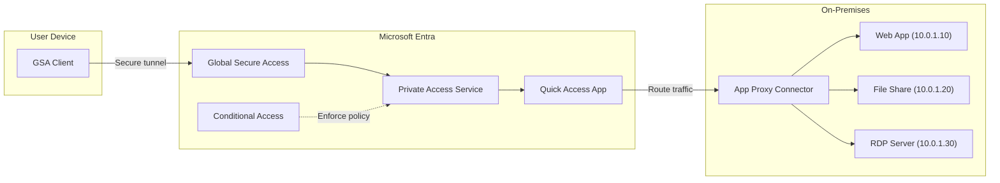
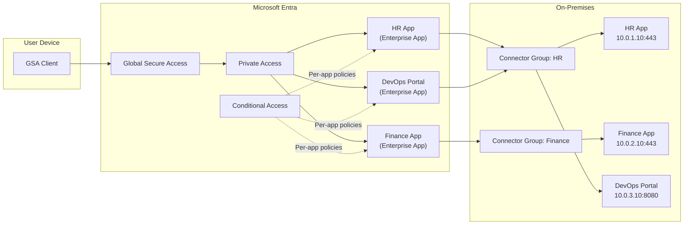
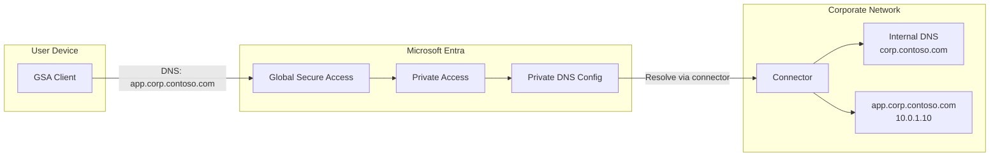

# Private Access Scenarios

## Choosing Between Quick Access and Enterprise Apps (Per-App Access)

Before configuring Private Access, determine which publishing model fits the administrator's use case:

| Criteria | Quick Access | Enterprise App (Per-App Access) |
|---|---|---|
| **Use case** | VPN replacement; broad network-level access | Publishing specific applications or servers |
| **Network segments** | Wide IP ranges (e.g., `10.0.0.0/8`, `172.16.0.0/12`) or wildcard FQDNs (e.g., `*.corp.contoso.com`) | Specific IPs and ports (e.g., `10.0.1.10:443`, `10.0.2.20:3389`) |
| **Granularity** | Single app with many segments — all-or-nothing access | One enterprise app per resource — granular user and policy assignment |
| **Conditional Access** | One policy covers all Quick Access traffic | Per-app policies with different controls per resource |
| **When to recommend** | Admin wants to replace a VPN or provide broad subnet access quickly | Admin wants to publish a specific app, database, or small set of servers |

> [!IMPORTANT]
> Default to **Enterprise App (Per-App Access)** when the administrator describes specific applications, individual servers, or discrete IP/port combinations. Only recommend **Quick Access** when the scenario is explicitly a VPN replacement, involves wide subnet ranges, or uses wildcard FQDNs.

---

## Scenario: private-access-quick-access

**Name:** Entra Private Access - Quick Access (VPN Replacement)
**Description:** Configure Quick Access to replace traditional VPN by providing broad network-level access to private resources through wide IP ranges or wildcard FQDNs. Quick Access is appropriate when the goal is VPN replacement or when the administrator needs to publish entire subnets or wildcard domains. For publishing specific applications or servers with discrete IP/port combinations, use Per-App Access with individual enterprise applications instead.
**Products:** Microsoft Entra Private Access, Global Secure Access
**Complexity:** Medium
**Estimated Time:** 45 minutes

### Prerequisites

- **Licenses:** Microsoft Entra Suite OR Microsoft Entra Private Access (assigned to pilot users)
- **Roles:** Global Administrator OR (Security Administrator + Application Administrator)
- **Infrastructure:**
  - Windows Server 2019+ with network line-of-sight to private resources for connector installation
  - Test device with Windows 10/11 (22H2+) for GSA Client
  - Private resources accessible from the connector server (e.g., internal web app, file share, RDP target)

### Architecture

### Configuration Steps

1. **Activate Global Secure Access**
   - Component: Global Secure Access
   - Portal Path: **Entra admin center** > **Global Secure Access** > **Get started**
   - Graph API: GET /beta/networkAccess/settings
   - Validation: GET /beta/networkAccess/settings -> `{"isEnabled": true}`

2. **Enable Private Access traffic forwarding profile**
   - Component: Traffic Forwarding
   - Portal Path: **Global Secure Access** > **Connect** > **Traffic forwarding** > **Private access profile**
   - Graph API: PATCH /beta/networkAccess/forwardingProfiles/{id}
   - Body: `{"state": "enabled"}`
   - Validation: GET /beta/networkAccess/forwardingProfiles -> profile with `state: "enabled"`

3. **Install Microsoft Entra private network connector**
   - Component: Connectors
   - Portal Path: **Global Secure Access** > **Connect** > **Connectors** > **Download connector service**
   - Graph API: N/A (manual installation on Windows Server)
   - Validation: GET /beta/onPremisesPublishingProfiles/applicationProxy/connectors -> connector shows `status: "active"`

4. **Create connector group**
   - Component: Connectors
   - Portal Path: **Global Secure Access** > **Connect** > **Connectors** > **New connector group**
   - Graph API: POST /beta/onPremisesPublishingProfiles/applicationProxy/connectorGroups
   - Body: `{"name": "POC-ConnectorGroup", "region": "nam"}`
   - Validation: GET /beta/onPremisesPublishingProfiles/applicationProxy/connectorGroups -> group exists

5. **Assign connector to group**
   - Component: Connectors
   - Portal Path: Select connector > Change group
   - Graph API: POST /beta/onPremisesPublishingProfiles/applicationProxy/connectorGroups/{groupId}/members/$ref
   - Body: `{"@odata.id": "https://graph.microsoft.com/beta/onPremisesPublishingProfiles/applicationProxy/connectors/{connectorId}"}`

6. **Configure Quick Access application**
   - Component: Private Access
   - Portal Path: **Global Secure Access** > **Applications** > **Quick Access** > **Add Quick Access application segment**
   - Graph API: POST /beta/networkAccess/connectivity/remoteNetworks (or enterprise app configuration)
   - Body: Application segment with FQDNs/IP ranges and ports
   - Validation: GET the Quick Access enterprise app -> segments configured

7. **Create pilot security group**
   - Component: Entra ID
   - Portal Path: **Entra admin center** > **Groups** > **All groups** > **New group**
   - Graph API: POST /v1.0/groups
   - Body: `{"displayName": "POC-PrivateAccess-Pilot", "mailEnabled": false, "mailNickname": "poc-pa-pilot", "securityEnabled": true}`

8. **Assign users to pilot group**
   - Component: Entra ID
   - Portal Path: Select group > **Members** > **Add members**
   - Graph API: POST /v1.0/groups/{groupId}/members/$ref

9. **Assign Quick Access app to pilot group**
   - Component: Enterprise Apps
   - Portal Path: **Enterprise applications** > **Quick Access** > **Users and groups**
   - Graph API: POST /v1.0/servicePrincipals/{spId}/appRoleAssignments

10. **Create Conditional Access policy for Private Access**
    - Component: Conditional Access
    - Portal Path: **Entra admin center** > **Protection** > **Conditional Access** > **New policy**
    - Graph API: POST /v1.0/identity/conditionalAccessPolicies
    - Body: Policy targeting pilot group, Global Secure Access app, requiring compliant device or MFA
    - Validation: GET /v1.0/identity/conditionalAccessPolicies/{id} -> policy exists in report-only mode

11. **Install GSA Client on test device**
    - Component: GSA Client
    - Portal Path: **Global Secure Access** > **Connect** > **Client download**
    - Manual: Download and install on Windows 10/11 test device
    - Validation: GSA Client system tray shows "Connected"

### Validation Steps

1. **Connector connectivity**
   - Type: automated
   - Description: Verify connector shows "Active" status in the admin center

2. **Quick Access application segments**
   - Type: automated
   - Description: Verify application segments are configured with correct FQDNs/IPs and ports

3. **GSA Client connectivity**
   - Type: manual
   - Description: On test device, verify GSA Client icon shows "Connected" in system tray

4. **Private resource access**
   - Type: manual
   - Description: From test device, access a private resource (web app, file share, or RDP) and verify connectivity

5. **Traffic logging**
   - Type: automated
   - Description: Check GSA traffic logs for private access traffic from the test device

---

## Scenario: private-access-per-app

**Name:** Entra Private Access - Per-App Access (Enterprise Apps)
**Description:** Configure per-application access by creating individual enterprise applications (private access apps) for specific resources with discrete IP/port combinations. This is the **recommended approach** when publishing specific applications, databases, or servers (e.g., `10.0.1.10:443`, `10.0.2.20:3389`). Each enterprise app gets its own user assignments and Conditional Access policy, enabling true zero trust per-resource access control. Use Quick Access only for VPN replacement scenarios involving wide IP ranges or wildcard FQDNs.
**Products:** Microsoft Entra Private Access, Global Secure Access
**Complexity:** High
**Estimated Time:** 90 minutes

### Prerequisites

- **Licenses:** Microsoft Entra Suite OR Microsoft Entra Private Access
- **Roles:** Global Administrator OR (Security Administrator + Application Administrator)
- **Infrastructure:**
  - Windows Server 2019+ with connector installed (Quick Access prerequisites apply)
  - Multiple private applications/resources to publish individually
  - Test device with Windows 10/11 (22H2+)

### Architecture

### Configuration Steps

1. **Complete Quick Access prerequisites** (Steps 1-4 from quick-access scenario)
   - Activate GSA, enable traffic forwarding, install connector, create connector group

2. **Create per-app enterprise applications**
   - Component: Private Access
   - Portal Path: **Global Secure Access** > **Applications** > **Enterprise applications** > **New application**
   - Create one enterprise app per private resource
   - Configure application segments (FQDN/IP, ports, protocol) for each

3. **Assign connector groups per application**
   - Component: Connectors
   - Assign each enterprise app to the appropriate connector group based on network topology

4. **Configure user/group assignments per application**
   - Component: Enterprise Apps
   - Assign specific users/groups to each application (not all users)

5. **Create per-app Conditional Access policies**
   - Component: Conditional Access
   - Create separate CA policies per application with appropriate controls
   - Example: HR App requires MFA + compliant device; DevOps requires managed device only

6. **Deploy GSA Client and test each application**
   - Component: GSA Client
   - Verify each application is accessible to assigned users and inaccessible to unassigned users

### Validation Steps

1. **Per-app isolation**
   - Type: manual
   - Description: Verify User A can access App 1 but not App 2 (if only assigned to App 1)

2. **Per-app CA enforcement**
   - Type: manual
   - Description: Verify different CA policies apply to different apps

3. **Traffic segmentation**
   - Type: automated
   - Description: Verify traffic logs show correct app assignment per user

---

## Scenario: private-access-private-dns

**Name:** Entra Private Access - Private DNS
**Description:** Configure Private DNS to enable DNS-based access to private resources using internal DNS names, providing a seamless user experience similar to being on the corporate network.
**Products:** Microsoft Entra Private Access, Global Secure Access
**Complexity:** High
**Estimated Time:** 60 minutes

### Prerequisites

- **Licenses:** Microsoft Entra Suite OR Microsoft Entra Private Access
- **Roles:** Global Administrator OR (Security Administrator + Application Administrator)
- **Infrastructure:**
  - Connector server with access to internal DNS servers
  - Internal DNS zone (e.g., `corp.contoso.com`)
  - Private resources with internal DNS names

### Architecture

### Configuration Steps

1. **Complete Quick Access prerequisites** (Steps 1-4 from quick-access scenario)

2. **Configure Private DNS suffixes**
   - Component: Private Access
   - Portal Path: **Global Secure Access** > **Connect** > **Private DNS**
   - Add internal DNS suffixes (e.g., `corp.contoso.com`)
   - Associate with connector group that has DNS visibility

3. **Configure application segments with FQDNs**
   - Component: Private Access
   - Use FQDNs instead of IPs in Quick Access or Per-App configuration
   - The GSA Client will resolve these through the Private DNS configuration

4. **Test DNS resolution**
   - From test device with GSA Client, resolve internal DNS names
   - Verify resolution succeeds through the GSA tunnel

### Validation Steps

1. **DNS resolution**
   - Type: manual
   - Description: Run `nslookup app.corp.contoso.com` from test device and verify it resolves to internal IP

2. **Application access via FQDN**
   - Type: manual
   - Description: Access private application using its internal DNS name (e.g., `https://app.corp.contoso.com`)

3. **DNS logs**
   - Type: automated
   - Description: Check GSA traffic logs for DNS queries routed through Private DNS
