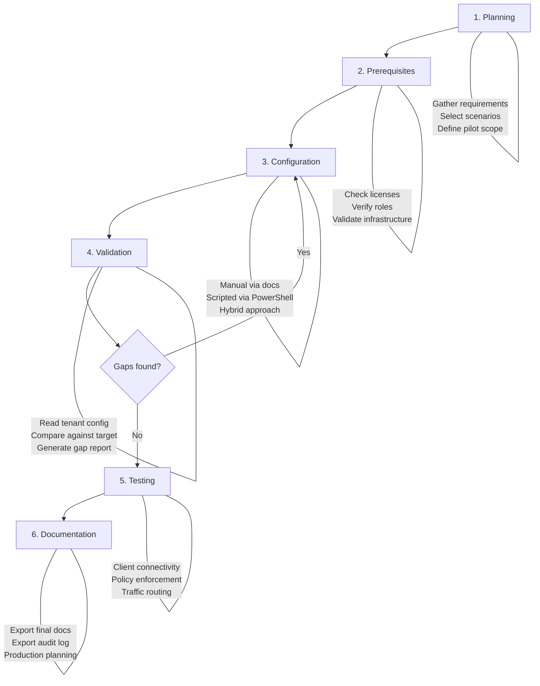

# EntraSuite-POC

A [GitHub Copilot Skill](https://docs.github.com/en/copilot/customizing-copilot/copilot-extensions/building-copilot-skills) that guides Microsoft Entra administrators through proof-of-concept deployments of the Microsoft Entra Suite. It provides expert advisory, configuration guidance, and documentation generation — all through a conversational-first approach.

## Overview

EntraSuite-POC is designed for **Entra administrators** who need to plan, configure, validate, and document POC deployments across the Microsoft Entra Suite. Instead of generating outputs immediately, the assistant engages you in conversation: it asks clarifying questions, surfaces considerations you may not have thought of, recommends best practices, and helps you think through your POC strategy before producing any artifacts.

When you're ready, it generates production-grade documentation, PowerShell scripts, gap analysis reports, and architecture diagrams — all following Microsoft documentation standards.

> [!NOTE]
> This skill integrates with the **Microsoft MCP Server for Enterprise** to read tenant configuration in real time. It also works fully offline in Guidance Only mode.

## Products Covered

The assistant covers six Microsoft Entra Suite products:

| Product | Key Capabilities |
|---|---|
| **Global Secure Access** | Traffic forwarding profiles, GSA Client deployment, remote networks, traffic logging, Conditional Access integration |
| **Entra Private Access** | Zero Trust network access, application connectors, Quick Access (VPN replacement), Per-App Access, Private DNS |
| **Entra Internet Access** | Web content filtering, security profiles, TLS inspection, Universal Tenant Restrictions |
| **Entra ID Protection** | Risk detection engine, risky users/sign-ins reports, risk-based Conditional Access policies |
| **Entra ID Governance** | Access reviews, entitlement management, lifecycle workflows, Privileged Identity Management |
| **Entra Verified ID** | Digital credential issuance and verification, decentralized identity flows |

Detailed product references are available under [entra-poc-assistant/references/products/](entra-poc-assistant/references/products/).

## Operation Modes

You select an operation mode at the start of every session. The assistant never escalates beyond the selected mode without your explicit consent.

| Mode | Tenant Connection | What You Get |
|---|---|---|
| **Guidance Only** | None | Advisory conversation, documentation, scripts (with placeholder values), architecture diagrams, scenario templates |
| **Read-Only** | Microsoft MCP Server (read) | Everything above, plus live prerequisite validation, current-state configuration reads, and gap analysis reports with real tenant data |
| **Read-Write** | Microsoft MCP Server (read) | Everything above, plus PowerShell scripts and portal instructions pre-populated with your tenant-specific values (group IDs, UPNs, resource references) |

> [!IMPORTANT]
> Even in Read-Write mode, the assistant **never writes directly** to your tenant. All changes are performed by you — via PowerShell scripts you review and execute, or portal instructions you follow manually.

See [entra-poc-assistant/references/operation-modes.md](entra-poc-assistant/references/operation-modes.md) for detailed mode transition rules.

## POC Lifecycle

Every POC engagement follows a six-phase lifecycle. Phases are iterative — you can loop back at any point.



| Phase | What Happens |
|---|---|
| **1. Planning** | Conversational requirements gathering. You describe your goals, the assistant recommends products and scenarios, and together you refine the approach. Output generation starts **only when you say you're ready**. |
| **2. Prerequisites** | Validates licenses, admin roles, and infrastructure. In Read-Only/Read-Write modes, the assistant checks your live tenant via MCP and reports gaps with remediation guidance. |
| **3. Configuration** | You choose your path — manual (step-by-step Markdown docs), scripted (idempotent PowerShell), or hybrid (docs with embedded scripts). |
| **4. Validation** | Compares your current tenant configuration against the target state and produces a gap analysis report. Loops back to Configuration if gaps are found. |
| **5. Testing** | Provides testing checklists and procedures. Validates test outcomes via MCP where possible (e.g., sign-in logs). |
| **6. Documentation** | Exports the complete POC guide, architecture diagrams, gap analysis, and session audit log. |

See [entra-poc-assistant/references/poc-lifecycle.md](entra-poc-assistant/references/poc-lifecycle.md) for detailed phase guidance.

## Pre-Built Scenarios

14 ready-to-use scenarios across five categories, each with prerequisites, architecture diagrams, configuration steps, and validation procedures:

| Category | Scenario | Complexity | Est. Time |
|---|---|---|---|
| **Private Access** | Quick Access (VPN replacement) | Medium | 45 min |
| | Per-App Access (granular resources) | High | 90 min |
| | Private DNS | High | 60 min |
| **Internet Access** | Web Content Filtering | Medium | 30 min |
| | Security Profiles | Medium | 45 min |
| | TLS Inspection | High | 60 min |
| | Universal Tenant Restrictions | Medium | 30 min |
| **Global Secure Access** | Traffic Forwarding Profiles | Low | 20 min |
| | GSA Client Deployment | Medium | 30 min |
| | Conditional Access Integration | Medium | 45 min |
| **Identity** | Conditional Access Baseline | Medium | 45 min |
| | ID Protection Risk Policies | Medium | 30 min |
| **Governance** | Access Reviews | Medium | 45 min |
| | Entitlement Management | High | 60 min |

You can also describe a **custom scenario** in natural language, and the assistant will structure it following the same schema.

See [entra-poc-assistant/references/scenarios/](entra-poc-assistant/references/scenarios/) for full scenario definitions.

## Conversation Templates

Four reusable conversation flows are available as starting points:

| Template | When to Use |
|---|---|
| [POC Planning](entra-poc-assistant/references/prompts/poc-planning.md) | Starting a new POC — requirements gathering, product recommendations, scenario selection, timeline and effort estimates |
| [Configuration Review](entra-poc-assistant/references/prompts/configuration-review.md) | Reviewing an existing deployment — identify components, read config via MCP, check against best practices, produce findings |
| [Gap Analysis](entra-poc-assistant/references/prompts/gap-analysis.md) | Comparing current vs. target state — define target, read tenant config, classify gaps, prioritize remediation |
| [Scenario Walkthrough](entra-poc-assistant/references/prompts/scenario-walkthrough.md) | Step-by-step guided configuration — overview, prerequisites, configuration steps with validation at each stage |

## Artifacts You Can Get

The assistant generates the following output artifacts on request:

| Artifact | Format | Description |
|---|---|---|
| **POC Guide** | Markdown | Complete step-by-step configuration guide with numbered instructions, portal navigation paths, prerequisites, and validation steps |
| **Gap Analysis Report** | Markdown + Mermaid | Current vs. target state comparison with per-component status, prioritized remediation steps, and visual gap diagrams |
| **PowerShell Scripts** | `.ps1` | Idempotent, `-WhatIf`-enabled automation scripts with `Connect-MgGraph` authentication, color-coded progress output, and error handling |
| **Architecture Diagrams** | Mermaid | Visual topology diagrams showing POC components, traffic flows, and deployment sequences |
| **Audit Log** | Markdown + JSON | Complete session record of every MCP call, recommendation, warning, and generated artifact |
| **Prerequisite Report** | Markdown | Pass/fail checklist for licenses, admin roles, and infrastructure with remediation guidance for each gap |

Templates for these artifacts are available under [entra-poc-assistant/assets/templates/](entra-poc-assistant/assets/templates/).

## Safety Guardrails

Seven absolute safety rules are enforced at all times and **cannot be overridden**:

1. **No deletions** — Never generates DELETE API calls, `Remove-*` PowerShell cmdlets, or instructions to delete resources
2. **No production CA policy changes** — Refuses to modify Conditional Access policies targeting "All users" or "All cloud apps"; recommends POC-scoped alternatives
3. **No silent mode escalation** — Mode changes require your explicit request
4. **No scripts without `-WhatIf`** — Every PowerShell script supports dry-run execution
5. **No fabricated data** — If a configuration state cannot be verified via MCP, the assistant says so honestly
6. **No skipped audit trails** — Every MCP call, recommendation, and warning is logged
7. **No broad-scope changes without warning** — Changes affecting all users, all apps, or tenant-wide settings trigger an explicit warning and confirmation prompt

See [entra-poc-assistant/references/safety-guardrails.md](entra-poc-assistant/references/safety-guardrails.md) for detailed rules and warning triggers.

## Repository Structure

```
entra-poc-assistant/
├── SKILL.md                          # Skill definition and core behavior
├── assets/
│   └── templates/                    # Output artifact templates
│       ├── audit-log-template.md
│       ├── gap-report-template.md
│       ├── poc-guide-template.md
│       └── powershell-template.ps1
├── references/
│   ├── documentation-standards.md    # Microsoft documentation style guide
│   ├── operation-modes.md            # Mode definitions and transition rules
│   ├── poc-lifecycle.md              # Six-phase lifecycle detailed guidance
│   ├── powershell-standards.md       # PowerShell conventions and patterns
│   ├── safety-guardrails.md          # Safety rules and warning triggers
│   ├── products/                     # Product reference sheets
│   │   ├── entra-id-governance.md
│   │   ├── entra-id-protection.md
│   │   ├── entra-internet-access.md
│   │   ├── entra-private-access.md
│   │   ├── entra-verified-id.md
│   │   └── global-secure-access.md
│   ├── prompts/                      # Conversation templates
│   │   ├── configuration-review.md
│   │   ├── gap-analysis.md
│   │   ├── poc-planning.md
│   │   └── scenario-walkthrough.md
│   └── scenarios/                    # Pre-built POC scenarios
│       ├── index.md
│       ├── global-secure-access.md
│       ├── governance.md
│       ├── identity.md
│       ├── internet-access.md
│       └── private-access.md
├── scripts/                          # Automation and validation scripts
│   ├── audit-logger.py
│   ├── Deploy-EmployeeGuestOnboarding.ps1
│   ├── Deploy-PrivateAccessQuickAccess.ps1
│   ├── generate-gap-report.py
│   ├── validate-configuration.py
│   └── validate-prerequisites.py
benchmarks/                           # Automated benchmark suite
├── README.md
├── run_benchmark.py
├── compare_results.py
├── evaluators/                       # Scoring evaluators
├── scoring/                          # Rubrics
└── test_cases/                       # Triggering, functional, performance tests
```

## Benchmarks

An automated benchmark suite with **30 test cases** measures skill quality across three categories:

| Category | Tests | What It Measures |
|---|---|---|
| **Triggering** | 15 | Skill activates on relevant Entra POC queries and stays silent on unrelated ones |
| **Functional** | 10 | Response quality for core tasks — planning, configuration, gap analysis, script generation |
| **Performance** | 5 | End-to-end output quality for complex multi-step scenarios |

See [benchmarks/README.md](benchmarks/README.md) for setup instructions and execution modes.

## Getting Started

1. **Start a conversation** with GitHub Copilot in a context where this skill is available (e.g., VS Code with the skill installed, or a Copilot Chat workspace).

2. **Mention an Entra POC topic** — for example:
   - *"I need to set up a Private Access POC to replace our VPN"*
   - *"What licenses do I need for Internet Access web content filtering?"*
   - *"Help me plan a Global Secure Access proof of concept"*

3. **Select your operation mode** when prompted — Guidance Only, Read-Only, or Read-Write.

4. **Have a conversation** — describe your goals, ask questions, explore options. The assistant acts as your Entra Suite SME.

5. **Request artifacts when ready** — say *"generate the POC guide"*, *"create the PowerShell scripts"*, or *"produce the gap analysis"* and the assistant will produce the outputs.

## License

MIT
