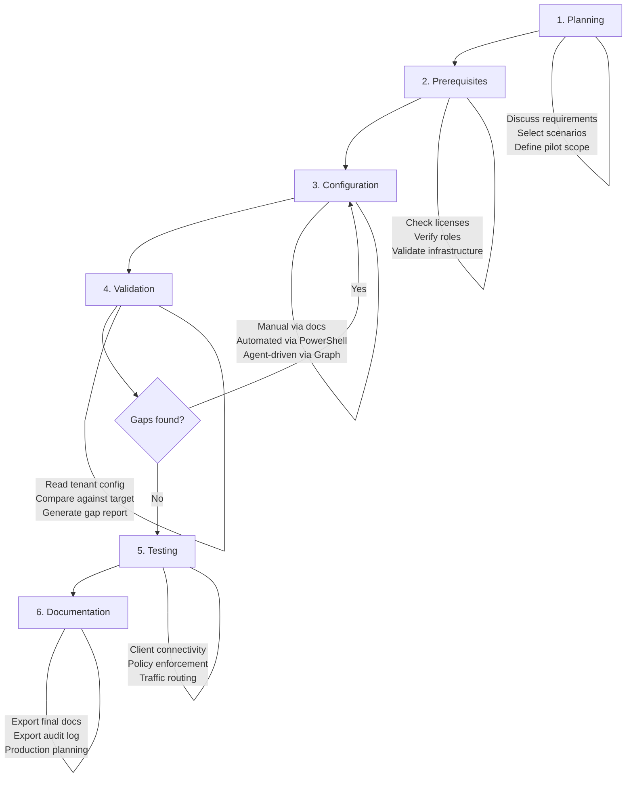

# entra-poc-assistant - Product Specification

## 1. Overview

**entra-poc-assistant** is a Model Context Protocol (MCP) server that helps Microsoft Entra administrators plan, configure, validate, and test proof-of-concept (POC) deployments of Microsoft Entra Suite products. The agent operates within VS Code (or any MCP-compatible client) alongside the administrator's preferred large language model.

### 1.1 Target Audience

Entra ID administrators who want to perform a proof of concept in their tenants for Microsoft Entra Suite products, including but not limited to:

- Microsoft Entra Private Access (Quick Access, Per-App Access, Private DNS)
- Microsoft Entra Internet Access (Security Profiles, Web Content Filtering, TLS Inspection, Universal Tenant Restrictions)
- Global Secure Access Client deployment and configuration
- Traffic Forwarding Profiles
- Conditional Access integration with Global Secure Access
- Microsoft Entra ID Protection
- Microsoft Entra ID Governance
- Microsoft Entra Verified ID

### 1.2 Problem Statement

Setting up a Global Secure Access or broader Entra Suite POC requires navigating multiple admin portals, understanding complex product interdependencies, configuring numerous policies, and validating that everything works together. Administrators often rely on scattered documentation, community blog posts, and trial-and-error. This agent consolidates product knowledge, provides guided workflows, generates tailored documentation, and optionally automates configuration -- reducing POC setup time and increasing success rates.

### 1.3 Key Design Principles

| Principle | Description |
|---|---|
| **Safety first** | Never delete tenant configuration. Write operations require explicit admin consent. High-risk modifications trigger warnings. |
| **Transparency** | Every action is visible to the admin via MCP tool call approval. All tenant changes are logged in a local audit trail. |
| **Model-agnostic** | Works with any capable LLM (Claude, GPT-4, Gemini, etc.) through the MCP protocol. |
| **Client-agnostic** | Works with any MCP-compatible client (VS Code, Claude Desktop, OpenCode, Cursor, etc.). |
| **Progressive disclosure** | Admins choose their comfort level via explicit operation modes. The agent never escalates without consent. |

---

## 2. Architecture

### 2.1 High-Level Architecture

```
+------------------------------------------------------------------+
|                        MCP Client (VS Code)                      |
|  +------------------------------------------------------------+  |
|  |                    LLM (e.g. Claude Opus)                   |  |
|  |                                                             |  |
|  |  - Entra Suite product knowledge (from training data)       |  |
|  |  - Reasoning, planning, and conversation                   |  |
|  |  - Orchestrates tool calls to both components below         |  |
|  +-----+---------------------------+--------------------------+  |
|        |                           |                             |
|        v                           v                             |
|  +--------------+      +---------------------------+             |
|  | entra-poc-   |      | msgraph Agent Skill       |             |
|  | assistant    |      | (graph.pm)                |             |
|  | MCP Server   |      |                           |             |
|  |              |      | - Graph API search (local) |             |
|  | - POC tools  |      | - Auth (delegated/app)     |             |
|  | - Doc gen    |      | - API execution            |             |
|  | - Script gen |      | - Safety enforcement       |             |
|  | - Scenarios  |      | - 27,700+ API index        |             |
|  | - Audit log  |      +---------------------------+             |
|  +--------------+                                                |
+------------------------------------------------------------------+
```

### 2.2 Component Responsibilities

| Component | Responsibility |
|---|---|
| **LLM** | Product knowledge, conversational guidance, reasoning, scenario analysis, orchestration of tool calls. |
| **entra-poc-assistant (MCP Server)** | POC-specific tools: scenario templates, documentation generation, PowerShell script generation, gap analysis reporting, configuration validation, audit logging, and operation mode management. |
| **msgraph Agent Skill (graph.pm)** | Graph API knowledge (27,700+ endpoints, local SQLite FTS5 indexes), authentication to Microsoft Graph (delegated or app-only), API execution with safety enforcement (read-only by default, writes require `--allow-writes`, DELETE always blocked). |

### 2.3 Integration Model

The LLM orchestrates both components:

1. **entra-poc-assistant** provides domain-specific MCP tools for POC workflows.
2. **msgraph skill** provides Graph API knowledge and execution. The LLM reads its `SKILL.md` and invokes the `msgraph` CLI for API search and execution.
3. The MCP server does **not** call Graph APIs directly. All Graph interactions are routed through the msgraph skill, which handles authentication, permission management, safety, and incremental consent.

### 2.4 Technology Stack

| Layer | Technology |
|---|---|
| Runtime | Node.js (LTS) |
| Language | TypeScript |
| MCP SDK | `@modelcontextprotocol/sdk` |
| Graph Integration | msgraph Agent Skill CLI (`graph.pm`) |
| Diagram Generation | Mermaid syntax |
| Documentation Output | Markdown (Microsoft documentation style) |
| PowerShell Scripts | Microsoft Graph PowerShell SDK (`Connect-MgGraph`) + `Invoke-GraphRequest` |

---

## 3. Operation Modes

The agent operates in three explicit modes. The administrator selects a mode at the start of a session. The agent never escalates beyond the selected mode without explicit admin consent to switch modes.

### 3.1 Mode 1: Guidance Only

**No tenant connection. Advisory and documentation only.**

| Capability | Available |
|---|---|
| Discuss requirements and scenarios | Yes |
| Recommend Entra Suite products/features for scenarios | Yes |
| Generate step-by-step configuration documentation | Yes |
| Generate architecture/relationship diagrams (Mermaid) | Yes |
| Generate PowerShell automation scripts | Yes |
| Provide pre-defined scenario templates | Yes |
| Connect to tenant | No |
| Read tenant configuration | No |
| Write tenant configuration | No |

### 3.2 Mode 2: Read-Only

**Connects to tenant via msgraph skill. Read access only.**

Includes all Guidance Only capabilities, plus:

| Capability | Available |
|---|---|
| Authenticate to tenant (delegated auth via msgraph) | Yes |
| Validate prerequisites (licenses, roles, permissions) | Yes |
| Read current tenant configuration | Yes |
| Produce gap analysis report (current vs. target) | Yes |
| Validate configuration against POC requirements | Yes |
| Highlight misconfiguration or missing settings | Yes |
| Write tenant configuration | No |

### 3.3 Mode 3: Read-Write

**Connects to tenant with write access. Requires explicit admin consent.**

Includes all Read-Only capabilities, plus:

| Capability | Available |
|---|---|
| Create and configure Entra resources | Yes |
| Apply POC configuration to tenant | Yes |
| Modify existing non-production policies | Yes |
| Delete any configuration | **Never** |
| Modify production Conditional Access policies | **Blocked with warning** |

When the admin selects Read-Write mode, the agent:

1. Displays a clear consent prompt explaining what write access entails.
2. Lists the types of configuration changes it may make.
3. Requires explicit confirmation before proceeding.
4. Logs every write operation to the audit trail.
5. Leverages the msgraph skill with `--allow-writes` for Graph API mutations.

---

## 4. MCP Server Tools

### 4.1 Session Management

#### `set_operation_mode`

Sets the current operation mode for the session.

| Parameter | Type | Required | Description |
|---|---|---|---|
| `mode` | `"guidance"` \| `"read-only"` \| `"read-write"` | Yes | The operation mode to activate. |

**Behavior:**
- Switching to `read-only` or `read-write` triggers authentication via the msgraph skill (if not already authenticated).
- Switching to `read-write` displays a consent prompt and requires explicit confirmation.
- Mode can be changed at any time during the session.

#### `get_session_status`

Returns the current session state including operation mode, authentication status, tenant information (if connected), and a summary of actions performed.

### 4.2 Scenario Management

#### `list_scenarios`

Returns the list of pre-defined POC scenarios bundled with the agent. Each scenario includes a name, description, required products/features, complexity level, and estimated setup time.

#### `get_scenario`

Returns the full details of a pre-defined scenario including:

| Field | Description |
|---|---|
| `name` | Scenario display name |
| `description` | What the scenario demonstrates |
| `products` | Required Entra Suite products |
| `prerequisites` | Licenses, roles, infrastructure requirements |
| `architecture` | Mermaid diagram of the target architecture |
| `configuration_steps` | Ordered list of configuration steps |
| `validation_steps` | How to verify the configuration works |
| `estimated_time` | Estimated time to complete |

| Parameter | Type | Required | Description |
|---|---|---|---|
| `scenario_id` | `string` | Yes | The identifier of the scenario to retrieve. |

#### `analyze_requirements`

Takes free-form admin requirements and returns a structured analysis including:
- Which Entra Suite products/features are relevant.
- Suggested scenario(s) from the pre-defined list (if applicable).
- Prerequisites and licensing requirements.
- A recommended implementation approach.

| Parameter | Type | Required | Description |
|---|---|---|---|
| `requirements` | `string` | Yes | Free-form text describing the admin's requirements or scenario. |

### 4.3 Documentation Generation

#### `generate_documentation`

Generates a tailored Markdown document with step-by-step instructions for configuring the specified scenario through the Entra admin portal.

| Parameter | Type | Required | Description |
|---|---|---|---|
| `scenario_id` | `string` | No | Pre-defined scenario ID. Either this or `custom_config` is required. |
| `custom_config` | `object` | No | Custom configuration details provided by the LLM based on conversation. |
| `include_diagrams` | `boolean` | No | Include Mermaid architecture/relationship diagrams. Default: `true`. |
| `output_path` | `string` | No | File path for the generated document. Default: `./docs/poc-guide.md`. |

**Output format:**
- Title and overview
- Prerequisites checklist
- Architecture diagram (Mermaid)
- Step-by-step configuration instructions (numbered, with portal navigation paths)
- Configuration relationship diagrams (Mermaid) showing how objects relate
- Validation and testing steps
- Troubleshooting tips
- Follows Microsoft documentation style conventions

#### `generate_gap_report`

*Requires: Read-Only or Read-Write mode.*

Generates a formal gap analysis report comparing current tenant configuration against the target POC configuration.

| Parameter | Type | Required | Description |
|---|---|---|---|
| `scenario_id` | `string` | No | Pre-defined scenario ID for the target configuration. |
| `target_config` | `object` | No | Custom target configuration to compare against. |
| `output_path` | `string` | No | File path for the report. Default: `./docs/gap-analysis.md`. |

**Output format:**
- Executive summary (what percentage is already configured)
- Per-component status table (Configured / Partially Configured / Missing)
- Detailed findings per component with current values vs. expected values
- Prioritized remediation steps
- Mermaid diagram highlighting gaps

### 4.4 Script Generation

#### `generate_powershell`

Generates idempotent PowerShell scripts for automating the POC configuration.

| Parameter | Type | Required | Description |
|---|---|---|---|
| `scenario_id` | `string` | No | Pre-defined scenario ID. Either this or `custom_config` is required. |
| `custom_config` | `object` | No | Custom configuration details. |
| `output_path` | `string` | No | File path for the script. Default: `./scripts/configure-poc.ps1`. |

**Script characteristics:**
- Uses `Connect-MgGraph` for authentication.
- Uses `Invoke-GraphRequest` for all Graph API calls.
- Idempotent: safe to run multiple times. Checks for existing resources before creating.
- Includes `Write-Host` progress messages for each step.
- Includes error handling with descriptive messages.
- Never includes `Remove-*` or `DELETE` operations.
- Parameterized: uses script parameters for tenant-specific values (group names, user UPNs, etc.).
- Includes a `-WhatIf` mode that shows what would be configured without making changes.
- Includes comments explaining each section and the purpose of each API call.

### 4.5 Tenant Validation

*Requires: Read-Only or Read-Write mode.*

#### `check_prerequisites`

Checks the connected tenant for POC prerequisites.

| Parameter | Type | Required | Description |
|---|---|---|---|
| `scenario_id` | `string` | No | Pre-defined scenario to check prerequisites for. |
| `checks` | `string[]` | No | Specific checks to run (e.g., `["licenses", "roles", "features"]`). Default: all. |

**Checks performed:**
- Required licenses (Entra ID P1/P2, Entra Suite, GSA, etc.)
- Admin role assignments (Global Administrator, Security Administrator, etc.)
- Required Entra features enabled (e.g., Global Secure Access activation)
- Network infrastructure prerequisites (connector groups, connectors)
- Conditional Access policy conflicts

#### `validate_configuration`

Reads the current tenant configuration for a specific scenario and validates it against the expected state.

| Parameter | Type | Required | Description |
|---|---|---|---|
| `scenario_id` | `string` | No | Pre-defined scenario to validate against. |
| `target_config` | `object` | No | Custom target configuration to validate against. |
| `components` | `string[]` | No | Specific components to validate. Default: all. |

**Returns:** Per-component validation results with status, current value, expected value, and remediation guidance.

### 4.6 Tenant Configuration

*Requires: Read-Write mode.*

#### `apply_configuration`

Applies a specific configuration step or set of steps to the tenant.

| Parameter | Type | Required | Description |
|---|---|---|---|
| `steps` | `object[]` | Yes | Array of configuration steps to apply. Each step includes the Graph API call details. |
| `dry_run` | `boolean` | No | If `true`, validates the steps without executing. Default: `false`. |

**Behavior:**
- Each step is confirmed individually by the admin via the MCP tool approval flow.
- Each step is logged to the audit trail before and after execution.
- If a step fails, execution stops and the admin is informed of the failure and what was successfully applied.
- Uses the msgraph skill with `--allow-writes` for all write operations.
- Never issues DELETE requests (the msgraph skill also blocks DELETE unconditionally).

**Guardrails:**
- Production Conditional Access policies: the agent refuses to modify policies targeting "All users" or "All cloud apps" and warns the admin.
- Global-scope changes: changes that affect all users in the tenant trigger an additional confirmation warning.
- The agent recommends creating POC-scoped policies with targeted groups rather than modifying broad policies.

### 4.7 Audit Logging

#### `get_audit_log`

Returns the contents of the current session's audit log.

#### `export_audit_log`

Exports the audit log to a Markdown file.

| Parameter | Type | Required | Description |
|---|---|---|---|
| `output_path` | `string` | No | File path for the audit log. Default: `./docs/audit-log.md`. |

**Audit log format (Markdown):**

```markdown
# POC Audit Log

**Tenant:** contoso.onmicrosoft.com
**Session started:** 2026-03-11T10:00:00Z
**Operation mode:** Read-Write

## Actions

### [2026-03-11T10:05:23Z] CHECK_PREREQUISITES
- **Type:** Read
- **Component:** Licenses
- **Details:** Checked for Entra Suite license assignment
- **Result:** Found: Entra Suite license assigned to 50 users

### [2026-03-11T10:12:45Z] CREATE_TRAFFIC_FORWARDING_PROFILE
- **Type:** Write
- **API:** POST /beta/networkAccess/forwardingProfiles
- **Details:** Created Microsoft 365 traffic forwarding profile
- **Result:** Success (id: abc-123-def)
- **Rollback:** Manual removal required via Entra admin portal
```

---

## 5. MCP Resources

The MCP server exposes the following resources for the LLM to consume:

### 5.1 Static Resources

| Resource URI | Description |
|---|---|
| `entrapoc://scenarios` | Index of all pre-defined POC scenarios |
| `entrapoc://products/{product}` | Product-specific reference material (configuration objects, relationships, API endpoints) |
| `entrapoc://templates/{template}` | Documentation and script templates |

### 5.2 Dynamic Resources (when connected)

| Resource URI | Description |
|---|---|
| `entrapoc://tenant/status` | Current tenant connection and mode status |
| `entrapoc://tenant/prerequisites` | Last prerequisite check results |
| `entrapoc://tenant/audit-log` | Current session audit log |

---

## 6. MCP Prompts

The MCP server exposes prompt templates that guide the LLM's behavior for common workflows:

| Prompt Name | Description |
|---|---|
| `poc-planning` | Guides the LLM through a structured POC planning conversation: gather requirements, recommend products, assess prerequisites, and propose an implementation plan. |
| `scenario-walkthrough` | Steps through a specific scenario end-to-end: explain architecture, generate docs, optionally validate or configure. |
| `gap-analysis` | Guides the LLM through reading tenant config, comparing against target, and producing a gap report with remediation steps. |
| `configuration-review` | Guides the LLM through reviewing existing tenant configuration for correctness and best practices. |

---

## 7. Pre-Defined Scenarios

Pre-defined scenarios are bundled as structured data files within the MCP server. Each scenario contains all the metadata described in section 4.2. The initial set of scenarios will be defined in a subsequent phase. The scenario framework supports:

### 7.1 Scenario Structure

```
scenarios/
  private-access/
    quick-access.json
    per-app-access.json
    private-dns.json
  internet-access/
    web-content-filtering.json
    security-profiles.json
    tls-inspection.json
    universal-tenant-restrictions.json
  global-secure-access/
    traffic-forwarding-profiles.json
    client-deployment.json
    conditional-access-integration.json
  identity/
    conditional-access-baseline.json
    identity-protection.json
  governance/
    access-reviews.json
    entitlement-management.json
  custom/
    README.md  (instructions for admins to add their own scenarios)
```

### 7.2 Scenario Definition Schema

```json
{
  "id": "private-access/quick-access",
  "name": "Entra Private Access - Quick Access",
  "description": "Configure Quick Access to provide secure remote access to all private applications and resources through a single FQDN or IP range, replacing traditional VPN.",
  "products": ["Entra Private Access"],
  "complexity": "medium",
  "estimated_time": "45 minutes",
  "prerequisites": {
    "licenses": ["Microsoft Entra Suite", "OR", "Microsoft Entra Private Access"],
    "roles": ["Global Administrator", "OR", "Security Administrator + Application Administrator"],
    "infrastructure": ["Windows Server with network line-of-sight to private resources for connector installation"]
  },
  "architecture": "<<Mermaid diagram>>",
  "configuration_steps": [
    {
      "order": 1,
      "title": "Activate Global Secure Access",
      "component": "Global Secure Access",
      "portal_path": "Entra admin center > Global Secure Access > Get started",
      "description": "Enable the Global Secure Access feature in your tenant.",
      "graph_api": {
        "method": "POST",
        "endpoint": "/beta/networkAccess/...",
        "body": {}
      },
      "validation": {
        "method": "GET",
        "endpoint": "/beta/networkAccess/...",
        "expected": {}
      }
    }
  ],
  "validation_steps": [
    {
      "order": 1,
      "title": "Verify GSA Client connectivity",
      "description": "Install the Global Secure Access client on a test device and verify it connects successfully.",
      "type": "manual"
    }
  ]
}
```

### 7.3 Custom Scenarios

Administrators can add their own scenario files to the `scenarios/custom/` directory following the same schema. The `list_scenarios` tool includes custom scenarios alongside built-in ones.

---

## 8. Documentation Generation Standards

All generated documentation follows these standards:

### 8.1 Style

- **Microsoft documentation style**: Professional, direct, second person ("you"), present tense for instructions.
- **Numbered steps**: All procedures use numbered steps with clear portal navigation paths.
- **Prerequisites section**: Always included at the top.
- **Note/Warning/Important callouts**: Use blockquote-based callouts:
  ```markdown
  > [!NOTE]
  > Additional information the admin should be aware of.

  > [!WARNING]
  > This action affects all users in the tenant.
  ```

### 8.2 Diagrams

All diagrams use **Mermaid** syntax for native rendering in VS Code, GitHub, and most modern Markdown viewers.

**Types of diagrams generated:**

| Diagram Type | Purpose | Mermaid Type |
|---|---|---|
| Architecture overview | Shows the overall POC topology (users, clients, cloud, private network) | `flowchart` |
| Configuration relationships | Shows how Entra objects relate (profiles, policies, groups, apps) | `graph` or `flowchart` |
| Traffic flow | Shows how traffic routes through GSA components | `sequenceDiagram` |
| Deployment sequence | Shows the order of configuration steps | `flowchart` |

### 8.3 File Organization

Generated files are organized in the project directory:

```
./
  docs/
    poc-guide.md              # Main step-by-step guide
    gap-analysis.md           # Gap analysis report (if applicable)
    architecture.md           # Architecture documentation with diagrams
    audit-log.md              # Session audit trail
  scripts/
    configure-poc.ps1         # Main configuration script
    validate-poc.ps1          # Validation script
    prerequisites-check.ps1   # Prerequisites check script
```

---

## 9. PowerShell Script Generation Standards

### 9.1 Script Structure

Every generated script follows this structure:

```powershell
<#
.SYNOPSIS
    [Brief description of what the script configures]

.DESCRIPTION
    [Detailed description including which Entra Suite features are configured]
    
    Generated by entra-poc-assistant on [date].
    Scenario: [scenario name]

.PARAMETER TenantId
    The tenant ID to connect to.

.PARAMETER WhatIf
    Shows what would be configured without making changes.

.NOTES
    This script is idempotent and safe to run multiple times.
    It will NOT delete any existing configuration.
    
    Required modules: Microsoft.Graph
    Required permissions: [list of Graph permissions]
#>

[CmdletBinding(SupportsShouldProcess)]
param(
    [Parameter(Mandatory = $false)]
    [string]$TenantId,
    
    [Parameter(Mandatory = $false)]
    [switch]$WhatIf
)

#region Prerequisites
# Check for required PowerShell modules
#endregion

#region Authentication  
Connect-MgGraph -Scopes "..." -TenantId $TenantId
#endregion

#region Step 1: [Step Title]
Write-Host "[1/N] Configuring [component]..." -ForegroundColor Cyan

# Check if resource already exists
$existing = Invoke-GraphRequest -Method GET -Uri "..." -ErrorAction SilentlyContinue

if ($null -eq $existing) {
    if ($PSCmdlet.ShouldProcess("[resource description]", "Create")) {
        $body = @{ ... } | ConvertTo-Json -Depth 10
        $result = Invoke-GraphRequest -Method POST -Uri "..." -Body $body -ContentType "application/json"
        Write-Host "  Created [resource]: $($result.id)" -ForegroundColor Green
    }
} else {
    Write-Host "  [Resource] already exists, skipping." -ForegroundColor Yellow
}
#endregion

# ... additional steps ...

#region Summary
Write-Host "`nPOC Configuration Complete!" -ForegroundColor Green
Write-Host "Next steps:"
Write-Host "  1. [Manual step if any]"
Write-Host "  2. [Validation step]"
#endregion
```

### 9.2 Script Conventions

- **Authentication**: Always use `Connect-MgGraph` with explicit scopes.
- **API calls**: Always use `Invoke-GraphRequest` (not `Invoke-MgGraphRequest` or REST cmdlets).
- **Idempotency**: Always check for existing resources before creating.
- **No deletions**: Never include `Remove-*` cmdlets or `DELETE` API calls.
- **Error handling**: Use `try/catch` blocks with descriptive error messages.
- **Progress**: Use `Write-Host` with color coding (Cyan for progress, Green for success, Yellow for skipped, Red for errors).
- **WhatIf support**: All modification steps wrapped in `$PSCmdlet.ShouldProcess()`.
- **Parameters**: Tenant-specific values (group names, user UPNs, IP ranges) are script parameters with sensible defaults.

---

## 10. Safety and Guardrails

### 10.1 Never-Do Rules

| Rule | Enforcement |
|---|---|
| Never delete tenant configuration | MCP server never generates DELETE calls. msgraph skill blocks DELETE unconditionally. |
| Never modify production CA policies | MCP server detects policies targeting "All users" / "All cloud apps" and refuses with a warning. |
| Never escalate operation mode silently | Mode changes require explicit admin selection via `set_operation_mode`. |
| Never write without consent | Read-Write mode requires explicit consent flow. Each write operation is visible via MCP tool approval. |

### 10.2 Warning Triggers

The agent issues explicit warnings when:

- A configuration change would affect all users in the tenant.
- A Conditional Access policy targets broad scopes (All users, All cloud apps).
- Required licenses are not assigned to the pilot group.
- The admin role is not sufficient for the planned configuration.
- A configuration step would conflict with an existing policy.

### 10.3 Audit Trail

Every action the agent performs on the tenant is logged in a local Markdown audit file:

- **Timestamp**: UTC ISO 8601 format.
- **Action type**: Read or Write.
- **Component**: Which Entra component was affected.
- **API call**: Method and endpoint (for Graph API calls).
- **Details**: Human-readable description of what was done.
- **Result**: Success/failure and relevant IDs or error messages.
- **Rollback guidance**: For write operations, how to manually undo the change if needed.

---

## 11. POC Lifecycle

The agent supports the full POC lifecycle:



### 11.1 Phase 1: Planning

- Admin describes their requirements or selects pre-defined scenarios.
- Agent recommends Entra Suite products and features.
- Agent produces an implementation plan with estimated effort.
- **Mode required:** Guidance Only (minimum).

### 11.2 Phase 2: Prerequisites Validation

- Agent checks licenses, roles, and infrastructure requirements.
- Agent reports any gaps and provides remediation guidance.
- **Mode required:** Read-Only (to check tenant) or Guidance Only (for generic checklist).

### 11.3 Phase 3: Configuration

Three configuration paths (admin chooses):

| Path | Description | Mode Required |
|---|---|---|
| **Manual** | Agent generates step-by-step Markdown docs. Admin follows instructions in the Entra admin portal. | Guidance Only |
| **Scripted** | Agent generates idempotent PowerShell scripts. Admin reviews and runs the scripts. | Guidance Only |
| **Agent-driven** | Agent configures the tenant directly via Graph API through the msgraph skill. Admin approves each step. | Read-Write |

### 11.4 Phase 4: Validation

- Agent reads tenant configuration and compares against the target state.
- Produces a gap analysis report with remediation steps.
- **Mode required:** Read-Only.

### 11.5 Phase 5: Testing

- Agent provides testing checklists and procedures.
- Includes manual test steps (e.g., "Install the GSA client and verify connectivity").
- Can validate some test outcomes via Graph API (e.g., check sign-in logs for GSA traffic).
- **Mode required:** Read-Only (for log-based validation) or Guidance Only (for test procedures).

### 11.6 Phase 6: Documentation Export

- Agent exports final documentation including:
  - Complete POC guide with all configuration steps.
  - Architecture diagrams.
  - Gap analysis report.
  - Audit log of all actions performed.
  - Recommendations for production deployment.
- **Mode required:** Any.

---

## 12. Installation and Setup

### 12.1 Prerequisites

- Node.js LTS (v20+)
- An MCP-compatible client (VS Code with Copilot, OpenCode, Claude Desktop, Cursor, etc.)
- msgraph Agent Skill installed (`npx skills add merill/msgraph`)

### 12.2 Installation

```bash
# Install the MCP server
npm install -g entra-poc-assistant

# Or clone and build from source
git clone https://github.com/<org>/entra-poc-assistant.git
cd entra-poc-assistant
npm install
npm run build
```

### 12.3 MCP Client Configuration

Add to the MCP client configuration (example for VS Code `settings.json`):

```json
{
  "mcpServers": {
    "entra-poc-assistant": {
      "command": "npx",
      "args": ["entra-poc-assistant"],
      "env": {}
    }
  }
}
```

Ensure the msgraph skill is also installed in the project:

```
your-project/
  .agents/
    skills/
      msgraph/
        SKILL.md
        ...
```

### 12.4 First Run

1. Open VS Code (or your MCP client) in your project directory.
2. Start a conversation with your LLM.
3. Ask: "Help me set up a Global Secure Access proof of concept."
4. The agent will guide you through mode selection, requirement gathering, and the full POC lifecycle.

---

## 13. Project Structure

```
entra-poc-assistant/
  src/
    index.ts                    # MCP server entry point
    server.ts                   # MCP server setup and tool registration
    tools/
      session.ts                # set_operation_mode, get_session_status
      scenarios.ts              # list_scenarios, get_scenario, analyze_requirements
      documentation.ts          # generate_documentation, generate_gap_report
      scripts.ts                # generate_powershell
      validation.ts             # check_prerequisites, validate_configuration
      configuration.ts          # apply_configuration
      audit.ts                  # get_audit_log, export_audit_log
    resources/
      scenarios.ts              # Scenario resource providers
      tenant.ts                 # Tenant status resource providers
    prompts/
      poc-planning.ts           # POC planning prompt template
      scenario-walkthrough.ts   # Scenario walkthrough prompt
      gap-analysis.ts           # Gap analysis prompt
      configuration-review.ts   # Configuration review prompt
    services/
      msgraph-bridge.ts         # Interface to msgraph skill CLI
      audit-logger.ts           # Audit log management
      doc-generator.ts          # Markdown document generation engine
      script-generator.ts       # PowerShell script generation engine
      diagram-generator.ts      # Mermaid diagram generation
    models/
      scenario.ts               # Scenario type definitions
      session.ts                # Session state types
      audit.ts                  # Audit log entry types
      config.ts                 # Configuration types
  scenarios/
    private-access/
    internet-access/
    global-secure-access/
    identity/
    governance/
    custom/
  templates/
    documentation/              # Markdown templates for doc generation
    scripts/                    # PowerShell script templates
  tests/
    tools/
    services/
    scenarios/
  package.json
  tsconfig.json
  README.md
```

---

## 14. Future Considerations

Items explicitly out of scope for the initial release but worth noting for future iterations:

| Item | Notes |
|---|---|
| **Pre-defined scenario content** | Scenario JSON files will be authored in a subsequent phase. The framework and schema are defined in this spec. |
| **PDF/Word export** | Initial release generates Markdown only. Future versions may support PDF or Word export. |
| **Multi-tenant support** | Initial release supports one tenant per session. Future versions may support comparing or configuring multiple tenants. |
| **CI/CD integration** | PowerShell scripts could be integrated into deployment pipelines for repeatable POC environments. |
| **Maester integration** | The [Maester](https://maester.dev) testing framework could be used for comprehensive Entra configuration validation. |
| **Telemetry** | Optional anonymous usage telemetry to improve scenario recommendations. |

---

## 15. Glossary

| Term | Definition |
|---|---|
| **GSA** | Global Secure Access - Microsoft's Security Service Edge (SSE) solution. |
| **Entra Private Access** | Replacement for traditional VPN, providing Zero Trust Network Access (ZTNA) to private applications. |
| **Entra Internet Access** | Secure Web Gateway (SWG) for securing internet and SaaS traffic. |
| **Entra Suite** | Bundle of Microsoft Entra products including Private Access, Internet Access, ID Governance, ID Protection, and Verified ID. |
| **MCP** | Model Context Protocol - open protocol for connecting AI models to external tools and data. |
| **msgraph skill** | Agent Skill from graph.pm that provides Microsoft Graph API knowledge and execution. |
| **Traffic Forwarding Profile** | Configuration that determines which network traffic is routed through Global Secure Access. |
| **Connector** | Software agent installed on-premises that provides connectivity between the GSA cloud service and private network resources. |
| **POC** | Proof of Concept - a limited deployment to validate product capabilities before production rollout. |
