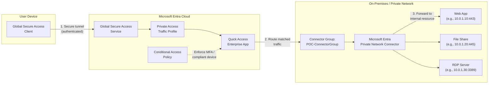

# Entra Private Access — Quick Access POC Guide

> Generated by entra-poc-assistant on 2026-03-17
> Scenario: Private Access — Quick Access | Mode: Guidance Only
> Reference scenario: private-access-quick-access

## Overview

This guide walks you through a proof-of-concept deployment of Microsoft Entra Private Access using the **Quick Access** feature. Quick Access replaces a traditional VPN by providing secure, identity-centric remote access to all your private applications and resources (web apps, file shares, RDP/SSH servers, and any TCP/UDP resource) through a single enterprise application with configured FQDN/IP segments. Traffic flows from the Global Secure Access (GSA) Client on user devices through the Microsoft Entra cloud service, then to on-premises connectors that proxy connections to internal resources — all protected by Conditional Access. All changes are scoped to the pilot group **POC-PrivateAccess-Pilot**.

## Prerequisites

Before you begin, verify the following:

- [ ] **Licenses:** Microsoft Entra Suite **or** Microsoft Entra Private Access (standalone) assigned to pilot users
- [ ] **Roles:** Global Administrator **or** the combination of: Global Secure Access Administrator + Application Administrator + Security Administrator
- [ ] **Infrastructure:**
  - Windows Server 2019+ with network line-of-sight to private resources (for connector installation)
  - The connector server must be able to reach the target private resources (web apps, file shares, RDP servers) on the required ports
  - The connector server must have outbound internet access to the Microsoft Entra service endpoints
  - Test device with Windows 10/11 (22H2+) for the GSA Client
  - Private resources to test with (e.g., an internal web application, file share, or RDP target)
- [ ] **Pilot group:** Security group **POC-PrivateAccess-Pilot** created with test users
- [ ] **Break-glass accounts:** Emergency access accounts identified and excluded from all Conditional Access policies
- [ ] **Network information:** FQDNs, IP addresses, and ports of the private resources you want to publish through Quick Access

## Architecture



**How it works:**
1. The GSA Client on the user's device establishes an authenticated, encrypted tunnel to the Microsoft Entra cloud edge.
2. Traffic destined for configured FQDNs/IPs (the Quick Access application segments) is intercepted by the GSA Client and routed through the tunnel.
3. The Entra Private Access service matches traffic against the Quick Access app segments and forwards it to the assigned connector group.
4. The connector on your private network receives the traffic and proxies it to the target internal resource.
5. Conditional Access policies enforce security controls (MFA, compliant device, etc.) before traffic is allowed.

---

## Phase 1: Activate Global Secure Access

### Step 1: Activate Global Secure Access in the Tenant

Global Secure Access is the foundational platform that must be activated before Private Access can function. This is a one-time, tenant-level operation.

1. Sign in to the [Microsoft Entra admin center](https://entra.microsoft.com) with at least a **Global Administrator** role.

2. Navigate to **Global Secure Access** > **Get started**.

3. Select **Activate** to enable Global Secure Access for the tenant.

4. Wait for activation to complete (typically a few minutes).

**What this does:** Activating GSA provisions the Global Secure Access infrastructure in your tenant — including the traffic forwarding engine, traffic logging, and the three default forwarding profiles (Microsoft 365, Private Access, Internet Access). All three profiles are disabled by default after activation. No traffic is affected until you explicitly enable a profile and deploy the GSA Client.

> [!WARNING]
> GSA activation is a one-time operation that **cannot be reversed** through the admin center. For production tenants, ensure you have approval before activating. For POC, use a dedicated test tenant if possible.

**Verify via Microsoft Graph:**

```http
GET https://graph.microsoft.com/beta/networkAccess/settings
```

Expected response:
```json
{
    "isEnabled": true
}
```

**PowerShell equivalent:**

```powershell
# Check GSA activation status
$gsaSettings = Invoke-MgGraphRequest -Method GET -Uri "https://graph.microsoft.com/beta/networkAccess/settings"
if ($gsaSettings.isEnabled) {
    Write-Host "Global Secure Access is activated." -ForegroundColor Green
} else {
    Write-Host "Global Secure Access is NOT activated. Activate via the portal." -ForegroundColor Red
}
```

---

### Step 2: Enable the Private Access Traffic Forwarding Profile

Enable the Private Access traffic forwarding profile so the GSA Client routes private application traffic through the Entra service.

1. Navigate to **Global Secure Access** > **Connect** > **Traffic forwarding**.

2. You see three profiles: Microsoft 365, Private Access, and Internet Access.

3. Toggle **Private access profile** to **Enabled**.

4. Select **Save** (if prompted).

**What this does:** Enabling the Private Access profile tells the GSA Client to intercept traffic destined for any configured Quick Access or Per-App application segments and route it through the Entra cloud edge. Without this profile enabled, the GSA Client ignores private access traffic even if the Quick Access app is configured.

**Verify and enable via Microsoft Graph:**

```http
GET https://graph.microsoft.com/beta/networkAccess/forwardingProfiles
```

Find the profile where `trafficForwardingType` is `"private"` and note its `id`. Then enable it:

```http
PATCH https://graph.microsoft.com/beta/networkAccess/forwardingProfiles/{profileId}
Content-Type: application/json

{
    "state": "enabled"
}
```

**PowerShell equivalent:**

```powershell
# List forwarding profiles and find Private Access
$profiles = Invoke-MgGraphRequest -Method GET -Uri "https://graph.microsoft.com/beta/networkAccess/forwardingProfiles"
$privateProfile = $profiles.value | Where-Object { $_.trafficForwardingType -eq "private" }

if ($privateProfile) {
    Write-Host "Private Access profile ID: $($privateProfile.id), State: $($privateProfile.state)"
    if ($privateProfile.state -ne "enabled") {
        $body = @{ state = "enabled" } | ConvertTo-Json
        Invoke-MgGraphRequest -Method PATCH `
            -Uri "https://graph.microsoft.com/beta/networkAccess/forwardingProfiles/$($privateProfile.id)" `
            -Body $body -ContentType "application/json"
        Write-Host "Private Access profile enabled." -ForegroundColor Green
    } else {
        Write-Host "Private Access profile is already enabled." -ForegroundColor Yellow
    }
}
```

> [!NOTE]
> You only need to enable the **Private Access** profile for this POC. The Microsoft 365 and Internet Access profiles are separate features and can remain disabled.

---

## Phase 2: Install and Configure Connectors

### Step 3: Install the Microsoft Entra Private Network Connector

The connector is a lightweight Windows service that runs on a server in your private network. It receives traffic from the Entra cloud edge and forwards it to your internal resources.

**Server requirements:**

| Requirement | Details |
|---|---|
| OS | Windows Server 2019, 2022, or later |
| RAM | 8 GB minimum |
| CPU | 2 cores minimum |
| .NET | .NET Framework 4.7.2+ |
| Network | Line-of-sight to private resources; outbound HTTPS to Microsoft endpoints |
| TLS | TLS 1.2 enabled |

1. Sign in to the [Microsoft Entra admin center](https://entra.microsoft.com).

2. Navigate to **Global Secure Access** > **Connect** > **Connectors**.

3. Select **Download connector service**.

4. **On the connector server:** Run the downloaded installer as a local administrator.

5. During installation, sign in with an Entra ID account that has **Application Administrator** or **Global Administrator** role.

6. The installer registers the connector with your tenant and starts the connector service.

7. After installation completes, return to the Entra admin center and verify the connector appears under **Connectors** with status **Active**.

**What this does:** The connector creates an outbound-only connection to the Microsoft Entra cloud edge — it does **not** require any inbound firewall ports. Traffic flows: Entra cloud → connector → internal resource. This is a key security advantage over traditional VPN: no inbound holes in your perimeter firewall. The connector uses certificate-based mutual TLS to authenticate with the Entra service.

> [!IMPORTANT]
> The connector server must have **network access to the private resources** you want to publish. If the connector can't reach a resource (e.g., it's on a different network segment with no route), traffic won't flow. Test connectivity from the connector server to your target resources before proceeding.

**Verify connector status via Microsoft Graph:**

```http
GET https://graph.microsoft.com/beta/onPremisesPublishingProfiles/applicationProxy/connectors
```

Expected: At least one connector with `"status": "active"`.

**PowerShell equivalent:**

```powershell
# Check connector status
$connectors = Invoke-MgGraphRequest -Method GET `
    -Uri "https://graph.microsoft.com/beta/onPremisesPublishingProfiles/applicationProxy/connectors"
foreach ($c in $connectors.value) {
    $color = if ($c.status -eq "active") { "Green" } else { "Red" }
    Write-Host "  Connector: $($c.machineName) | Status: $($c.status) | IP: $($c.externalIp)" -ForegroundColor $color
}
```

> [!TIP]
> For production, install at least two connectors and place them in the same connector group for high availability. For a POC, a single connector is sufficient.

---

### Step 4: Create a Connector Group

A connector group is a logical grouping that determines which connectors handle traffic for which applications. Create a dedicated group for the POC.

1. Navigate to **Global Secure Access** > **Connect** > **Connectors**.

2. Select **New connector group**.

3. Configure:

   | Setting | Value |
   |---|---|
   | Name | POC-ConnectorGroup |
   | Region | Select the region closest to your connector server |

4. Select **Save**.

**What this does:** Connector groups enable network segmentation. By assigning the Quick Access app to this connector group, you ensure that only connectors in this group handle POC traffic. In production, you might have separate connector groups for different network segments (e.g., DMZ, internal LAN, cloud VNET). For the POC, a single group is sufficient.

**Create via Microsoft Graph:**

```http
POST https://graph.microsoft.com/beta/onPremisesPublishingProfiles/applicationProxy/connectorGroups
Content-Type: application/json

{
    "name": "POC-ConnectorGroup",
    "region": "nam"
}
```

> [!NOTE]
> Valid region values include: `nam` (North America), `eur` (Europe), `aus` (Australia), `asi` (Asia), `ind` (India). Select the region closest to your connector server for optimal performance.

**PowerShell equivalent:**

```powershell
# Create connector group
$cgBody = @{
    name   = "POC-ConnectorGroup"
    region = "nam"
} | ConvertTo-Json

$newGroup = Invoke-MgGraphRequest -Method POST `
    -Uri "https://graph.microsoft.com/beta/onPremisesPublishingProfiles/applicationProxy/connectorGroups" `
    -Body $cgBody -ContentType "application/json"
Write-Host "Created connector group: $($newGroup.name) (id: $($newGroup.id))" -ForegroundColor Green
```

---

### Step 5: Assign the Connector to the Connector Group

Move your connector from the default group into the POC connector group.

1. Navigate to **Global Secure Access** > **Connect** > **Connectors**.

2. Select your connector.

3. Under **Connector group**, change from **Default** to **POC-ConnectorGroup**.

4. Select **Save**.

**What this does:** This associates your physical connector with the logical connector group. When traffic arrives for the Quick Access app (which you assign to this group in a later step), the Entra service routes it to connectors in this group. The connector then forwards the traffic to the target internal resource.

**Assign via Microsoft Graph:**

```http
POST https://graph.microsoft.com/beta/onPremisesPublishingProfiles/applicationProxy/connectorGroups/{connectorGroupId}/members/$ref
Content-Type: application/json

{
    "@odata.id": "https://graph.microsoft.com/beta/onPremisesPublishingProfiles/applicationProxy/connectors/{connectorId}"
}
```

**PowerShell equivalent:**

```powershell
# Assign connector to group
$connectorId = "<your-connector-id>"        # From Step 3 query
$connectorGroupId = "<your-group-id>"        # From Step 4

$assignBody = @{
    "@odata.id" = "https://graph.microsoft.com/beta/onPremisesPublishingProfiles/applicationProxy/connectors/$connectorId"
} | ConvertTo-Json

Invoke-MgGraphRequest -Method POST `
    -Uri "https://graph.microsoft.com/beta/onPremisesPublishingProfiles/applicationProxy/connectorGroups/$connectorGroupId/members/`$ref" `
    -Body $assignBody -ContentType "application/json"
Write-Host "Connector assigned to POC-ConnectorGroup." -ForegroundColor Green
```

---

## Phase 3: Configure Quick Access Application

### Step 6: Configure the Quick Access Application Segments

The Quick Access application is a built-in enterprise application in Entra. You define **application segments** — the FQDNs, IP addresses, or CIDR ranges (with ports and protocols) — that represent the private resources you want to make accessible.

1. Navigate to **Global Secure Access** > **Applications** > **Quick Access**.

2. Under **Application segments**, select **Add Quick Access application segment**.

3. Add your first application segment:

   | Setting | Value | Example |
   |---|---|---|
   | Destination type | IP address, IP range, FQDN, or CIDR | IP address |
   | IP address / FQDN | The internal address of the resource | `10.0.1.10` |
   | Ports | The port(s) the resource listens on | `443` |
   | Protocol | TCP, UDP, or TCP/UDP | TCP |

4. Select **Save** to add the segment.

5. Repeat for each private resource you want to include in the POC:

   | Resource | Destination | Ports | Protocol |
   |---|---|---|---|
   | Internal web app | `10.0.1.10` or `webapp.contoso.local` | `443` | TCP |
   | File share | `10.0.1.20` or `fileserver.contoso.local` | `445` | TCP |
   | RDP server | `10.0.1.30` or `rdp.contoso.local` | `3389` | TCP |
   | SSH server | `10.0.1.40` | `22` | TCP |
   | Subnet (broad) | `10.0.1.0/24` | `1-65535` | TCP/UDP |

6. Under **Connector group**, assign the Quick Access app to **POC-ConnectorGroup** (created in Step 4).

7. Select **Save**.

**What this does:** Application segments are the core of Quick Access. They define **which traffic** the GSA Client intercepts and routes through the Private Access service. When a user on a GSA Client-enabled device tries to reach `10.0.1.10:443`, the client matches it against the application segments, tunnels the traffic to the Entra cloud edge, which forwards it to the assigned connector group. The connector then proxies the connection to `10.0.1.10:443` on your private network.

> [!TIP]
> For a quick POC, you can add an entire subnet as a CIDR range (e.g., `10.0.1.0/24`) with all ports. This simulates broad VPN-like access. For production, use narrow FQDN/IP + port definitions for zero-trust granularity.

> [!IMPORTANT]
> Quick Access segments define what the GSA Client intercepts at the network level. If a resource is not covered by a segment, the GSA Client does **not** intercept traffic to it — it goes directly to the internet or default network route as usual.

**Verify Quick Access application via Microsoft Graph:**

You can query the Quick Access enterprise app by its known display name:

```http
GET https://graph.microsoft.com/v1.0/servicePrincipals?$filter=displayName eq 'Quick Access'&$select=id,displayName,appId
```

To check the application's on-premises publishing configuration (segments):

```http
GET https://graph.microsoft.com/beta/applications?$filter=displayName eq 'Quick Access'&$select=id,displayName,onPremisesPublishing
```

---

## Phase 4: Configure User Access

### Step 7: Create Pilot Security Group

Create a dedicated security group for the Private Access POC.

1. Sign in to the [Microsoft Entra admin center](https://entra.microsoft.com).

2. Navigate to **Identity** > **Groups** > **All groups**.

3. Select **New group**.

4. Configure:

   | Setting | Value |
   |---|---|
   | Group type | Security |
   | Group name | POC-PrivateAccess-Pilot |
   | Group description | Pilot group for Entra Private Access Quick Access POC |
   | Membership type | Assigned |

5. Under **Members**, add your test users.

6. Select **Create**.

**What this does:** The pilot group scopes all Private Access configuration to a controlled set of users. Only users in this group are assigned the Quick Access enterprise app and targeted by the Conditional Access policy. This prevents any impact on production users.

**Create via Microsoft Graph:**

```http
POST https://graph.microsoft.com/v1.0/groups
Content-Type: application/json

{
    "displayName": "POC-PrivateAccess-Pilot",
    "description": "Pilot group for Entra Private Access Quick Access POC",
    "securityEnabled": true,
    "mailEnabled": false,
    "mailNickname": "poc-pa-pilot",
    "groupTypes": []
}
```

**Add members:**

```http
POST https://graph.microsoft.com/v1.0/groups/{groupId}/members/$ref
Content-Type: application/json

{
    "@odata.id": "https://graph.microsoft.com/v1.0/directoryObjects/{userId}"
}
```

**PowerShell equivalent:**

```powershell
# Create pilot group
$groupBody = @{
    displayName     = "POC-PrivateAccess-Pilot"
    description     = "Pilot group for Entra Private Access Quick Access POC"
    securityEnabled = $true
    mailEnabled     = $false
    mailNickname    = "pocpapilot"
    groupTypes      = @()
} | ConvertTo-Json -Depth 5

$newGroup = Invoke-MgGraphRequest -Method POST `
    -Uri "https://graph.microsoft.com/v1.0/groups" `
    -Body $groupBody -ContentType "application/json"
Write-Host "Created group: $($newGroup.displayName) (id: $($newGroup.id))" -ForegroundColor Green
```

---

### Step 8: Create Break-Glass Exclusion Group

Create a group for emergency access accounts that must always bypass Conditional Access policies.

1. Navigate to **Identity** > **Groups** > **All groups** > **New group**.

2. Configure:

   | Setting | Value |
   |---|---|
   | Group type | Security |
   | Group name | CA-Exclusion-BreakGlass |
   | Group description | Emergency access accounts excluded from all CA policies |
   | Membership type | Assigned |

3. Add your emergency/break-glass accounts as members.

4. Select **Create**.

**What this does:** Break-glass accounts are your recovery path if Conditional Access policies lock out all administrators. By adding them to an exclusion group and excluding this group from every CA policy, you ensure at least one admin can always sign in to recover.

**Create via Microsoft Graph:**

```http
POST https://graph.microsoft.com/v1.0/groups
Content-Type: application/json

{
    "displayName": "CA-Exclusion-BreakGlass",
    "description": "Emergency access accounts excluded from all CA policies",
    "securityEnabled": true,
    "mailEnabled": false,
    "mailNickname": "caexclusionbg",
    "groupTypes": []
}
```

---

### Step 9: Assign Quick Access App to Pilot Group

Users must be assigned to the Quick Access enterprise application before the GSA Client routes private access traffic for them.

1. Navigate to **Identity** > **Applications** > **Enterprise applications**.

2. Search for and select **Quick Access**.

3. Select **Users and groups** > **Add user/group**.

4. Under **Users and groups**, select **POC-PrivateAccess-Pilot**.

5. Under **Role**, select the default role.

6. Select **Assign**.

**What this does:** Assigning the pilot group to the Quick Access enterprise app grants those users access to the Private Access service. When a user in the pilot group signs in on a GSA Client-enabled device, the client activates the Private Access tunnel and routes traffic matching the Quick Access application segments. Users **not** assigned to the app do not get private access traffic routing — their GSA Client ignores Private Access segments.

**Assign via Microsoft Graph:**

First, find the Quick Access service principal ID:

```http
GET https://graph.microsoft.com/v1.0/servicePrincipals?$filter=displayName eq 'Quick Access'&$select=id,displayName,appRoles
```

Then create the app role assignment:

```http
POST https://graph.microsoft.com/v1.0/servicePrincipals/{servicePrincipalId}/appRoleAssignments
Content-Type: application/json

{
    "principalId": "{pilotGroupId}",
    "principalType": "Group",
    "appRoleId": "00000000-0000-0000-0000-000000000000",
    "resourceId": "{servicePrincipalId}"
}
```

> [!NOTE]
> The `appRoleId` of `00000000-0000-0000-0000-000000000000` represents the default access role. If the Quick Access app has custom roles defined, use the appropriate role ID instead.

**PowerShell equivalent:**

```powershell
# Find Quick Access service principal
$sp = (Invoke-MgGraphRequest -Method GET `
    -Uri "https://graph.microsoft.com/v1.0/servicePrincipals?`$filter=displayName eq 'Quick Access'&`$select=id,displayName").value[0]

# Assign pilot group
$assignBody = @{
    principalId   = "<pilotGroupId>"
    principalType = "Group"
    appRoleId     = "00000000-0000-0000-0000-000000000000"
    resourceId    = $sp.id
} | ConvertTo-Json

Invoke-MgGraphRequest -Method POST `
    -Uri "https://graph.microsoft.com/v1.0/servicePrincipals/$($sp.id)/appRoleAssignments" `
    -Body $assignBody -ContentType "application/json"
Write-Host "Assigned pilot group to Quick Access app." -ForegroundColor Green
```

---

## Phase 5: Configure Conditional Access

### Step 10: Create Conditional Access Policy for Private Access

Create a Conditional Access policy that enforces MFA or device compliance for users accessing private resources through Quick Access.

1. Sign in to the [Microsoft Entra admin center](https://entra.microsoft.com) with at least a **Conditional Access Administrator** role.

2. Navigate to **Protection** > **Conditional Access** > **Policies**.

3. Select **+ New policy**.

4. Configure:

   | Setting | Value |
   |---|---|
   | **Policy name** | POC-PrivateAccess-RequireMFA |
   | **Users — Include** | Select users and groups > **POC-PrivateAccess-Pilot** |
   | **Users — Exclude** | Select users and groups > **CA-Exclusion-BreakGlass** |
   | **Target resources — Include** | Select apps > search for **Quick Access** > select it |
   | **Grant** | **Grant access** > **Require multifactor authentication** |
   | **Session** | (Optional) **Sign-in frequency**: Every time |
   | **Enable policy** | **Report-only** |

5. Select **Create**.

**What this does:** This Conditional Access policy requires MFA whenever a pilot user accesses private resources through Quick Access. By targeting the Quick Access enterprise application specifically (instead of "All cloud apps"), the policy only fires when the user accesses private resources — not for regular cloud app access. Starting in report-only mode lets you validate that the policy evaluates correctly before enforcing it.

> [!IMPORTANT]
> Always exclude your break-glass group from CA policies. Target the **Quick Access** enterprise application specifically — do not use "All cloud apps" unless you want the policy to apply to all applications.

**Create via Microsoft Graph:**

```http
POST https://graph.microsoft.com/v1.0/identity/conditionalAccess/policies
Content-Type: application/json

{
    "displayName": "POC-PrivateAccess-RequireMFA",
    "state": "enabledForReportingButNotEnforced",
    "conditions": {
        "users": {
            "includeGroups": ["{pilotGroupId}"],
            "excludeGroups": ["{breakGlassGroupId}"]
        },
        "applications": {
            "includeApplications": ["{quickAccessAppId}"]
        }
    },
    "grantControls": {
        "operator": "OR",
        "builtInControls": ["mfa"]
    }
}
```

**PowerShell equivalent:**

```powershell
$caBody = @{
    displayName = "POC-PrivateAccess-RequireMFA"
    state       = "enabledForReportingButNotEnforced"
    conditions  = @{
        users = @{
            includeGroups = @("<pilotGroupId>")
            excludeGroups = @("<breakGlassGroupId>")
        }
        applications = @{
            includeApplications = @("<quickAccessAppId>")
        }
    }
    grantControls = @{
        operator        = "OR"
        builtInControls = @("mfa")
    }
} | ConvertTo-Json -Depth 10

$newCA = Invoke-MgGraphRequest -Method POST `
    -Uri "https://graph.microsoft.com/v1.0/identity/conditionalAccess/policies" `
    -Body $caBody -ContentType "application/json"
Write-Host "Created CA policy: $($newCA.displayName) (id: $($newCA.id))" -ForegroundColor Green
Write-Host "State: REPORT-ONLY — review before enabling." -ForegroundColor Yellow
```

**To switch to enforced mode** (after validation):

```powershell
$patchBody = @{ state = "enabled" } | ConvertTo-Json
Invoke-MgGraphRequest -Method PATCH `
    -Uri "https://graph.microsoft.com/v1.0/identity/conditionalAccess/policies/<policyId>" `
    -Body $patchBody -ContentType "application/json"
```

---

## Phase 6: Deploy the GSA Client

### Step 11: Install the Global Secure Access Client on Test Devices

The GSA Client is the endpoint agent that creates the secure tunnel from the user's device to the Entra cloud edge.

**Device requirements:**

| Requirement | Details |
|---|---|
| OS | Windows 10/11, version 22H2 or later |
| Join state | Microsoft Entra joined or Hybrid Entra joined |
| Admin rights | Local administrator required for installation |

1. Navigate to **Global Secure Access** > **Connect** > **Client download**.

2. Select **Download client** to download the installer.

3. **On the test device:** Run the installer as a local administrator.

4. After installation, the GSA Client icon appears in the system tray.

5. Right-click the icon to verify it shows **Connected**.

6. Click **Advanced diagnostics** to verify:
   - Connection status: Connected
   - User: Shows the signed-in pilot user
   - Private access: Shows forwarding profile active

**What this does:** The GSA Client installs a lightweight network driver that intercepts outbound traffic matching the enabled forwarding profiles. When the user tries to reach a destination covered by a Quick Access application segment (e.g., `10.0.1.10:443`), the client tunnels that traffic through an encrypted connection to the Entra cloud edge. All other traffic (not matching any segment) goes through the device's normal network route — no split-tunnel VPN configuration needed.

> [!IMPORTANT]
> The device must be **Microsoft Entra joined** or **Hybrid Entra joined**. The GSA Client uses the device's Entra identity for authentication. Devices that are only Azure AD registered (workplace joined) are **not** supported.

> [!NOTE]
> The GSA Client installation is a manual process for the POC. For production deployment at scale, package the installer as a Win32 app in Microsoft Intune and deploy to a device group.

---

## Phase 7: Testing and Validation

### Step 12: Verify Connector Health

Confirm the connector is active and communicating with the Entra service.

1. Navigate to **Global Secure Access** > **Connect** > **Connectors**.

2. Verify your connector shows:
   - [ ] **Status:** Active
   - [ ] **Connector group:** POC-ConnectorGroup
   - [ ] **Version:** Current (no update available)

**Verify via Microsoft Graph:**

```http
GET https://graph.microsoft.com/beta/onPremisesPublishingProfiles/applicationProxy/connectorGroups?$expand=members
```

**PowerShell equivalent:**

```powershell
# Check connector health in group
$groups = Invoke-MgGraphRequest -Method GET `
    -Uri "https://graph.microsoft.com/beta/onPremisesPublishingProfiles/applicationProxy/connectorGroups?`$expand=members"
foreach ($g in $groups.value) {
    Write-Host "Group: $($g.name)" -ForegroundColor Cyan
    foreach ($m in $g.members) {
        $color = if ($m.status -eq "active") { "Green" } else { "Red" }
        Write-Host "  Connector: $($m.machineName) | Status: $($m.status)" -ForegroundColor $color
    }
}
```

---

### Step 13: Verify Quick Access Application Segments

Confirm the application segments are correctly configured.

1. Navigate to **Global Secure Access** > **Applications** > **Quick Access**.

2. Verify application segments:
   - [ ] All target FQDNs/IPs are listed
   - [ ] Ports are correct
   - [ ] Protocol is correct (TCP/UDP)
   - [ ] Connector group shows **POC-ConnectorGroup**

---

### Step 14: Verify GSA Client Connectivity

On the test device, confirm the GSA Client is connected and the Private Access tunnel is active.

1. Right-click the **GSA Client** icon in the system tray.

2. Select **Advanced diagnostics**.

3. Verify:
   - [ ] **Connection status:** Connected
   - [ ] **User:** Shows the signed-in pilot user (from POC-PrivateAccess-Pilot group)
   - [ ] **Private access forwarding profile:** Active / Enabled
   - [ ] **Tunnel status:** Connected

> [!TIP]
> If the GSA Client shows "Not Connected," check: (1) the device has internet connectivity, (2) the user is assigned to the Quick Access app, (3) the device is Entra joined, (4) the Private Access forwarding profile is enabled (Step 2).

---

### Step 15: Test Private Resource Access

From the test device, access the private resources you configured in the Quick Access application segments.

1. **Web application test:**
   - Open a browser on the test device.
   - Navigate to the internal web app URL (e.g., `https://10.0.1.10` or `https://webapp.contoso.local`).
   - Verify the page loads successfully.
   - [ ] Result: Web app accessible

2. **File share test:**
   - Open File Explorer on the test device.
   - Navigate to the file share (e.g., `\\10.0.1.20\sharename` or `\\fileserver.contoso.local\sharename`).
   - Verify you can browse files.
   - [ ] Result: File share accessible

3. **RDP test:**
   - Open Remote Desktop Connection on the test device.
   - Connect to the RDP server (e.g., `10.0.1.30`).
   - Verify the RDP session establishes.
   - [ ] Result: RDP connection successful

> [!NOTE]
> If a resource is not accessible, troubleshoot in order: (1) Can the **connector server** reach the resource? (2) Is the resource covered by a Quick Access application segment? (3) Is the GSA Client connected and showing private access as active? (4) Check GSA traffic logs for errors.

---

### Step 16: Verify Traffic Logs

Check that traffic from the test device is visible in the Global Secure Access traffic logs.

1. Navigate to **Global Secure Access** > **Monitor** > **Traffic logs**.

2. Filter for recent traffic from your test user.

3. Verify you see entries for the private resources accessed in Step 15:
   - [ ] Source user matches the test user
   - [ ] Destination matches the private resource IP/FQDN
   - [ ] Action shows **Allow**
   - [ ] Traffic type shows **Private Access**

**Query via Microsoft Graph:**

```http
GET https://graph.microsoft.com/beta/networkAccess/logs/traffic?$filter=userId eq '{testUserId}'&$top=20&$orderby=createdDateTime desc
```

**PowerShell equivalent:**

```powershell
# Query traffic logs for test user
$userId = "<test-user-object-id>"
$logs = Invoke-MgGraphRequest -Method GET `
    -Uri "https://graph.microsoft.com/beta/networkAccess/logs/traffic?`$filter=userId eq '$userId'&`$top=20&`$orderby=createdDateTime desc"

foreach ($log in $logs.value) {
    Write-Host "Time: $($log.createdDateTime) | Dest: $($log.destinationFqdn)$($log.destinationIp):$($log.destinationPort) | Action: $($log.action)" -ForegroundColor Cyan
}
```

---

### Step 17: Validate Conditional Access Policy

Verify the CA policy is evaluating correctly for Private Access traffic.

1. Navigate to **Protection** > **Conditional Access** > **Insights and reporting**.

2. Filter for the **POC-PrivateAccess-RequireMFA** policy.

3. If the policy is in **report-only** mode:
   - Verify sign-ins to the Quick Access app show "Report-only: MFA required" in the policy result.
   - [ ] Result: Policy evaluates correctly

4. To switch to **enforced mode** (after validation):
   - Edit the policy > change **Enable policy** to **On** > **Save**.
   - On the test device, access a private resource and verify MFA is prompted.
   - [ ] Result: MFA prompted when accessing private resources

**Check CA policy via Microsoft Graph:**

```http
GET https://graph.microsoft.com/v1.0/identity/conditionalAccess/policies?$filter=displayName eq 'POC-PrivateAccess-RequireMFA'
```

**PowerShell equivalent:**

```powershell
# Get CA policy details
$policy = (Invoke-MgGraphRequest -Method GET `
    -Uri "https://graph.microsoft.com/v1.0/identity/conditionalAccess/policies?`$filter=displayName eq 'POC-PrivateAccess-RequireMFA'").value[0]
Write-Host "Policy: $($policy.displayName) | State: $($policy.state) | ID: $($policy.id)" -ForegroundColor Cyan
```

---

## Validation Summary

| # | Validation Item | Status |
|---|---|---|
| 1 | Global Secure Access activated in tenant | ☐ |
| 2 | Private Access traffic forwarding profile enabled | ☐ |
| 3 | Connector installed and showing Active status | ☐ |
| 4 | Connector group created and connector assigned | ☐ |
| 5 | Quick Access application segments configured | ☐ |
| 6 | Quick Access app assigned to POC-ConnectorGroup | ☐ |
| 7 | Pilot security group created with test users | ☐ |
| 8 | Break-glass exclusion group created | ☐ |
| 9 | Quick Access app assigned to pilot group | ☐ |
| 10 | Conditional Access policy created (report-only) | ☐ |
| 11 | GSA Client installed on test device | ☐ |
| 12 | GSA Client shows Connected with Private Access active | ☐ |
| 13 | Internal web app accessible from test device | ☐ |
| 14 | File share accessible from test device | ☐ |
| 15 | RDP/SSH accessible from test device | ☐ |
| 16 | Traffic logs show Private Access traffic from test user | ☐ |
| 17 | CA policy evaluates correctly in report-only mode | ☐ |

---

## Troubleshooting

| Symptom | Possible Cause | Resolution |
|---|---|---|
| GSA Client shows "Not Connected" | Device not Entra joined; no internet; user not assigned to Quick Access app | Verify device join state, internet connectivity, and app assignment (Step 9) |
| GSA Client connected but Private Access shows "Inactive" | Private Access forwarding profile not enabled | Enable the profile in Global Secure Access > Traffic forwarding (Step 2) |
| Cannot reach private resource despite GSA Client connected | Resource not covered by an application segment; connector can't reach resource | Verify application segments (Step 6); test connectivity from connector server |
| Connector shows "Inactive" status | Connector service stopped; server offline; network issues | Restart the Microsoft Entra Private Network Connector service on the server; check outbound connectivity |
| Slow performance accessing private resources | Connector underspecified; high latency to Entra edge | Verify connector server meets hardware requirements; check region assignment matches connector location |
| "Access Denied" when accessing Quick Access app | User not assigned to Quick Access enterprise app | Assign the pilot group to the Quick Access app (Step 9) |
| CA policy not triggering for private access | Policy in report-only mode; targeting wrong app | Check policy targets "Quick Access" app specifically; switch from report-only to On after validation |
| Traffic logs show no Private Access entries | GSA Client not routing traffic; segments misconfigured | Verify segments cover the destination; check GSA Client advanced diagnostics for routing info |
| Connector registration fails during install | Insufficient admin role; network blocked | Ensure installing user has Application Administrator role; verify outbound HTTPS access to Microsoft endpoints |

---

## Next Steps

1. **Switch CA policy to enforced:** After validating in report-only mode, switch the policy from Report-only to On.
2. **Add more application segments:** Expand Quick Access to cover additional private resources.
3. **Deploy GSA Client at scale:** Package the installer as a Win32 app in Intune for managed deployment.
4. **Explore Per-App Access:** For more granular control, create individual enterprise applications per private resource with dedicated Conditional Access policies.
5. **Enable Private DNS:** Configure internal DNS suffixes so the GSA Client can resolve internal hostnames (e.g., `webapp.contoso.local`) through the connector.
6. **Add a second connector:** Install a second connector for high availability and add it to the same connector group.
7. **Production planning:** Define the full set of private resources, plan connector placement across network segments, and design Conditional Access policies for all user groups.

---

## Resources

- [Microsoft Entra Private Access documentation](https://learn.microsoft.com/en-us/entra/global-secure-access/concept-private-access)
- [Quick Access configuration guide](https://learn.microsoft.com/en-us/entra/global-secure-access/how-to-configure-quick-access)
- [Install the Microsoft Entra private network connector](https://learn.microsoft.com/en-us/entra/global-secure-access/how-to-configure-connectors)
- [Global Secure Access Client for Windows](https://learn.microsoft.com/en-us/entra/global-secure-access/how-to-install-windows-client)
- [Conditional Access and Global Secure Access](https://learn.microsoft.com/en-us/entra/global-secure-access/how-to-target-resource-private-access-apps)
- [Traffic logs in Global Secure Access](https://learn.microsoft.com/en-us/entra/global-secure-access/how-to-view-traffic-logs)
