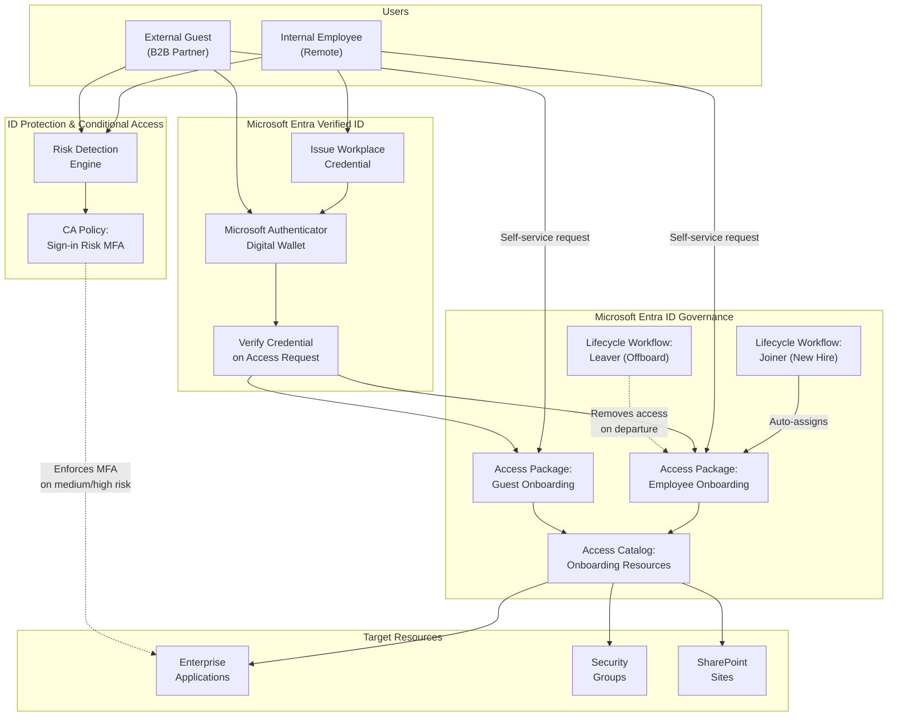

# Streamline Employee and Guest Onboarding — POC Guide

> Generated by entra-poc-assistant on 2026-03-17
> Scenario: Streamline Employee and Guest Onboarding | Mode: Guidance Only
> Reference: [EntraSuite Training — Scenario 1](https://microsoft.github.io/EntraSuite-Training/Scenarios/Scenario1/)

## Overview

This guide walks you through a proof-of-concept deployment that streamlines onboarding for new remote employees and external guests (partners, vendors, customers). You configure Microsoft Entra Verified ID to issue and verify digital proofs of identity, Entra ID Governance to create self-service access packages with approval workflows and lifecycle automation, and Entra ID Protection with Conditional Access to enforce risk-based security controls. All changes are scoped to the pilot group **POC-Onboarding-Pilot**.

## Prerequisites

Before you begin, verify the following:

- [ ] **Licenses:** Microsoft Entra Suite (or individual licenses: Entra ID P2, ID Governance, Verified ID) assigned to pilot users
- [ ] **Roles:** Global Administrator (for initial setup) **or** the combination of: Identity Governance Administrator, Security Administrator, Authentication Policy Administrator, Lifecycle Workflows Administrator
- [ ] **Infrastructure:**
  - A registered custom domain for Verified ID (e.g., `contoso.com`)
  - Azure Key Vault in the same tenant (required by Verified ID)
  - Test devices with Microsoft Authenticator installed (for Verified ID wallet)
- [ ] **Tenant features:** Microsoft Entra Verified ID enabled
- [ ] **Pilot group:** Security group **POC-Onboarding-Pilot** created with test users
- [ ] **Test users:** At minimum one internal employee test user (with `employeeHireDate` and `department` attributes populated) and one external guest test user
- [ ] **Break-glass accounts:** Emergency access accounts identified and excluded from all Conditional Access policies
- [ ] **External partner tenant:** A partner/vendor tenant ID or domain available for B2B connected organization setup

## Architecture



---

## Phase 1: Prerequisites Setup

### Step 1: Validate Licenses

Verify that the required licenses are assigned to your pilot users before configuring any features.

1. Sign in to the [Microsoft Entra admin center](https://entra.microsoft.com).

2. Navigate to **Identity** > **Billing** > **Licenses** > **All products**.

3. Verify that one of the following SKUs is present and has available units:

   | License SKU | Includes |
   |---|---|
   | Microsoft Entra Suite | Verified ID, ID Governance, ID Protection (P2), Private Access, Internet Access |
   | Microsoft Entra ID P2 + ID Governance + Verified ID | Individual licenses covering all scenario products |

4. Navigate to **Identity** > **Users** > select a pilot user > **Licenses**.

5. Confirm that the required license is assigned to the user.

> [!IMPORTANT]
> All users in the pilot group must have licenses assigned **before** risk-based policies or governance features will apply to them. Verified ID basic issuance is included with Entra ID P1/P2, but the full scenario requires ID Governance and ID P2 for access packages and risk policies.

**PowerShell alternative:** Run the companion script `Deploy-EmployeeGuestOnboarding.ps1` with `-WhatIf` — it validates licenses automatically in the prerequisites check phase.

---

### Step 2: Validate Admin Roles

Ensure the administrator account has the necessary roles to configure all scenario components.

1. Sign in to the [Microsoft Entra admin center](https://entra.microsoft.com).

2. Navigate to **Identity** > **Roles & admins** > **Roles & admins**.

3. Search for and verify the following role assignments for your admin account:

   | Role | Purpose |
   |---|---|
   | Identity Governance Administrator | Catalogs, access packages, lifecycle workflows |
   | Security Administrator | Conditional Access policies, ID Protection |
   | Authentication Policy Administrator | Verified ID configuration |
   | Lifecycle Workflows Administrator | Joiner/leaver workflows |

4. If any roles are missing, select the role > **Add assignments** > add your admin account.

> [!TIP]
> If you are a Global Administrator, you already have all required permissions. However, for production, use the principle of least privilege and assign only the specific roles listed above.

---

### Step 3: Create Pilot Security Group

Create a dedicated security group for the POC. All policies and packages are scoped to this group to avoid impacting production users.

1. Sign in to the [Microsoft Entra admin center](https://entra.microsoft.com).

2. Navigate to **Identity** > **Groups** > **All groups**.

3. Select **New group**.

4. Configure the following settings:

   | Setting | Value |
   |---|---|
   | Group type | Security |
   | Group name | POC-Onboarding-Pilot |
   | Group description | Pilot group for employee and guest onboarding POC |
   | Membership type | Assigned |

5. Under **Members**, select **No members selected** and add your test users (both internal and guest).

6. Select **Create**.

> [!NOTE]
> You need at least one internal employee user and one external guest user in this group. The internal user must have `department` and `employeeHireDate` attributes populated for lifecycle workflows to function correctly.

---

### Step 4: Configure Test Users

Lifecycle workflows require specific user attributes to trigger correctly. Configure these attributes on your internal test user.

1. Navigate to **Identity** > **Users** > select your internal test user.

2. Select **Properties** > **Edit properties**.

3. Under **Job information**, configure:

   | Attribute | Value | Purpose |
   |---|---|---|
   | Department | Finance | Lifecycle workflow scoping condition |
   | Employee hire date | A future date (e.g., tomorrow) | Joiner workflow trigger |
   | Employee type | Employee | Distinguishes from guest |

4. Select **Save**.

5. Repeat for any additional internal test users.

> [!IMPORTANT]
> The `employeeHireDate` attribute must be set in the user profile for the joiner workflow to trigger automatically. If you plan to run the workflow on-demand for testing, the hire date can be any value — but it **must** be populated. The `department` attribute is used as the scoping condition (the workflow only fires for users where `department = Finance`).

**To configure via PowerShell:**

```powershell
# Update a test user's attributes for lifecycle workflow compatibility
$userId = "<user-object-id>"
$body = @{
    department       = "Finance"
    employeeHireDate = "2026-03-18T00:00:00Z"
    employeeType     = "Employee"
} | ConvertTo-Json

Invoke-MgGraphRequest -Method PATCH -Uri "https://graph.microsoft.com/v1.0/users/$userId" `
    -Body $body -ContentType "application/json"
```

---

## Phase 2: Configure Microsoft Entra Verified ID

### Step 5: Set Up Verified ID with Quick Setup

Configure Microsoft Entra Verified ID to issue workplace credentials that employees and guests present when requesting access packages.

> [!IMPORTANT]
> Quick Setup requires a custom domain already registered with your Entra tenant. If you have not registered a custom domain, follow the steps at [Add your custom domain](https://learn.microsoft.com/en-us/entra/fundamentals/add-custom-domain) before proceeding.

1. Sign in to the [Microsoft Entra admin center](https://entra.microsoft.com) with at least a **Global Administrator** role.

2. Navigate to **Verified ID** > **Setup**.

3. Select **Get started** to launch Quick Setup.

4. If you have multiple registered domains, select the one you want to use for Verified ID (e.g., `contoso.com`).

5. The setup process automatically:
   - Creates a decentralized identifier (DID) for your organization
   - Configures the linked domain
   - Creates a default **Verified Workplace Credential** contract

6. After setup completes, you see the default workplace credential available to edit.

**What this does:** Quick Setup establishes your organization's decentralized identity (DID) and links it to your custom domain. This lets users receive digitally signed workplace credentials that prove they are verified members of your organization. The DID is published to a trust registry so that relying parties (including your own access packages) can verify credentials without contacting the issuer directly.

> [!NOTE]
> Quick Setup is a portal-only wizard and cannot be automated via the Graph API. The PowerShell deployment script skips this step and provides a reminder to complete it manually.

---

### Step 6: Issue a Test Workplace Credential

Before wiring Verified ID into access packages, verify that credential issuance works correctly.

1. On a test device with **Microsoft Authenticator** installed, sign in to [My Account](https://myaccount.microsoft.com) with the internal test user's credentials.

2. Select **Get my Verified ID** to issue a verified workplace credential.

3. Microsoft Authenticator prompts you to accept the credential. Select **Add**.

4. Verify the credential appears in the Authenticator app under the **Verified IDs** tab with your organization's name and branding.

**What this does:** This step validates the end-to-end issuance flow — your Authority (DID) signs the credential, Authenticator stores it in the user's digital wallet, and the credential is ready for presentation. If this step succeeds, the Verified ID infrastructure is working correctly.

> [!TIP]
> If the test user does not see "Get my Verified ID" in My Account, verify that: (1) the Verified ID setup completed successfully, (2) the user has a valid license, and (3) the default workplace credential contract is enabled.

---

## Phase 3: Configure B2B Connected Organizations

### Step 7: Add Trusted External Organization

Add a partner organization as a connected organization so their users can request guest access packages.

1. Sign in to the [Microsoft Entra admin center](https://entra.microsoft.com) with at least a **Security Administrator** role.

2. Navigate to **Identity** > **External Identities** > **Cross-tenant access settings**.

3. Select **Organizational settings**.

4. Select **Add organization**.

5. Enter the partner organization's full domain name (e.g., `fabrikam.com`) or tenant ID.

6. Select the organization in the search results and select **Add**.

7. Confirm the new organization appears in Organizational settings. By default, it inherits settings from the default cross-tenant access policy.

   | Setting | Value |
   |---|---|
   | Organization domain | Partner's domain (e.g., `fabrikam.com`) |
   | Inbound access | Inherited from default |
   | Outbound access | Inherited from default |

**What this does:** Adding a connected organization enables B2B collaboration with the partner tenant. Their users can now be targeted by access package policies scoped to "specific connected organizations." This is the foundation for governed guest onboarding — rather than ad-hoc guest invitations, you use entitlement management to control which external users get access and to what resources.

> [!NOTE]
> The default cross-tenant access settings allow B2B collaboration. If your tenant has restricted inbound access, you may need to explicitly allow inbound access for the partner organization. Navigate to the partner's settings row > **Inbound access** > add the applications and groups that guest users need.

---

## Phase 4: Configure Entitlement Management

### Step 8: Create an Access Catalog

Create a catalog that groups the resources (apps, groups, sites) that onboarding access packages will draw from.

1. Sign in to the [Microsoft Entra admin center](https://entra.microsoft.com) with at least an **Identity Governance Administrator** role.

2. Navigate to **Identity governance** > **Entitlement management** > **Catalogs**.

3. Select **+ New catalog**.

4. Configure the following settings:

   | Setting | Value |
   |---|---|
   | Name | Onboarding Resources |
   | Description | Resources for employee and guest onboarding POC |
   | Enabled | Yes |
   | Enabled for external users | Yes |

5. Select **Create**.

**What this does:** A catalog is a container for resources. By creating a dedicated POC catalog, you isolate your test resources from any production catalogs. Setting "Enabled for external users" to Yes allows guest access packages to reference resources from this catalog.

---

### Step 9: Add Resources to the Catalog

Add the security groups, enterprise applications, and (optionally) SharePoint sites that your access packages will grant.

1. In the **Onboarding Resources** catalog, select **Resources** > **+ Add resources**.

2. Select **Type** and choose **Groups and Teams**.

3. Select the security group(s) that represent access (e.g., a group providing access to a line-of-business application). Select **Add**.

4. Repeat for **Applications**: select enterprise applications that onboarded employees and guests need access to.

5. (Optional) Repeat for **SharePoint sites**: select sites that should be part of the onboarding package.

   | Resource Type | Example Resource | Role |
   |---|---|---|
   | Groups and Teams | Finance-App-Users | Member |
   | Applications | Contoso Finance App | User |
   | SharePoint sites | POC Documentation Site | Member |

6. Verify all resources appear in the catalog's **Resources** tab.

**What this does:** Resources in the catalog become available for inclusion in access packages. When a user is granted an access package, they automatically receive the specified role in each resource — for example, membership in a security group or assignment to an application. This eliminates manual provisioning.

> [!NOTE]
> Only resources you add to this catalog can be used in access packages within it. If you need to add more resources later, return to the catalog and repeat this step.

---

### Step 10: Create Access Package for Internal Remote Employees

Create an access package that bundles resources for new hires, requires Verified ID presentation, and includes periodic access reviews.

1. Navigate to **Identity governance** > **Entitlement management** > **Access packages**.

2. Select **New access package**.

3. **Basics:**

   | Setting | Value |
   |---|---|
   | Name | Finance Apps for Remote Employees |
   | Description | Provides access to Finance department resources for verified remote employees |
   | Catalog | Onboarding Resources |

4. **Resource roles:** Select one or more resources from the catalog and assign the appropriate role:

   | Resource | Role |
   |---|---|
   | Finance-App-Users (group) | Member |
   | Contoso Finance App (application) | User |

5. **Requests:** Select **For users in your directory**.

6. Select **+ Add users and groups** and select the **POC-Onboarding-Pilot** group (or a subgroup of internal employees entitled to request this package).

7. Scroll to **Required Verified IDs**.

8. Select **+ Add issuer**. Select your organization's issuer from the Microsoft Entra Verified ID network.

9. **(Optional) Approval:** Configure whether manager approval is required.

   | Setting | Value |
   |---|---|
   | Require approval | Yes (recommended) or No (for faster POC testing) |
   | First approver | Manager or specific approver |

10. **(Optional) Requestor information:** Add a question for the requestor (e.g., "Why do you need access to Finance resources?").

11. **Lifecycle:**

    | Setting | Value |
    |---|---|
    | Expiration | Number of days: 90 (or a value suitable for your POC) |
    | Users can request extensions | Yes |

12. **Access Reviews:**

    | Setting | Value |
    |---|---|
    | Require access reviews | Yes |
    | Starting on | Today's date |
    | Review frequency | Quarterly |
    | Duration (days) | 25 |
    | Reviewers | Self review (or Manager) |

13. Select **Create**.

**What this does:** This access package is the core of governed internal onboarding. When an employee requests access, they must present their Verified ID credential (issued in Step 6) — proving their identity cryptographically without manual IT verification. The access review ensures access is periodically recertified; stale access is automatically removed if the review is not completed.

> [!IMPORTANT]
> The Verified ID requirement means requestors must have a valid workplace credential in their Microsoft Authenticator wallet before they can complete the request. Ensure Step 6 is completed for all pilot users before testing this flow.

---

### Step 11: Create Access Package for B2B Guests

Create a separate access package for external users from connected organizations, also requiring Verified ID.

1. Navigate to **Identity governance** > **Entitlement management** > **Access packages**.

2. Select **New access package**.

3. **Basics:**

   | Setting | Value |
   |---|---|
   | Name | Finance Apps for Guest Users |
   | Description | Provides access to Finance resources for verified external partners |
   | Catalog | Onboarding Resources |

4. **Resource roles:** Select the appropriate resources and roles (can differ from the internal package — typically a subset).

   | Resource | Role |
   |---|---|
   | Finance-App-Users (group) | Member |

5. **Requests:** Select **For users not in your directory**.

6. Select **Specific connected organizations** > **Add directory** > select the partner organization added in Step 7.

7. Scroll to **Required Verified IDs**.

8. Select **+ Add issuer**. Select an issuer from the Microsoft Entra Verified ID network — this should be the **partner organization's** issuer, so the guest presents their own organization's credential.

9. **(Optional) Approval:**

   | Setting | Value |
   |---|---|
   | Require approval | Yes (recommended for external users) |
   | First approver | Internal sponsor or manager |

10. **Lifecycle:**

    | Setting | Value |
    |---|---|
    | Expiration | Number of days: 30 (shorter for guests) |
    | Users can request extensions | Yes |

11. **Access Reviews:**

    | Setting | Value |
    |---|---|
    | Require access reviews | Yes |
    | Starting on | Today's date |
    | Review frequency | Quarterly |
    | Duration (days) | 25 |
    | Reviewers | Self review |

12. Select **Create**.

**What this does:** This access package governs guest onboarding. Instead of ad-hoc B2B invitations, external users discover and request access through the My Access portal. Verified ID verification ensures the guest is who they claim to be (their own organization's credential validates their identity). Approval workflows give your organization control, and time-limited access with reviews ensures guests don't retain access beyond what's needed.

---

## Phase 5: Configure Lifecycle Workflows

### Step 12: Create Joiner Workflow

Automate day-one onboarding for new hires so they receive access immediately without manual IT intervention.

1. Sign in to the [Microsoft Entra admin center](https://entra.microsoft.com) with at least a **Lifecycle Workflows Administrator** role.

2. Navigate to **Identity governance** > **Lifecycle workflows** > **+ Create a workflow**.

3. Select **Onboard new hire employee**.

4. **Basics:**

   | Setting | Value |
   |---|---|
   | Display name | Onboard New Hire Employee – Finance |
   | Description | Automatically provisions Finance department new hires with access packages and notifications |

5. **Configure scope:**
   - Under **Rule**, configure the scoping condition:

   | Property | Operator | Value |
   |---|---|---|
   | department | equals | Finance |

   This ensures the workflow only triggers for users where `department = Finance`.

6. **Review tasks:** Select **Add task** and add the following tasks in order:

   | Task | Description |
   |---|---|
   | **Enable User Account** | Activates the user's account on their hire date |
   | **Request user access package assignment** | Assigns the "Finance Apps for Remote Employees" access package |
   | **Add user to groups** | Adds the user to the POC-Onboarding-Pilot group |
   | **Send Welcome Email** | Sends a welcome notification to the user |
   | **Generate TAP and Send Email** | Generates a Temporary Access Pass and emails it to the user for initial sign-in |

7. For the **Request user access package assignment** task:
   - Select the access package: **Finance Apps for Remote Employees** (created in Step 10)
   - Select the assignment policy

8. Select **Enable Schedule** to activate automated execution.

9. Select **Review + create** > **Create**.

**What this does:** The joiner workflow automates the entire onboarding sequence. When a new user with `department = Finance` approaches their `employeeHireDate`, the workflow fires automatically and:
- Enables their account
- Assigns them the access package (granting all bundled resources)
- Adds them to the pilot group
- Sends a welcome email
- Generates a Temporary Access Pass so they can sign in and set up MFA on day one

This eliminates the delay between hire date and productive access.

> [!NOTE]
> Lifecycle workflows run automatically based on a combination of the trigger attribute (`employeeHireDate`) and an offset value. For example, if the offset is `-1`, the workflow triggers one day **before** the hire date. For POC testing, you can run the workflow on demand (see Step 17) without waiting for the schedule.

> [!IMPORTANT]
> For the **Send Welcome Email** and **Generate TAP** tasks, the user must have a `manager` and `mail` attribute populated. Verify these are set on your test users. See [Automate employee onboarding tasks](https://learn.microsoft.com/en-us/graph/tutorial-lifecycle-workflows-onboard-custom-workflow?tabs=http#prerequisites) for details on required attribute mappings.

---

### Step 13: Create Leaver Workflow (Optional)

Automate offboarding to ensure departing employees lose access promptly.

1. Navigate to **Identity governance** > **Lifecycle workflows** > **+ Create a workflow**.

2. Select **Offboard an employee**.

3. **Basics:**

   | Setting | Value |
   |---|---|
   | Display name | Offboard Employee – Finance |
   | Description | Automatically deprovisions Finance department employees on departure |

4. **Configure scope:**

   | Property | Operator | Value |
   |---|---|---|
   | department | equals | Finance |

5. **Review tasks:** Select **Add task** and add:

   | Task | Description |
   |---|---|
   | **Disable User Account** | Disables the account on the leave date |
   | **Remove user from all groups** | Removes group memberships |
   | **Remove user from all Teams** | Removes Teams memberships |

6. Select **Enable Schedule**.

7. Select **Review + create** > **Create**.

**What this does:** The leaver workflow triggers when a user's `employeeLeaveDateTime` attribute is reached. It disables the account and removes all group and Teams memberships, which cascades to remove access to all resources granted through those groups. This ensures that departed employees cannot retain access.

> [!NOTE]
> The `employeeLeaveDateTime` attribute must be populated for leaver workflows to trigger automatically. For POC testing, you can set this attribute on a test user and run the workflow on demand. The offset value determines how many days before or after the leave date the workflow fires (range: -180 to 180 days).

---

## Phase 6: Configure ID Protection and Conditional Access

### Step 14: Review Existing ID Protection Reports

Before deploying risk-based policies, review current risk detections to establish a baseline and investigate any existing suspicious activity.

1. Sign in to the [Microsoft Entra admin center](https://entra.microsoft.com).

2. Navigate to **Protection** > **Identity Protection** > **Overview**.

3. Review the dashboard for:
   - **Total risky users** — users flagged with compromised credentials or anomalous behavior
   - **Total risky sign-ins** — sign-in events flagged as suspicious
   - **Total risk detections** — individual risk events detected

4. Navigate to **Risk detections** and review any active detections.

5. If existing risky users are found:
   - **Investigate** each user: is this a legitimate compromise or a false positive?
   - **Dismiss risk** for users you've verified as safe
   - **Confirm compromise** and require password change for genuinely compromised users

**What this does:** Baselining risk before deploying policies prevents false positives from blocking legitimate users on day one. If you deploy a "block high-risk users" policy without reviewing existing risks, you might lock out users who were already flagged but aren't actually compromised. Clean up the baseline first.

> [!WARNING]
> Do not skip this step. Deploying risk-based Conditional Access policies without reviewing existing risk detections can cause unexpected access disruptions for pilot users.

**References:**
- [Investigate risk detections](https://learn.microsoft.com/en-us/entra/id-protection/howto-identity-protection-investigate-risk)
- [Remediate risks and unblock users](https://learn.microsoft.com/en-us/entra/id-protection/howto-identity-protection-remediate-unblock)

---

### Step 15: Create Sign-in Risk-Based Conditional Access Policy

Create a Conditional Access policy that requires MFA when medium or high sign-in risk is detected for pilot users.

1. Sign in to the [Microsoft Entra admin center](https://entra.microsoft.com) with at least a **Conditional Access Administrator** role.

2. Navigate to **Protection** > **Conditional Access** > **Policies**.

3. Select **+ New policy**.

4. Configure the following settings:

   | Setting | Value |
   |---|---|
   | **Policy name** | POC-SignInRisk-RequireMFA |
   | **Users — Include** | Select users and groups > **POC-Onboarding-Pilot** |
   | **Users — Exclude** | Select users and groups > your break-glass/emergency access accounts |
   | **Target resources — Include** | Select **All cloud apps** (or specific apps included in access packages) |
   | **Conditions — Sign-in risk** | Configure: Yes; Risk levels: **High** and **Medium** |
   | **Grant** | **Grant access** > **Require multifactor authentication** |
   | **Session** | **Sign-in frequency**: Every time |
   | **Enable policy** | **Report-only** |

5. Select **Create**.

**What this does:** This policy intercepts sign-in attempts that ID Protection flags as medium or high risk — such as sign-ins from anonymous IP addresses, atypical travel locations, or known malicious infrastructure. Instead of blocking access entirely, it challenges the user with MFA, which a legitimate user can satisfy but an attacker (with only stolen credentials) typically cannot.

**Why report-only first:** Starting in report-only mode lets you observe which sign-ins **would have** triggered MFA without actually enforcing it. You review sign-in logs for a validation period (1-3 days recommended for POC), confirm there are no unexpected impacts, and then switch the policy to **On** to enforce.

> [!IMPORTANT]
> **Never** create a Conditional Access policy targeting "All users" or "All cloud apps" without excluding your break-glass emergency access accounts. If all admins are locked out, the break-glass account is the only recovery path.

> [!NOTE]
> For users to self-remediate through MFA when a risk policy fires, they must have already registered for MFA **before** becoming risky. Verify that all pilot users have completed MFA registration. You can check at **Protection** > **Authentication methods** > **User registration details**.

**To switch to enforced mode** (after validation):

1. Navigate to **Protection** > **Conditional Access** > **Policies**.
2. Select **POC-SignInRisk-RequireMFA**.
3. Change **Enable policy** from **Report-only** to **On**.
4. Select **Save**.

---

### Step 16: Configure Risk Notifications

Set up email notifications so administrators are alerted when users are flagged as risky.

1. Navigate to **Protection** > **Identity Protection** > **Settings**.

2. Under **Users at risk detected alerts**, configure:

   | Setting | Value |
   |---|---|
   | Recipients | Your security operations team or POC admin email |
   | Alert threshold | Medium (to capture both medium and high risk) |

3. Under **Weekly digest**, configure:

   | Setting | Value |
   |---|---|
   | Recipients | Your security operations team or POC admin email |
   | Enabled | Yes |

4. Select **Save**.

**What this does:** These notifications provide operational awareness. The at-risk alert triggers immediately when a user's risk level reaches the configured threshold — allowing you to investigate and remediate before additional damage occurs. The weekly digest provides a summary view for trend analysis.

**References:**
- [Enable email notifications](https://learn.microsoft.com/en-us/entra/id-protection/howto-identity-protection-configure-notifications)
- [Impact analysis of risk-based access policies workbook](https://learn.microsoft.com/en-us/entra/id-protection/workbook-risk-based-policy-impact)

---

## Phase 7: Testing and Validation

### Step 17: Run Joiner Workflow On Demand

Test the joiner workflow without waiting for the automated schedule.

1. Navigate to **Identity governance** > **Lifecycle workflows** > **Workflows**.

2. Select **Onboard New Hire Employee – Finance**.

3. Select **Run on-demand**.

4. Select **Add users** > add your internal test user (who has `department = Finance`).

5. Select **Add** > **Run workflow**.

6. Navigate to **Workflow history** to monitor progress.

7. Verify each task shows a **Completed** status:
   - [ ] User account enabled
   - [ ] Access package assigned
   - [ ] User added to POC-Onboarding-Pilot group
   - [ ] Welcome email sent (check the user's inbox)
   - [ ] TAP generated and sent

**What this does:** Running on-demand executes the exact same workflow that would fire automatically on the hire date — but immediately. This lets you validate the end-to-end automation without waiting for the schedule. Check both the workflow history in the Entra admin center and the user's inbox for the welcome email and TAP.

> [!TIP]
> If a task fails, select it in the workflow history to see detailed error information. Common causes: missing `mail` or `manager` attribute on the user (required for email tasks), or the access package policy doesn't include the user's group in its requestors scope.

---

### Step 18: Request Access Package as Internal User

Test the self-service access request flow with Verified ID presentation.

1. On a test device, sign in to [My Access](https://myaccess.microsoft.com) with the internal test user's credentials.

2. Search for **Finance Apps for Remote Employees** (or browse the listed packages).

3. Select **Request**.

4. The system displays a banner: "To request access to this access package you need to present your Verifiable Credentials."

5. Select **Request Access**.

6. Scan the QR Code with your phone to launch Microsoft Authenticator.

7. In Authenticator, select the workplace credential and **Share** it.

8. After credentials are verified, continue with the approval workflow (if approval was configured in Step 10).

9. Once approved (or auto-approved), verify the user receives access to the bundled resources:
   - [ ] Group membership added
   - [ ] Application assignment active
   - [ ] User can access the target application

**What this does:** This validates the full governed onboarding experience from the employee's perspective. The Verified ID presentation proves the user's identity without manual IT verification. The access package automatically provisions all bundled resources upon approval.

---

### Step 19: Request Access Package as Guest

Test the external user onboarding flow.

1. On a test device, have a user from the **partner organization** (added in Step 7) sign in to [My Access](https://myaccess.microsoft.com).

2. Search for **Finance Apps for Guest Users**.

3. Select **Request**.

4. Present the external user's Verified ID credential (from their own organization) via the QR code flow.

5. Complete the approval workflow.

6. Verify the guest user receives the appropriate access:
   - [ ] Guest account created in your tenant (if not already present)
   - [ ] Group membership assigned
   - [ ] Application access granted

> [!NOTE]
> External users from connected organizations can discover and request access packages in the My Access portal. If the external user doesn't see the package, verify: (1) the partner org is added as a connected organization (Step 7), (2) the access package policy targets "specific connected organizations" including the partner, (3) the catalog is enabled for external users.

---

### Step 20: Simulate User Risk and Verify CA Policy

Validate that the sign-in risk Conditional Access policy correctly challenges risky sign-ins.

1. Follow the Microsoft guidance for simulating risk: [Simulating risk detections in Microsoft Entra ID Protection](https://learn.microsoft.com/en-us/entra/id-protection/howto-identity-protection-simulate-risk).

   Common simulation methods:
   - Use a Tor browser to create an "anonymous IP address" detection
   - Use a VPN from an unusual geography to trigger "atypical travel"

2. You may need to attempt multiple risk simulations to raise the sign-in risk to **Medium** or **High**.

3. If the CA policy is still in **report-only** mode:
   - Navigate to **Protection** > **Conditional Access** > **Insights and reporting**.
   - Filter for the **POC-SignInRisk-RequireMFA** policy.
   - Verify that risky sign-ins show a report-only result of "Would have required MFA."

4. If the CA policy has been switched to **On** (enforced):
   - Attempt to sign in to a cloud app with the test user.
   - Verify the user is prompted for MFA during the risky sign-in.
   - Verify access is granted after MFA completion.

5. Check the sign-in logs at **Identity** > **Monitoring & health** > **Sign-in logs** for the test user. Verify the risk level and policy evaluation results.

> [!NOTE]
> Risk simulations may take some time (up to a few hours) to appear in sign-in logs. If the risk level doesn't rise to Medium, retry the simulation. Do not switch the CA policy to enforced mode until you have validated it works correctly in report-only.

---

### Step 21: Verify Access Reviews

Confirm that access review definitions were properly created for the access packages.

1. Navigate to **Identity governance** > **Entitlement management** > **Access packages**.

2. Select **Finance Apps for Remote Employees** > **Lifecycle** section.

3. Verify that access reviews are configured:
   - [ ] Frequency: Quarterly
   - [ ] Duration: 25 days
   - [ ] Reviewers: Self review (or Manager)

4. Repeat for **Finance Apps for Guest Users**.

5. (Optional) Navigate to **Identity governance** > **Access reviews** to see the review definitions that were automatically created.

> [!TIP]
> For the POC, you can manually trigger an access review by changing the start date to today and the frequency to one-time. This lets you test the reviewer experience immediately. Reviewers receive email notification and can approve/deny access at [My Access](https://myaccess.microsoft.com) > **Access reviews**.

---

## Validation Summary

| # | Validation Item | Status |
|---|---|---|
| 1 | Licenses assigned to pilot users | ☐ |
| 2 | Admin roles verified | ☐ |
| 3 | Pilot group created with test users | ☐ |
| 4 | Test user attributes (`department`, `employeeHireDate`) populated | ☐ |
| 5 | Verified ID Quick Setup completed | ☐ |
| 6 | Test credential issued to Microsoft Authenticator | ☐ |
| 7 | Connected organization added | ☐ |
| 8 | Access catalog created with resources | ☐ |
| 9 | Internal employee access package created with Verified ID requirement | ☐ |
| 10 | Guest access package created with Verified ID requirement | ☐ |
| 11 | Joiner lifecycle workflow created and enabled | ☐ |
| 12 | Leaver lifecycle workflow created (optional) | ☐ |
| 13 | ID Protection baseline reviewed | ☐ |
| 14 | Sign-in risk CA policy created (report-only) | ☐ |
| 15 | Risk notifications configured | ☐ |
| 16 | Joiner workflow executed successfully on demand | ☐ |
| 17 | Internal user requested and received access package with Verified ID | ☐ |
| 18 | Guest user requested and received access package with Verified ID | ☐ |
| 19 | Risk simulation validated CA policy behavior | ☐ |
| 20 | Access reviews configured on both packages | ☐ |

---

## Troubleshooting

| Symptom | Possible Cause | Resolution |
|---|---|---|
| Verified ID "Get my Verified ID" not visible in My Account | Quick Setup not completed, or user lacks license | Complete Verified ID Quick Setup (Step 5); verify license on the user |
| Access package not visible in My Access portal | User not in the request policy scope, or catalog disabled | Verify user is in the pilot group targeted by the assignment policy; verify catalog is enabled |
| Guest cannot see access package | Connected org not added, or package not scoped to external users | Verify Step 7; verify package request policy targets "For users not in your directory" > specific connected orgs |
| Lifecycle workflow tasks fail | Missing user attributes (mail, manager, employeeHireDate) | Populate required attributes on the test user (Step 4) |
| TAP generation fails | User not eligible for TAP, or TAP policy not enabled | Enable TAP in **Authentication methods** > **Temporary Access Pass** |
| CA policy not triggering on risky sign-in | Policy in report-only mode, or risk level below threshold | Check report-only results in Conditional Access insights; retry risk simulation |
| MFA prompt not appearing for risky sign-in | User already satisfied MFA in the session, or session not expired | Set session sign-in frequency to "Every time" in the CA policy; use InPrivate browser |
| Access review not created | Review settings not enabled on the access package assignment policy | Edit the access package > Lifecycle > enable access reviews |

---

## Next Steps

1. **Switch CA policy to enforced:** After validating in report-only mode (Step 20), switch the sign-in risk CA policy from Report-only to On.
2. **Expand pilot scope:** Add additional users to the **POC-Onboarding-Pilot** group to test at a larger scale.
3. **Add a user risk policy:** Create a second CA policy that requires password change + MFA for users with **High** user risk level.
4. **Configure FaceCheck (optional):** For higher assurance, enable FaceCheck facial recognition as part of the Verified ID presentation flow (requires Entra Suite or Verified ID premium).
5. **Production planning:** Document any configuration changes needed for production rollout — broader user scope, integration with HR systems for lifecycle attribute sync, and production Conditional Access policies covering all users.

---

## Resources

- [Microsoft Entra Verified ID](https://www.microsoft.com/en-us/security/business/identity-access/microsoft-entra-verified-id)
- [Plan your Verified ID verification solution](https://learn.microsoft.com/en-us/entra/verified-id/plan-verification-solution)
- [What is Microsoft Entra ID Protection?](https://learn.microsoft.com/en-us/entra/id-protection/overview-identity-protection)
- [Microsoft Entra ID Governance overview](https://learn.microsoft.com/en-us/entra/id-governance/identity-governance-overview)
- [Plan a Conditional Access deployment](https://learn.microsoft.com/en-us/entra/identity/conditional-access/plan-conditional-access)
- [How to synchronize attributes for Lifecycle workflows](https://learn.microsoft.com/en-us/entra/id-governance/how-to-lifecycle-workflow-sync-attributes)
